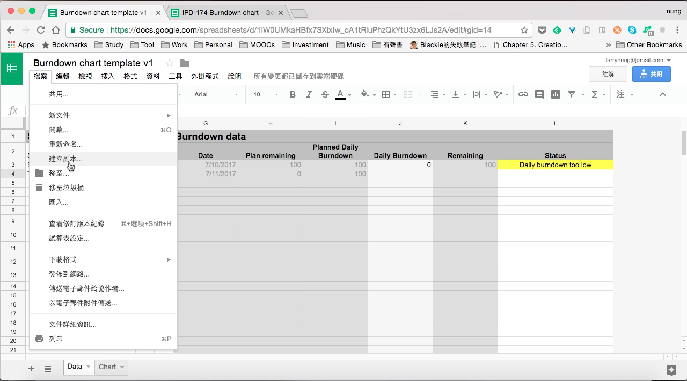

最近在找 Burndown chart 工具來管理案子進度，找到的網站工具跟 Excel 範本都不太適用，因此參閱 [Online Sprint Burndown chart | Logi Helgu](http://agile.logihelgu.com/online-sprint-burndown-chart/) 自行改了一版。  

<!-- More -->

 

要使用的話可先到 [Burndown chart template v1](https://docs.google.com/spreadsheets/d/1lW0UMkaHBfx7SXixIw_oA1tRiuPhzQkYtU3zx6LJs2A/edit?usp=sharing) 這邊，點選 [檔案 | 建立副本...] 主選單選項。  

 

設定檔名與要複製到的位置後按下確定按鈕，範本就會被複製到自身雲端硬碟的指定位置下。  

 

到自身的雲端硬碟開啟，將 Sprint Data 區塊的起訖時間、Point 數填入，右側 Burndown data 的資料就會自動展開，Plan remaining 是預計應該要剩餘的 point、Planned Daily Burndown 是預計每天要 Burndown 的 point、Daily Burndown 是每日Burndown 的 point、Remaining 是實際剩餘的 point。

 

接著只要每天填入 Daily burndown 的資料即可。  

 

填入 Daily burndown 資料後，後方的 Status 欄位會立即顯示專案的進度。如果專案進度與 Burndown 的量都符合預期，那會顯示 On the track。如果專案進度符合預期，但是 Burndown 的量稍低，那會顯示 Daily burndown too low。如果專案的進度落後，那會顯示 Project delay。  

 

若要查看產生出來的 Burndown chart，可切至 Chart 頁面，可以清楚看到 Remaining 是否在 Plan remaining 之下，或是 Daily burndown 是否在 Planned Daily Burndown 之下。  

 

Link
----
* [Online Sprint Burndown chart | Logi Helgu](http://agile.logihelgu.com/online-sprint-burndown-chart/)
* [Burndown chart template v1](https://docs.google.com/spreadsheets/d/1lW0UMkaHBfx7SXixIw_oA1tRiuPhzQkYtU3zx6LJs2A/edit?usp=sharing)
