要使用 Grafana Cloud，可在 Grafana 首頁按下 Get Grafana 按鈕。  

<!-- More -->

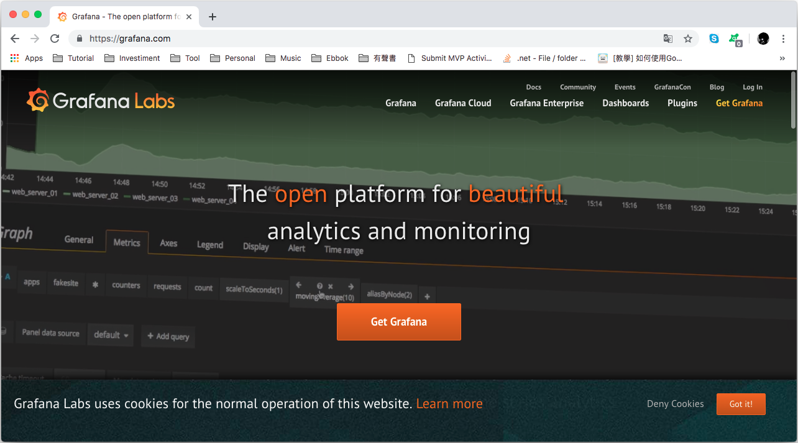

 

點選 Get yout free Instance now 按鈕。  

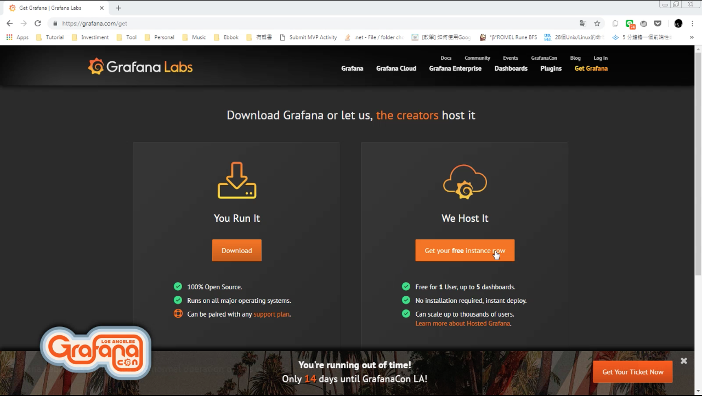

 

填入電子郵件後按下 Sign up Free 按鈕。  

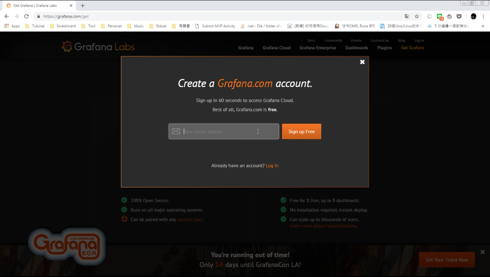

 

設定帳號、密碼，勾選同意服務條款，然後按下 Create my account 按鈕。  

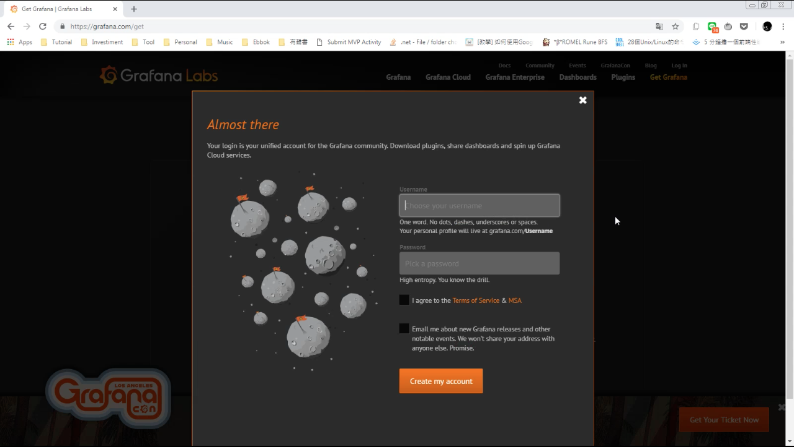

 

註冊的確認信會寄到信箱內。  

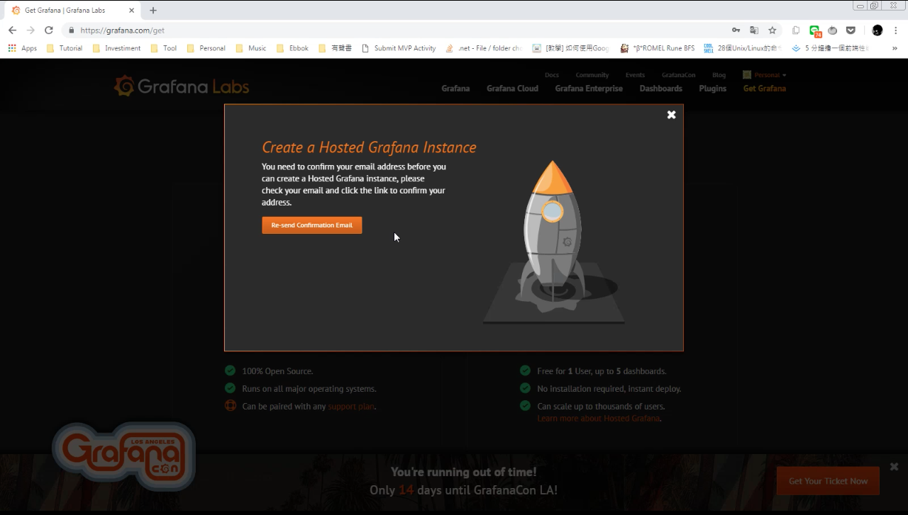

 

開啟確認信點擊確認。  

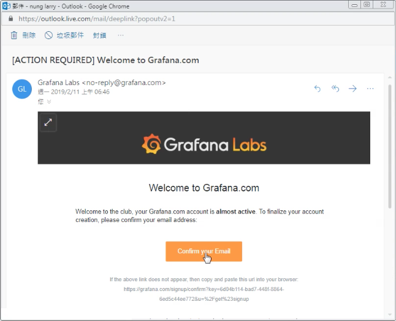

 

註冊確認完成。  

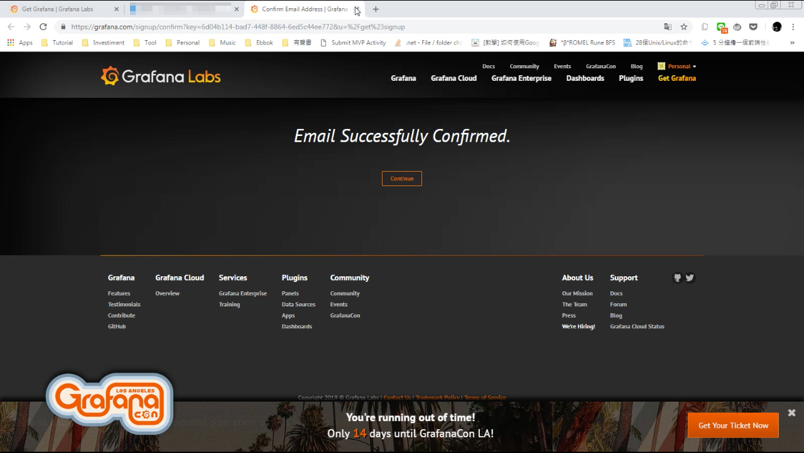

 

接著設定 Grafana Cloud 的 Plan 與網址，設定完後按下 Start your Grafana Cloud Instance 按鈕。  

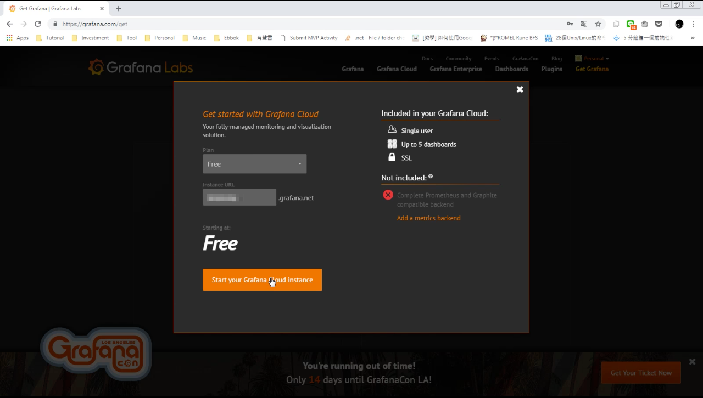

 

按下 Continue 按鈕。  

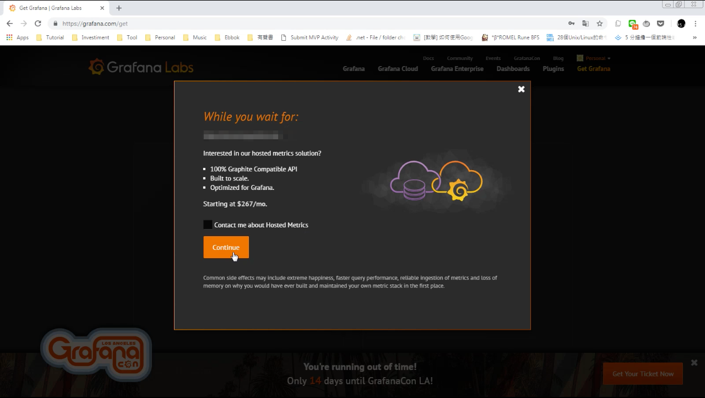

 

等待 Grafana Cloud 準備完成。  

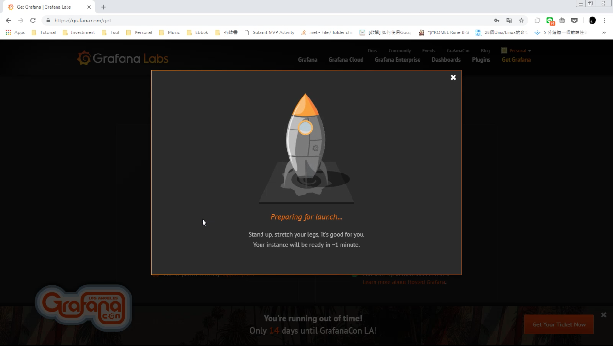

 

準備完成後火箭會升空，按下 Go to 按鈕。  

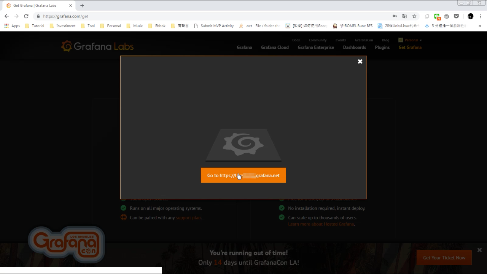

 

Grafana Cloud 認證通過。  

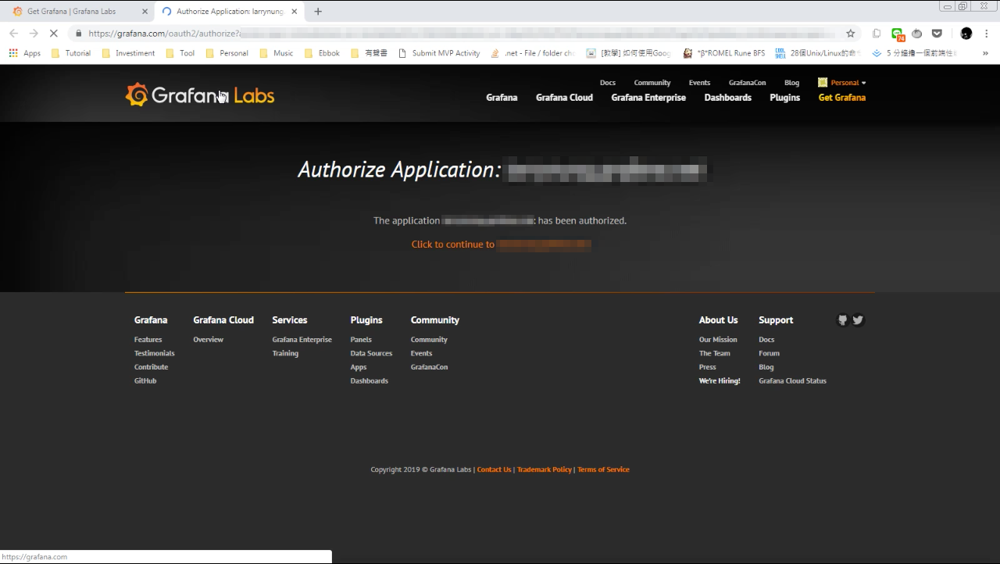

 

就可以開始使用 Grafana Cloud 了。  

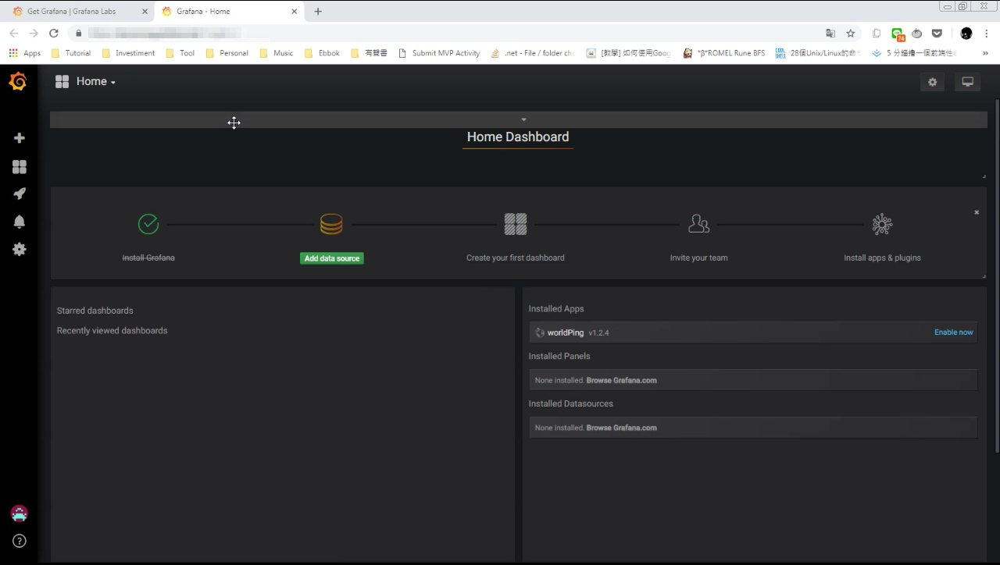

 
