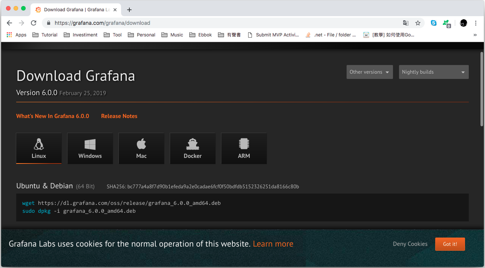
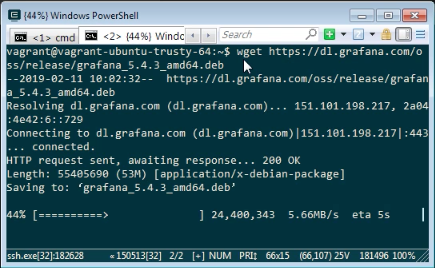
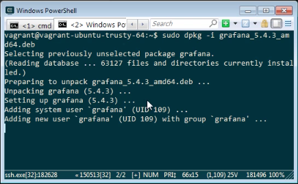
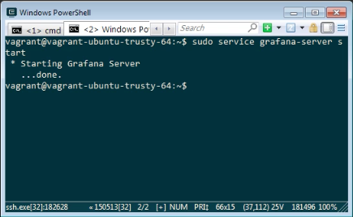
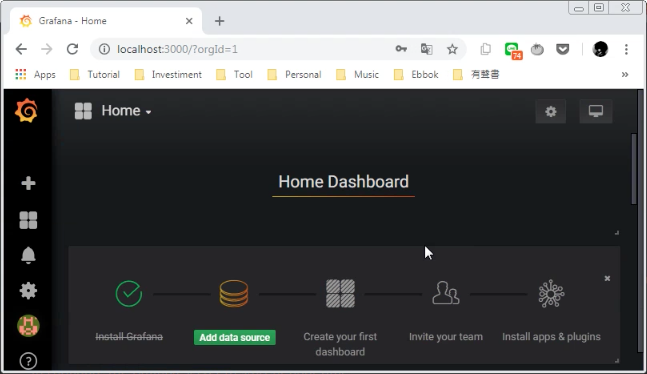

參照 [Grafana Download page](https://grafana.com/grafana/download)。

下載 Grafana 套件。

wget https://dl.grafana.com/oss/release/grafana_6.0.0_amd64.deb

安裝 Grafana 套件。

sudo dpkg -i grafana_6.0.0_amd64.deb

啟動 Grafana 服務。

sudo service grafana-server start

訪問 http://localhost:3000，輸入預設帳密 admin/admin。

更換預設帳號的密碼。

就可以開始使用 Grafana 了。

