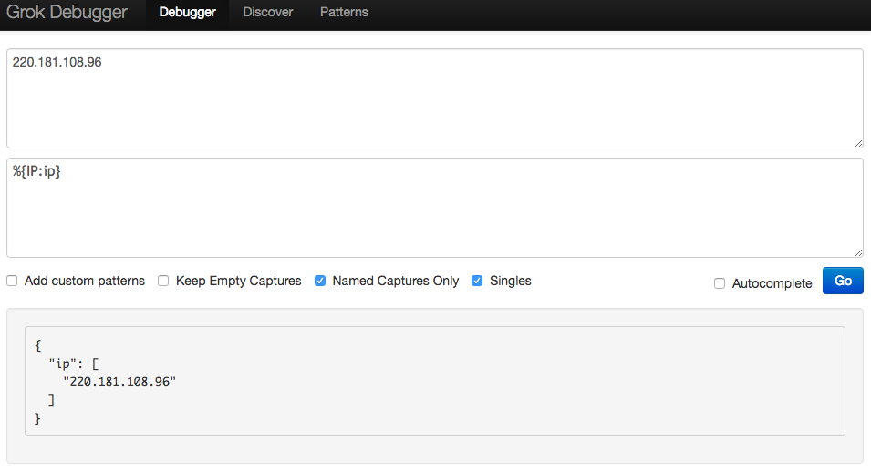

使用 Logstash 免不了會用到 Grok patterns，Grok patterns 其實也就只是用預先定義好的正規表示式來設定怎麼匹配，以及匹配成功後的 Group name，讓設定變得更為簡易、直覺。  

<!-- More -->

<br/>


Grok patterns 的語法為...  

    %{SYNTAX:SEMANTIC}

<br/>


SYNTAX 就是預先定義好的正規表示式，SEMANTIC 就是正規表示式匹配後的 Group name，等同於使用下面這樣的正規表示式語法。  

    (?<<GroupName>><RegexPattern>)

<br/>


SYNTAX 的設定可參閱 [logstash/grok-patterns at v1.4.2 · elastic/logstash](https://github.com/elastic/logstash/blob/v1.4.2/patterns/grok-patterns)，參閱設定可更加了解要怎樣使用 SYNTAX，以及有助了解設定的 SYNTAX 為何會無法正確的匹配。  

```
USERNAME [a-zA-Z0-9._-]+
USER %{USERNAME}
INT (?:[+-]?(?:[0-9]+))
BASE10NUM (?<![0-9.+-])(?>[+-]?(?:(?:[0-9]+(?:\.[0-9]+)?)|(?:\.[0-9]+)))
NUMBER (?:%{BASE10NUM})
BASE16NUM (?<![0-9A-Fa-f])(?:[+-]?(?:0x)?(?:[0-9A-Fa-f]+))
BASE16FLOAT (?<![0-9A-Fa-f.])(?:[+-]?(?:0x)?(?:(?:[0-9A-Fa-f]+(?:\.[0-9A-Fa-f]*)?)|(?:\.[0-9A-Fa-f]+)))

POSINT (?:[1-9][0-9]*)
NONNEGINT (?:[0-9]+)
WORD \w+
NOTSPACE \S+
SPACE \s*
DATA .*?
GREEDYDATA .*
QUOTEDSTRING (?>(?<!\)(?>"(?>\.|[^\"]+)+"|""|(?>'(?>\.|[^\']+)+')|''|(?>`(?>\.|[^\`]+)+`)|``))
UUID [A-Fa-f0-9]{8}-(?:[A-Fa-f0-9]{4}-){3}[A-Fa-f0-9]{12}

# Networking
MAC (?:%{CISCOMAC}|%{WINDOWSMAC}|%{COMMONMAC})
CISCOMAC (?:(?:[A-Fa-f0-9]{4}\.){2}[A-Fa-f0-9]{4})
WINDOWSMAC (?:(?:[A-Fa-f0-9]{2}-){5}[A-Fa-f0-9]{2})
COMMONMAC (?:(?:[A-Fa-f0-9]{2}:){5}[A-Fa-f0-9]{2})
IPV6 ((([0-9A-Fa-f]{1,4}:){7}([0-9A-Fa-f]{1,4}|:))|(([0-9A-Fa-f]{1,4}:){6}(:[0-9A-Fa-f]{1,4}|((25[0-5]|2[0-4]\d|1\d\d|[1-9]?\d)(\.(25[0-5]|2[0-4]\d|1\d\d|[1-9]?\d)){3})|:))|(([0-9A-Fa-f]{1,4}:){5}(((:[0-9A-Fa-f]{1,4}){1,2})|:((25[0-5]|2[0-4]\d|1\d\d|[1-9]?\d)(\.(25[0-5]|2[0-4]\d|1\d\d|[1-9]?\d)){3})|:))|(([0-9A-Fa-f]{1,4}:){4}(((:[0-9A-Fa-f]{1,4}){1,3})|((:[0-9A-Fa-f]{1,4})?:((25[0-5]|2[0-4]\d|1\d\d|[1-9]?\d)(\.(25[0-5]|2[0-4]\d|1\d\d|[1-9]?\d)){3}))|:))|(([0-9A-Fa-f]{1,4}:){3}(((:[0-9A-Fa-f]{1,4}){1,4})|((:[0-9A-Fa-f]{1,4}){0,2}:((25[0-5]|2[0-4]\d|1\d\d|[1-9]?\d)(\.(25[0-5]|2[0-4]\d|1\d\d|[1-9]?\d)){3}))|:))|(([0-9A-Fa-f]{1,4}:){2}(((:[0-9A-Fa-f]{1,4}){1,5})|((:[0-9A-Fa-f]{1,4}){0,3}:((25[0-5]|2[0-4]\d|1\d\d|[1-9]?\d)(\.(25[0-5]|2[0-4]\d|1\d\d|[1-9]?\d)){3}))|:))|(([0-9A-Fa-f]{1,4}:){1}(((:[0-9A-Fa-f]{1,4}){1,6})|((:[0-9A-Fa-f]{1,4}){0,4}:((25[0-5]|2[0-4]\d|1\d\d|[1-9]?\d)(\.(25[0-5]|2[0-4]\d|1\d\d|[1-9]?\d)){3}))|:))|(:(((:[0-9A-Fa-f]{1,4}){1,7})|((:[0-9A-Fa-f]{1,4}){0,5}:((25[0-5]|2[0-4]\d|1\d\d|[1-9]?\d)(\.(25[0-5]|2[0-4]\d|1\d\d|[1-9]?\d)){3}))|:)))(%.+)?
IPV4 (?<![0-9])(?:(?:25[0-5]|2[0-4][0-9]|[0-1]?[0-9]{1,2})[.](?:25[0-5]|2[0-4][0-9]|[0-1]?[0-9]{1,2})[.](?:25[0-5]|2[0-4][0-9]|[0-1]?[0-9]{1,2})[.](?:25[0-5]|2[0-4][0-9]|[0-1]?[0-9]{1,2}))(?![0-9])
IP (?:%{IPV6}|%{IPV4})
HOSTNAME (?:[0-9A-Za-z][0-9A-Za-z-]{0,62})(?:\.(?:[0-9A-Za-z][0-9A-Za-z-]{0,62}))*(\.?|)
HOST %{HOSTNAME}
IPORHOST (?:%{HOSTNAME}|%{IP})
HOSTPORT %{IPORHOST}:%{POSINT}

# paths
PATH (?:%{UNIXPATH}|%{WINPATH})
UNIXPATH (?>/(?>[\w_%!$@:.,-]+|\.)*)+
TTY (?:/dev/(pts|tty([pq])?)(\w+)?/?(?:[0-9]+))
WINPATH (?>[A-Za-z]+:|\)(?:\[^\?*]*)+
URIPROTO [A-Za-z]+(\+[A-Za-z+]+)?
URIHOST %{IPORHOST}(?::%{POSINT:port})?
# uripath comes loosely from RFC1738, but mostly from what Firefox
# doesn't turn into %XX
URIPATH (?:/[A-Za-z0-9$.+!*'(){},~:;=@#%_\-]*)+
#URIPARAM \?(?:[A-Za-z0-9]+(?:=(?:[^&]*))?(?:&(?:[A-Za-z0-9]+(?:=(?:[^&]*))?)?)*)?
URIPARAM \?[A-Za-z0-9$.+!*'|(){},~@#%&/=:;_?\-\[\]]*
URIPATHPARAM %{URIPATH}(?:%{URIPARAM})?
URI %{URIPROTO}://(?:%{USER}(?::[^@]*)?@)?(?:%{URIHOST})?(?:%{URIPATHPARAM})?

# Months: January, Feb, 3, 03, 12, December
MONTH (?:Jan(?:uary)?|Feb(?:ruary)?|Mar(?:ch)?|Apr(?:il)?|May|Jun(?:e)?|Jul(?:y)?|Aug(?:ust)?|Sep(?:tember)?|Oct(?:ober)?|Nov(?:ember)?|Dec(?:ember)?)
MONTHNUM (?:0?[1-9]|1[0-2])
MONTHNUM2 (?:0[1-9]|1[0-2])
MONTHDAY (?:(?:0[1-9])|(?:[12][0-9])|(?:3[01])|[1-9])

# Days: Monday, Tue, Thu, etc...
DAY (?:Mon(?:day)?|Tue(?:sday)?|Wed(?:nesday)?|Thu(?:rsday)?|Fri(?:day)?|Sat(?:urday)?|Sun(?:day)?)

# Years?
YEAR (?>\d\d){1,2}
HOUR (?:2[0123]|[01]?[0-9])
MINUTE (?:[0-5][0-9])
# '60' is a leap second in most time standards and thus is valid.
SECOND (?:(?:[0-5]?[0-9]|60)(?:[:.,][0-9]+)?)
TIME (?!<[0-9])%{HOUR}:%{MINUTE}(?::%{SECOND})(?![0-9])
# datestamp is YYYY/MM/DD-HH:MM:SS.UUUU (or something like it)
DATE_US %{MONTHNUM}[/-]%{MONTHDAY}[/-]%{YEAR}
DATE_EU %{MONTHDAY}[./-]%{MONTHNUM}[./-]%{YEAR}
ISO8601_TIMEZONE (?:Z|[+-]%{HOUR}(?::?%{MINUTE}))
ISO8601_SECOND (?:%{SECOND}|60)
TIMESTAMP_ISO8601 %{YEAR}-%{MONTHNUM}-%{MONTHDAY}[T ]%{HOUR}:?%{MINUTE}(?::?%{SECOND})?%{ISO8601_TIMEZONE}?
DATE %{DATE_US}|%{DATE_EU}
DATESTAMP %{DATE}[- ]%{TIME}
TZ (?:[PMCE][SD]T|UTC)
DATESTAMP_RFC822 %{DAY} %{MONTH} %{MONTHDAY} %{YEAR} %{TIME} %{TZ}
DATESTAMP_RFC2822 %{DAY}, %{MONTHDAY} %{MONTH} %{YEAR} %{TIME} %{ISO8601_TIMEZONE}
DATESTAMP_OTHER %{DAY} %{MONTH} %{MONTHDAY} %{TIME} %{TZ} %{YEAR}
DATESTAMP_EVENTLOG %{YEAR}%{MONTHNUM2}%{MONTHDAY}%{HOUR}%{MINUTE}%{SECOND}

# Syslog Dates: Month Day HH:MM:SS
SYSLOGTIMESTAMP %{MONTH} +%{MONTHDAY} %{TIME}
PROG (?:[\w._/%-]+)
SYSLOGPROG %{PROG:program}(?:\[%{POSINT:pid}\])?
SYSLOGHOST %{IPORHOST}
SYSLOGFACILITY <%{NONNEGINT:facility}.%{NONNEGINT:priority}>
HTTPDATE %{MONTHDAY}/%{MONTH}/%{YEAR}:%{TIME} %{INT}

# Shortcuts
QS %{QUOTEDSTRING}

# Log formats
SYSLOGBASE %{SYSLOGTIMESTAMP:timestamp} (?:%{SYSLOGFACILITY} )?%{SYSLOGHOST:logsource} %{SYSLOGPROG}:
COMMONAPACHELOG %{IPORHOST:clientip} %{USER:ident} %{USER:auth} \[%{HTTPDATE:timestamp}\] "(?:%{WORD:verb} %{NOTSPACE:request}(?: HTTP/%{NUMBER:httpversion})?|%{DATA:rawrequest})" %{NUMBER:response} (?:%{NUMBER:bytes}|-)
COMBINEDAPACHELOG %{COMMONAPACHELOG} %{QS:referrer} %{QS:agent}

# Log Levels
LOGLEVEL ([Aa]lert|ALERT|[Tt]race|TRACE|[Dd]ebug|DEBUG|[Nn]otice|NOTICE|[Ii]nfo|INFO|[Ww]arn?(?:ing)?|WARN?(?:ING)?|[Ee]rr?(?:or)?|ERR?(?:OR)?|[Cc]rit?(?:ical)?|CRIT?(?:ICAL)?|[Ff]atal|FATAL|[Ss]evere|SEVERE|EMERG(?:ENCY)?|[Ee]merg(?:ency)?)
```

<br/>  


像是如果要將 IP 資料做個匹配，匹配後切到指定的欄位，就可以使用 IP SYNTAX 去做設定。  



<br/>


這樣的寫法也就等同於使用下面這樣的正規表示式去匹配。  

    (?<ip>((([0-9A-Fa-f]{1,4}:){7}([0-9A-Fa-f]{1,4}|:))|(([0-9A-Fa-f]{1,4}:){6}(:[0-9A-Fa-f]{1,4}|((25[0-5]|2[0-4]\d|1\d\d|[1-9]?\d)(\.(25[0-5]|2[0-4]\d|1\d\d|[1-9]?\d)){3})|:))|(([0-9A-Fa-f]{1,4}:){5}(((:[0-9A-Fa-f]{1,4}){1,2})|:((25[0-5]|2[0-4]\d|1\d\d|[1-9]?\d)(\.(25[0-5]|2[0-4]\d|1\d\d|[1-9]?\d)){3})|:))|(([0-9A-Fa-f]{1,4}:){4}(((:[0-9A-Fa-f]{1,4}){1,3})|((:[0-9A-Fa-f]{1,4})?:((25[0-5]|2[0-4]\d|1\d\d|[1-9]?\d)(\.(25[0-5]|2[0-4]\d|1\d\d|[1-9]?\d)){3}))|:))|(([0-9A-Fa-f]{1,4}:){3}(((:[0-9A-Fa-f]{1,4}){1,4})|((:[0-9A-Fa-f]{1,4}){0,2}:((25[0-5]|2[0-4]\d|1\d\d|[1-9]?\d)(\.(25[0-5]|2[0-4]\d|1\d\d|[1-9]?\d)){3}))|:))|(([0-9A-Fa-f]{1,4}:){2}(((:[0-9A-Fa-f]{1,4}){1,5})|((:[0-9A-Fa-f]{1,4}){0,3}:((25[0-5]|2[0-4]\d|1\d\d|[1-9]?\d)(\.(25[0-5]|2[0-4]\d|1\d\d|[1-9]?\d)){3}))|:))|(([0-9A-Fa-f]{1,4}:){1}(((:[0-9A-Fa-f]{1,4}){1,6})|((:[0-9A-Fa-f]{1,4}){0,4}:((25[0-5]|2[0-4]\d|1\d\d|[1-9]?\d)(\.(25[0-5]|2[0-4]\d|1\d\d|[1-9]?\d)){3}))|:))|(:(((:[0-9A-Fa-f]{1,4}){1,7})|((:[0-9A-Fa-f]{1,4}){0,5}:((25[0-5]|2[0-4]\d|1\d\d|[1-9]?\d)(\.(25[0-5]|2[0-4]\d|1\d\d|[1-9]?\d)){3}))|:)))(%.+)?|(?<![0-9])(?:(?:25[0-5]|2[0-4][0-9]|[0-1]?[0-9]{1,2})[.](?:25[0-5]|2[0-4][0-9]|[0-1]?[0-9]{1,2})[.](?:25[0-5]|2[0-4][0-9]|[0-1]?[0-9]{1,2})[.](?:25[0-5]|2[0-4][0-9]|[0-1]?[0-9]{1,2}))(?![0-9]))


<br/>


如果是複雜一點的資料，像是下面這樣的資料。  

    55.3.244.1 GET /index.html 15824 0.043

<br/>


就可以像下面這樣撰寫 Grok patterns。  

    %{IP:client} %{WORD:method} %{URIPATHPARAM:request} %{NUMBER:bytes} %{NUMBER:duration}


<br/>


如果資料是像下面這樣。  

    2016-09-19T18:19:00 [8.8.8.8:prd] DEBUG this is an example log message

<br/>


那 Grok patterns 則可像這樣設定。  

    %{TIMESTAMP_ISO8601:timestamp} \[%{IPV4:ip}:%{WORD:environment}\] %{LOGLEVEL:log_level} %{GREEDYDATA:message}


<br/>


Link
