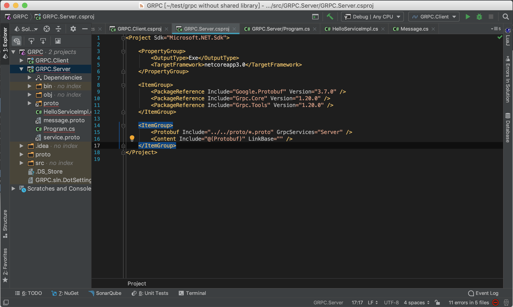
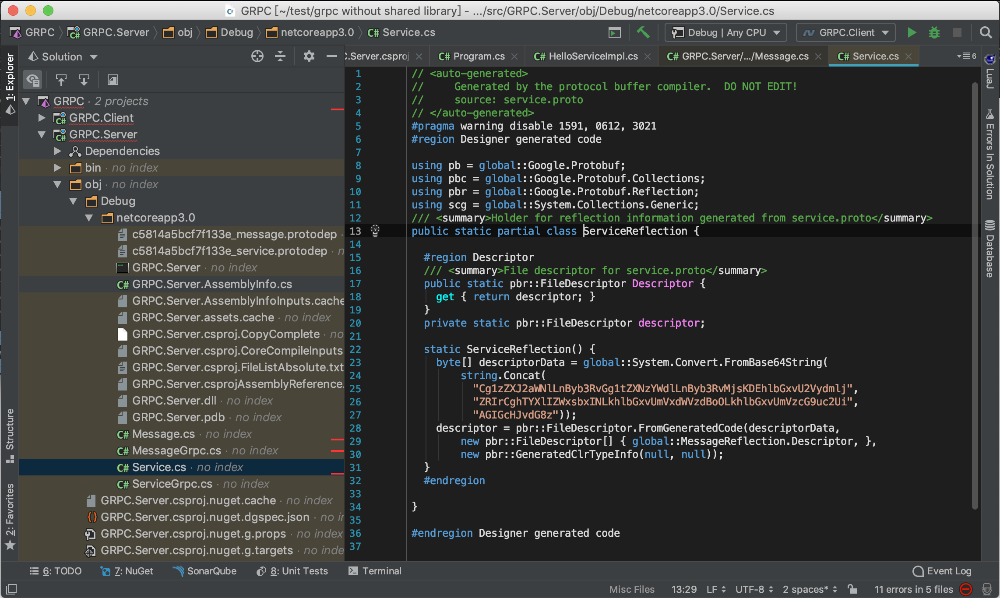
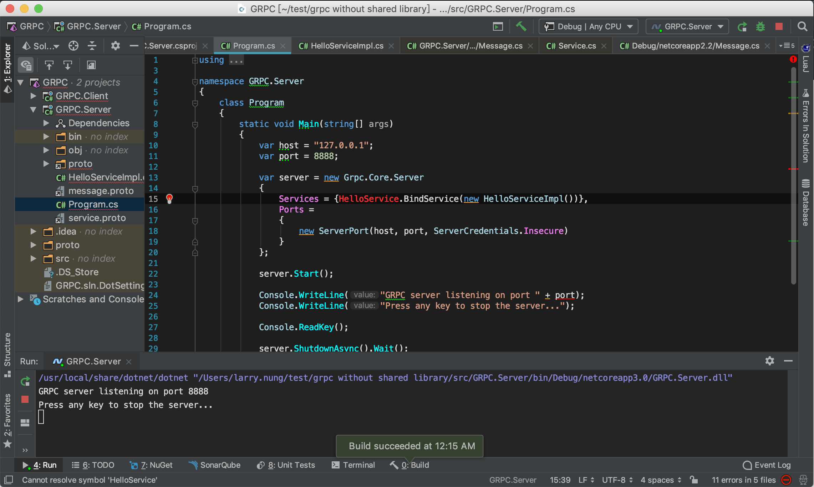

要建立 gRPC 的 Server，須先將 GRPC.Tools、GRPC.Core、Google.Protobuf 這三個 NuGet 套件加入參考。  

<!-- More -->

```C#
...
<ItemGroup>
    <PackageReference Include="Google.Protobuf" Version="3.7.0" />
    <PackageReference Include="Grpc.Core" Version="1.20.0" />
    <PackageReference Include="Grpc.Tools" Version="1.20.0" />
</ItemGroup>
...
```

<br/>


然後設定從 Proto 檔產生需要的程式部分。  

```C#
<ItemGroup>
    <Protobuf Include="../../proto/*.proto" GrpcServices="Server" />
    <Content Include="@(Protobuf)" LinkBase="" />
</ItemGroup>
```



<br/>


編譯後可在 obj 下看到產出的檔案。  



<br/>


接著開始實作 Service。

<br/>


繼承產出的 Service 基底類別。  

```C#
...
public class HelloServiceImpl:HelloService.HelloServiceBase
...
```

並覆寫該服務的方法即可。  

```C#
...
public override Task<HelloResponse> SayHello(HelloRequest request, ServerCallContext context)
{
    ...
}
...
```

<br/>


程式寫起來會像下面這樣 (這邊筆者只是簡單的將調用時送進來的人名做些加工回傳而已)：    

```C#
using System.Threading.Tasks;
using Grpc.Core;

public class HelloServiceImpl:HelloService.HelloServiceBase
{
    public override Task<HelloResponse> SayHello(HelloRequest request, ServerCallContext context)
    {
        return Task.FromResult(new HelloResponse
        {
            Name = "Hello~" + request.Name
        });
    }
}
```

<br/>


Service 實作完接著要實作 Server 的部分。  

<br/>


建立 Grpc.Core.Server 實體。

```C#
...
var server = new Grpc.Core.Server();
...
```

<br/>


指定 Service 要用哪個類別去處理。  

```C#
...
server.Services.Add(HelloService.BindService(new HelloServiceImpl()));
...
```

<br/>


指定 Server 的位置與 Port。  

```C#
...
server.Ports.Add(new ServerPort(host, port, ServerCredentials.Insecure));
...
```

<br/>


啟動 Server。  

```C#
...
server.Start();
...
```

<br/>


等待終止訊號，最後停止 Server 即可。

```C#
...
server.ShutdownAsync();
...
```

<br/>


程式寫起來會像下面這樣：  

```C#
using System;
using Grpc.Core;

namespace GRPC.Server
{
    class Program
    {
        static void Main(string[] args)
        {
            var host = "127.0.0.1";
            var port = 8888;

            var server = new Grpc.Core.Server
            {
                Services = {HelloService.BindService(new HelloServiceImpl())},
                Ports =
                {
                    new ServerPort(host, port, ServerCredentials.Insecure)
                }
            };

            server.Start();

            Console.WriteLine("GRPC server listening on port " + port);
            Console.WriteLine("Press any key to stop the server...");
            
            Console.ReadKey();

            server.ShutdownAsync().Wait();
        }
    }
}
```

<br/>


運行起來就可以提供 gRPC 的服務了。  


