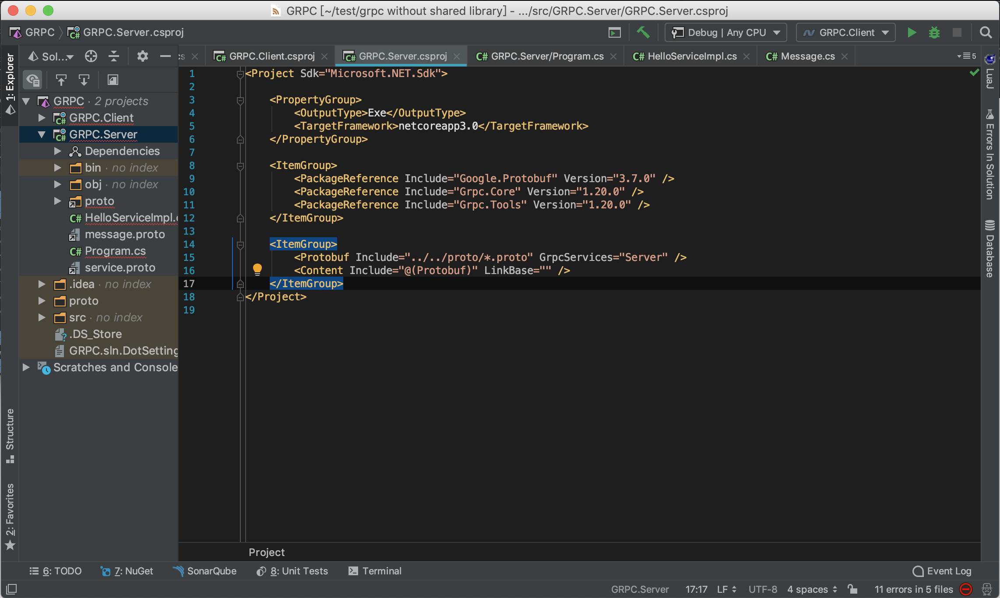
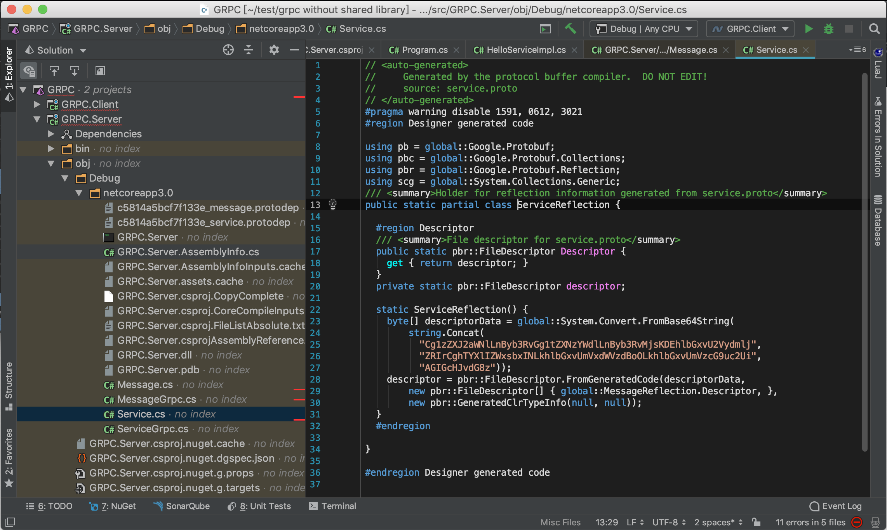
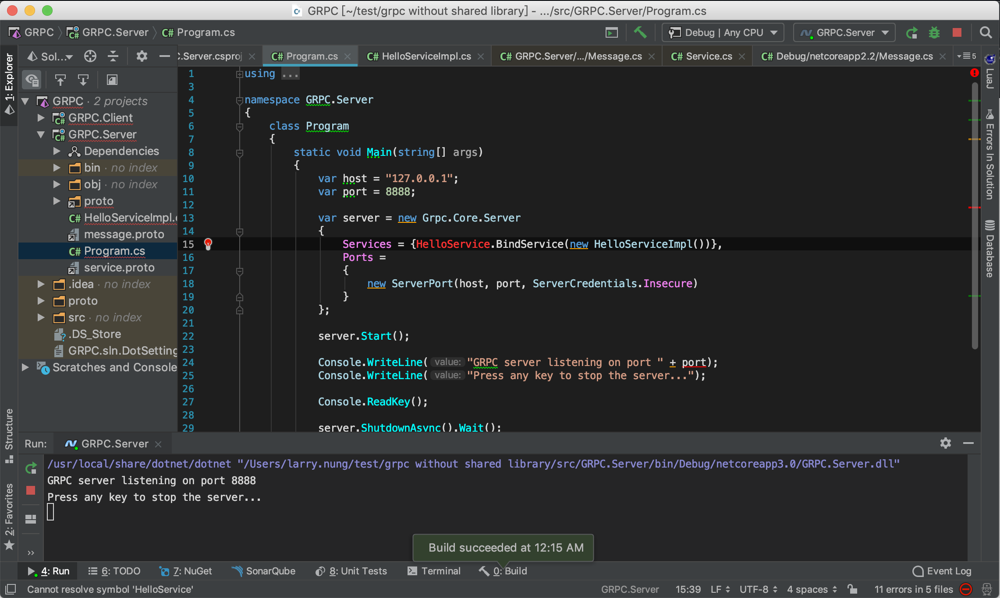

要建立 gRPC 的 Server，須先將 GRPC.Tools、GRPC.Core、Google.Protobuf 這三個 NuGet 套件加入參考。
```C#
...

...
```
然後設定從 Proto 檔產生需要的程式部分。
```C#
```


編譯後可在 obj 下看到產出的檔案。



接著開始實作 Service。

繼承產出的 Service 基底類別。
```C#
...
public class HelloServiceImpl:HelloService.HelloServiceBase
...
```
並覆寫該服務的方法即可。
```C#
...
public override Task SayHello(HelloRequest request, ServerCallContext context)
{
...
}
...
```
程式寫起來會像下面這樣 (這邊筆者只是簡單的將調用時送進來的人名做些加工回傳而已)：
```C#
using System.Threading.Tasks;
using Grpc.Core;

public class HelloServiceImpl:HelloService.HelloServiceBase
{
public override Task SayHello(HelloRequest request, ServerCallContext context)
{
return Task.FromResult(new HelloResponse
{
Name = "Hello~" + request.Name
});
}
}
```
Service 實作完接著要實作 Server 的部分。

建立 Grpc.Core.Server 實體。
```C#
...
var server = new Grpc.Core.Server();
...
```
指定 Service 要用哪個類別去處理。
```C#
...
server.Services.Add(HelloService.BindService(new HelloServiceImpl()));
...
```
指定 Server 的位置與 Port。
```C#
...
server.Ports.Add(new ServerPort(host, port, ServerCredentials.Insecure));
...
```
啟動 Server。
```C#
...
server.Start();
...
```
等待終止訊號，最後停止 Server 即可。
```C#
...
server.ShutdownAsync();
...
```
程式寫起來會像下面這樣：
```C#
using System;
using Grpc.Core;

namespace GRPC.Server
{
class Program
{
static void Main(string[] args)
{
var host = "127.0.0.1";
var port = 8888;

var server = new Grpc.Core.Server
{
Services = {HelloService.BindService(new HelloServiceImpl())},
Ports =
{
new ServerPort(host, port, ServerCredentials.Insecure)
}
};

server.Start();

Console.WriteLine("GRPC server listening on port " + port);
Console.WriteLine("Press any key to stop the server...");

Console.ReadKey();

server.ShutdownAsync().Wait();
}
}
}
```
運行起來就可以提供 gRPC 的服務了。

