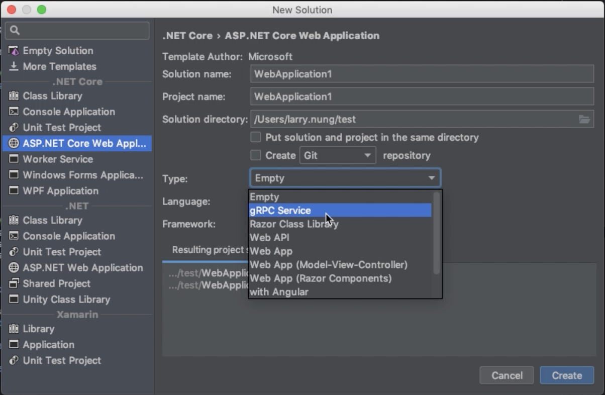
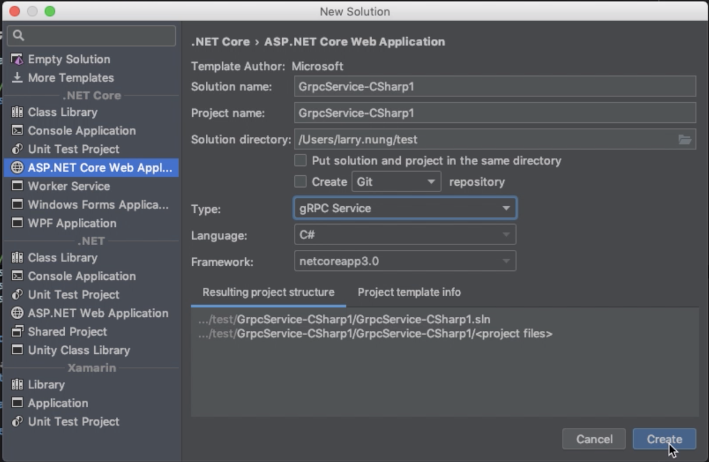
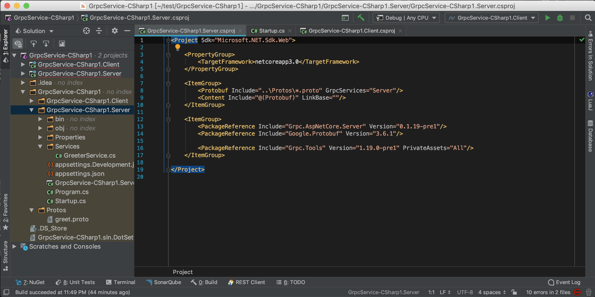
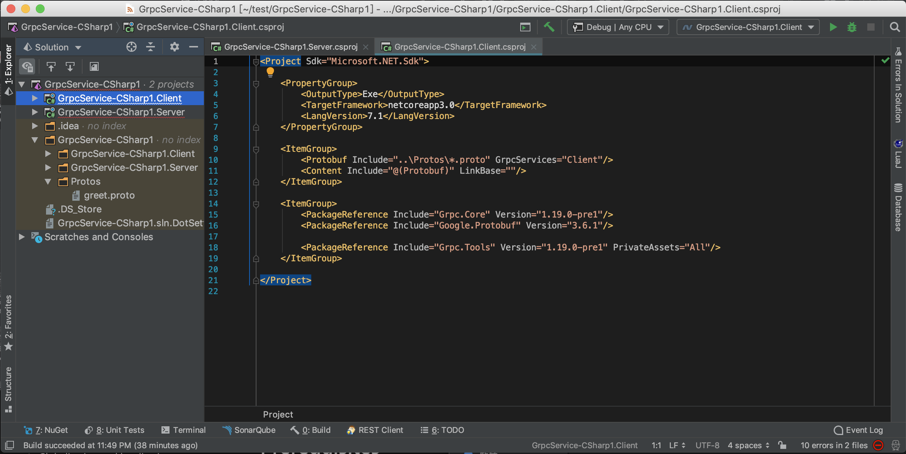
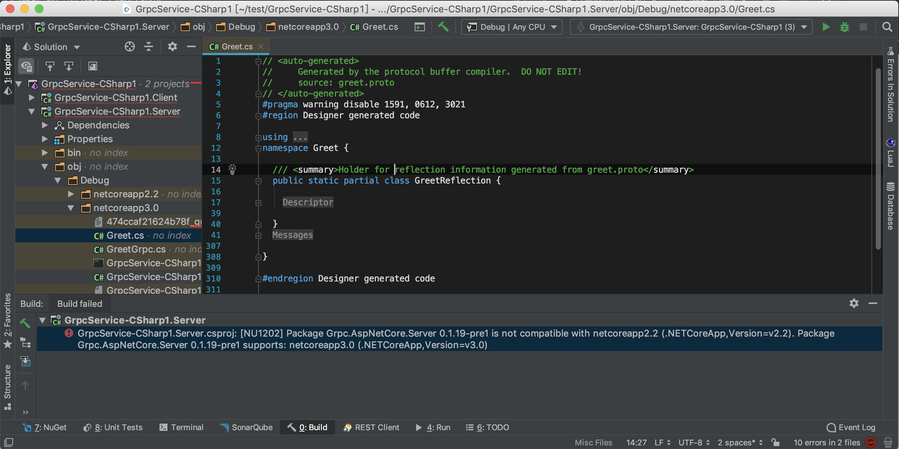
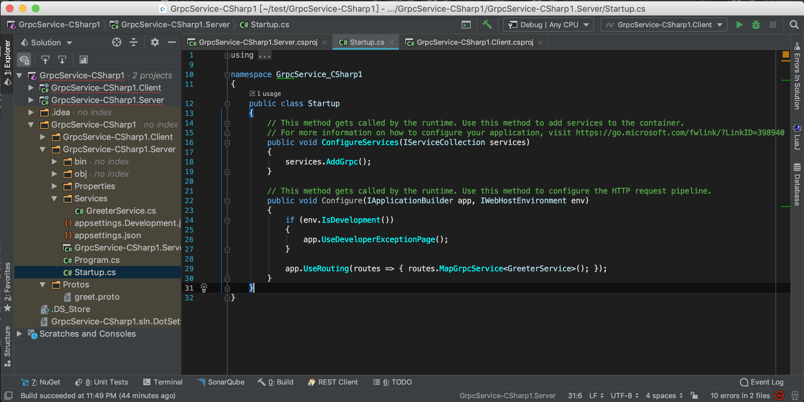
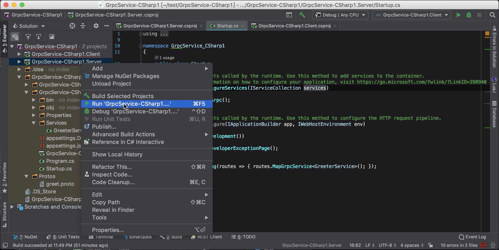
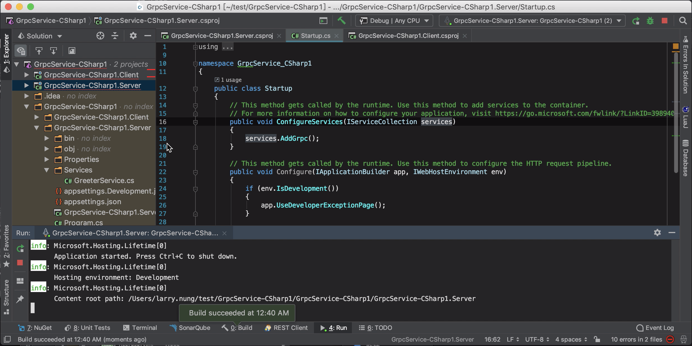
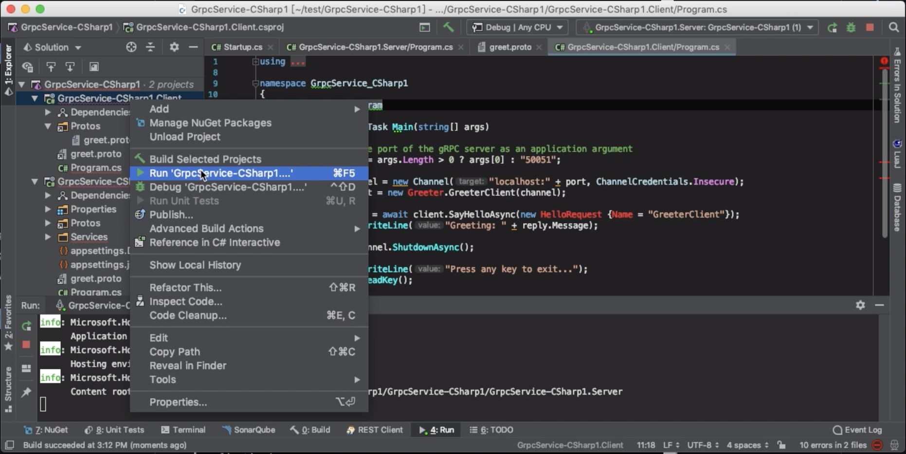
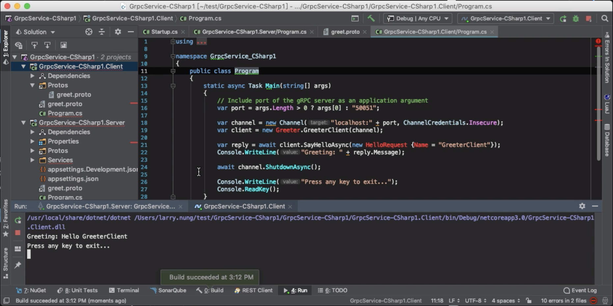

在 .NET Core 3.0 後，我們可透過 gRPC Service 範本建立方案或是專案，如果是用方案範本，除了 gRPC 的 Server 專案外，還會有 Client 的專案。

像是筆者這邊直接透過範本建立一個 gRPC 方案。





方案建立完會看到內含 Server 與 Client 兩個專案，需參考的套件以及要使用的 Proto 檔設定都已經設好了。





編譯檔案時會將 Proto 編譯成對應的程式碼，產生在 obj 下。



另外是 .NET Core 3.0 的 gRPC Service 已經被整進 ASP.NET Core 去了，只要在 Startup.cs 中的 ConfigServices 將 gRPC 服務開啟。
```C#
...
public void ConfigureServices(IServiceCollection services)
{
services.AddGrpc();
}
...
```
並設定 gRPC 服務對應的處理類別，gRPC Server 就好了。
```C#
...
public void Configure(IApplicationBuilder app, IWebHostEnvironment env)
{
    ...
    app.UseRouting(routes => { routes.MapGrpcService<GreeterService>(); });
}
...
```
這邊範本也都設定好了。



如果有需要可修改 Proto 檔及對應的 Service 類別實作。

最後運行起來就可以看到 gRPC 正常的在運作。









Link
----
* [gRPC services with ASP.NET Core | Microsoft Docs](https://docs.microsoft.com/en-us/aspnet/core/grpc/aspnetcore?view=aspnetcore-3.0&tabs=visual-studio)
* [Tutorial: Get started with gRPC in ASP.NET Core | Microsoft Docs](https://docs.microsoft.com/en-us/aspnet/core/tutorials/grpc/grpc-start?view=aspnetcore-3.0&tabs=visual-studio)
* [Tutorial: Create a .NET Core gRPC client | Microsoft Docs](https://docs.microsoft.com/en-us/aspnet/core/tutorials/grpc/grpc-client?view=aspnetcore-3.0&tabs=visual-studio)