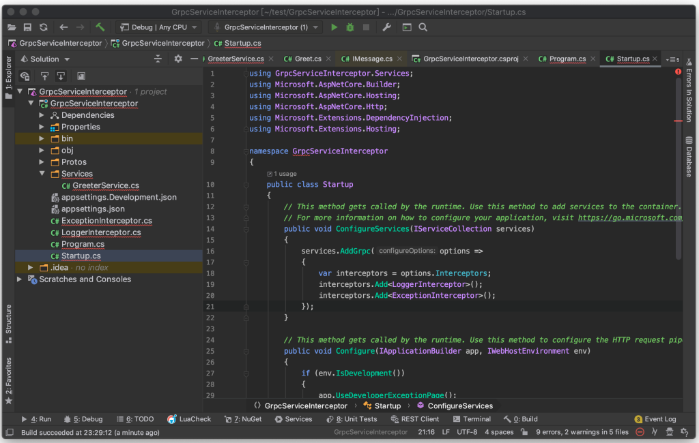
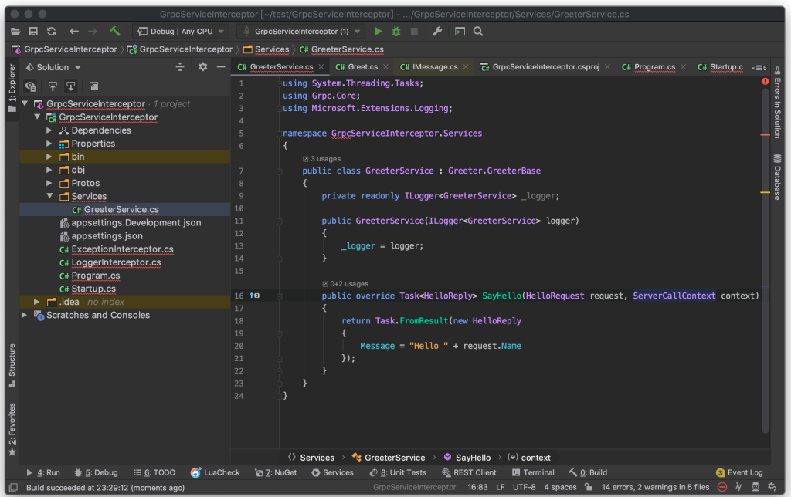
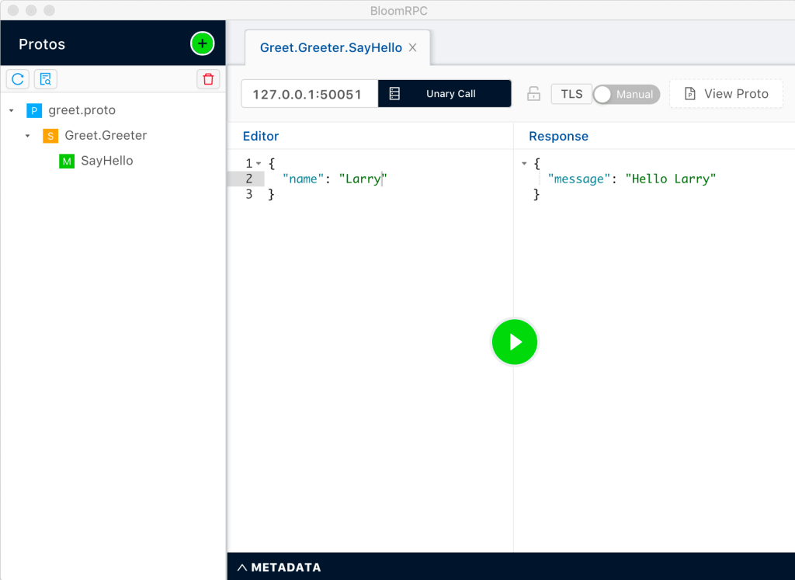
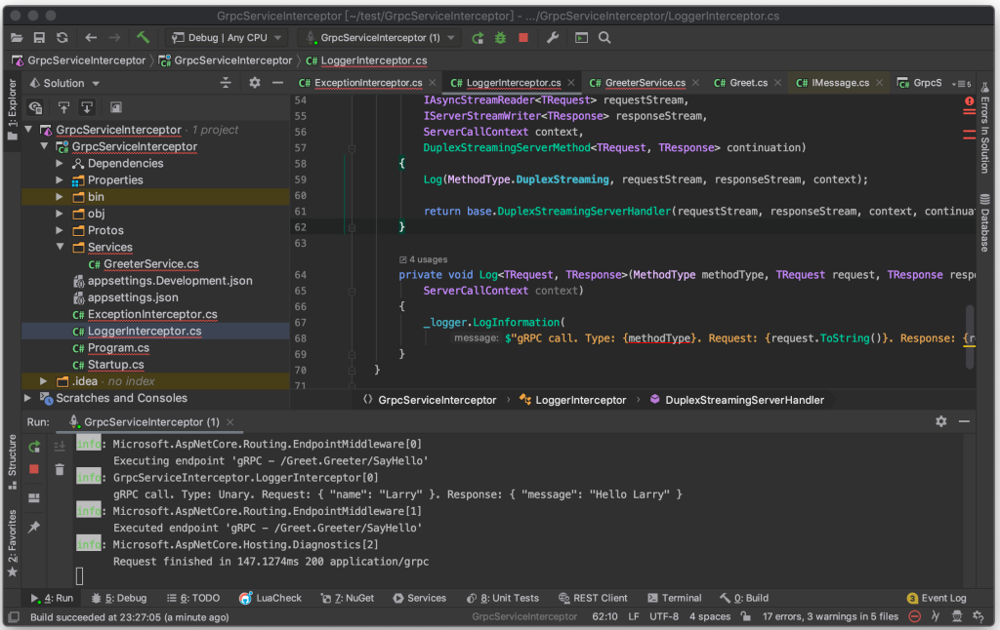

要紀錄每次 gRPC 的呼叫，可以使用 gRPC interceptor 來做。

建立一個 Interceptor 類別繼承自 gRPC 的 Interceptor，建立個建構子允許注入 Logger，接著覆寫掉會用到的方法，像是 UnaryServerHandler，然後在內部將要記錄的資訊透過 Logger 寫入 Log 即可。

像是下面這邊筆者實作了一個 Interceptor，希望能紀錄每次 gRPC 的調用。
```c#
using System.Linq;
using System.Text.Json.Serialization;
using System.Threading.Tasks;
using Grpc.Core;
using Grpc.Core.Interceptors;
using Microsoft.Extensions.Logging;
using Newtonsoft.Json;

namespace GrpcServiceInterceptor
{
public class LoggerInterceptor : Interceptor
{
private readonly ILogger _logger;

public LoggerInterceptor(ILogger logger)
{
_logger = logger;
}

public override async Task UnaryServerHandler(
TRequest request,
ServerCallContext context,
UnaryServerMethod continuation)
{
var response = await base.UnaryServerHandler(request, context, continuation);
Log(MethodType.Unary, request, response, context);

return response;
}

public override async Task ClientStreamingServerHandler(
IAsyncStreamReader requestStream,
ServerCallContext context,
ClientStreamingServerMethod continuation)
{
var response = await base.ClientStreamingServerHandler(requestStream, context, continuation);
Log(MethodType.ClientStreaming, requestStream, response, context);

return response;
}

public override Task ServerStreamingServerHandler(
TRequest request,
IServerStreamWriter responseStream,
ServerCallContext context,
ServerStreamingServerMethod continuation)
{
Log(MethodType.ServerStreaming, request, responseStream, context);

return base.ServerStreamingServerHandler(request, responseStream, context, continuation);
}

public override Task DuplexStreamingServerHandler(
IAsyncStreamReader requestStream,
IServerStreamWriter responseStream,
ServerCallContext context,
DuplexStreamingServerMethod continuation)
{
Log(MethodType.DuplexStreaming, requestStream, responseStream, context);

return base.DuplexStreamingServerHandler(requestStream, responseStream, context, continuation);
}

private void Log(MethodType methodType, TRequest request, TResponse response,
ServerCallContext context)
{
_logger.LogInformation(
$"gRPC call. Type: {methodType}. Request: {request.ToString()}. Response: {response.ToString()}");
}
}
}
```
Interceptor 寫好後掛載進去。
```c#
...
public class Startup
{
public void ConfigureServices(IServiceCollection services)
{
services.AddGrpc(options =>
{
var interceptors = options.Interceptors;
interceptors.Add();
...
});
}
...
}
...
```


準備用來測試的程式，這邊筆者只是很單純的將請求加工後回傳。



運行起來實際去調用 gRPC。



gRPC 的調用就會確實的被記錄下來。

