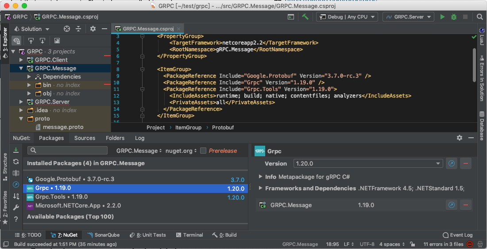
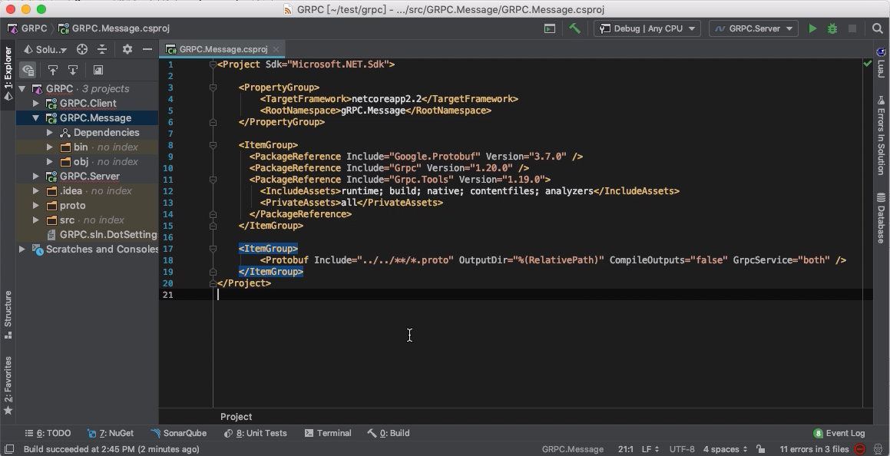
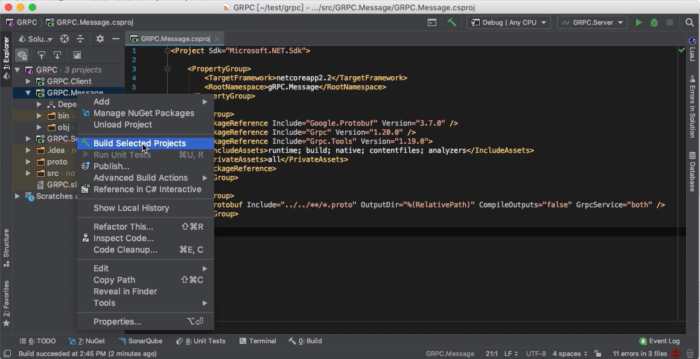
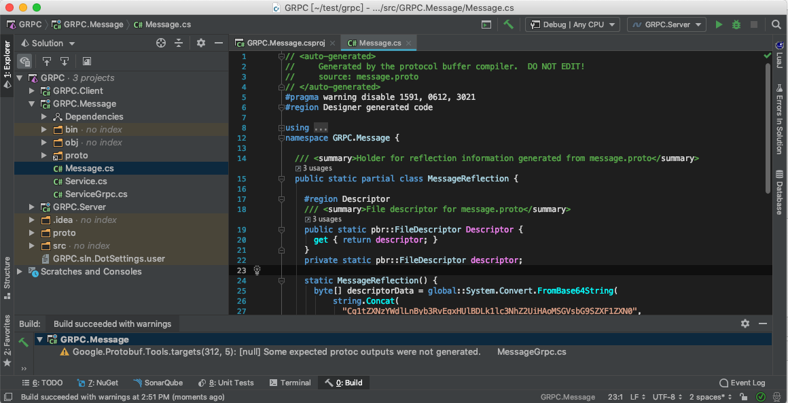

Grpc.Tools 在 1.17 後我們可以將 proto 檔的編譯動作直接整到 dotnet build。使用上只要在專案檔中加上 <Protobuf> 設定即可。    

<!-- More -->

<br/>


像是筆者這邊準備了一個 GRPC.Message 專案。加入 Grpc/Grpc.Tools/Google.Protobuf NuGet 套件參考。  



<br/>


proto 檔放在上上層的 proto 目錄下。  

```
.
|___ proto
|  |___ message.proto
|  |___ service.proto
|___ src
   |___ GRPC.Message
```

<br/>


那在 GRPC.Message 的專案檔中可以像下面這樣加入 <Protobuf> 設定，會用 Include 指定 proto 檔、ProtoRoot 指定 proto 檔中 import 語法的參考位置、OutputDir 指定輸出位置、GrpcService 指定要編譯 gRPC 的 server 還是 client...等。  

```xml
...
<ItemGroup>
    <Protobuf Include="../../**/*.proto" OutputDir="%(RelativePath)" CompileOutputs="false" GrpcService="both" />
</ItemGroup>
...
```



<br/>


像是如果只要產生 Server 需要使用的類別就可以像這樣設定。  

```C#
...
<ItemGroup>
    <Protobuf Include="../../proto/*.proto" GrpcServices="Server" />
</ItemGroup>
...
```

<br/>


如果只要產生 Client 需要使用的類別就可以像這樣設定。  

```C#
...
<ItemGroup>
    <Protobuf Include="../../proto/*.proto" GrpcServices="Client" />
</ItemGroup>
...
```

<br/>


設定可參閱：  

| Name | Default | Value | Synopsis |
|:-----:|:-----:|:-----:|:-----:|
| Access | public | public, internal | Generated class access |
| ProtoCompile | true | true, false | Pass files to protoc? |
| ProtoRoot |  |  | Common root for set of files |
| CompileOutputs | true | true, false | C#-compile generated files? |
| OutputDir | | | Directory for generated C# files |
| GrpcOutputDir | | | Directory for generated stubs |
| GrpcServices | both | none, client, server, both | Generated gRPC stubs |

<br/>


設定好後建置專案。  



<br/>


proto 檔就會被編譯成對應的程式碼。  



<br/>


Link
----
* [Protocol Buffers/gRPC Integration Into .NET Build](https://chromium.googlesource.com/external/github.com/grpc/grpc/+/HEAD/src/csharp/BUILD-INTEGRATION.md)
