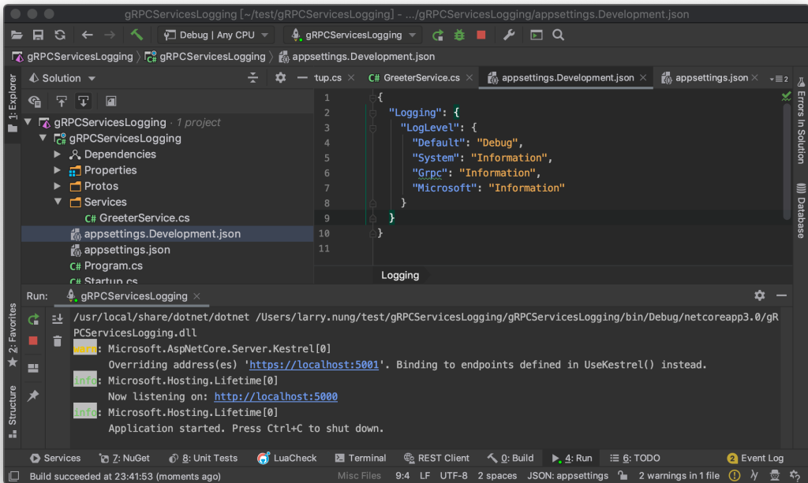
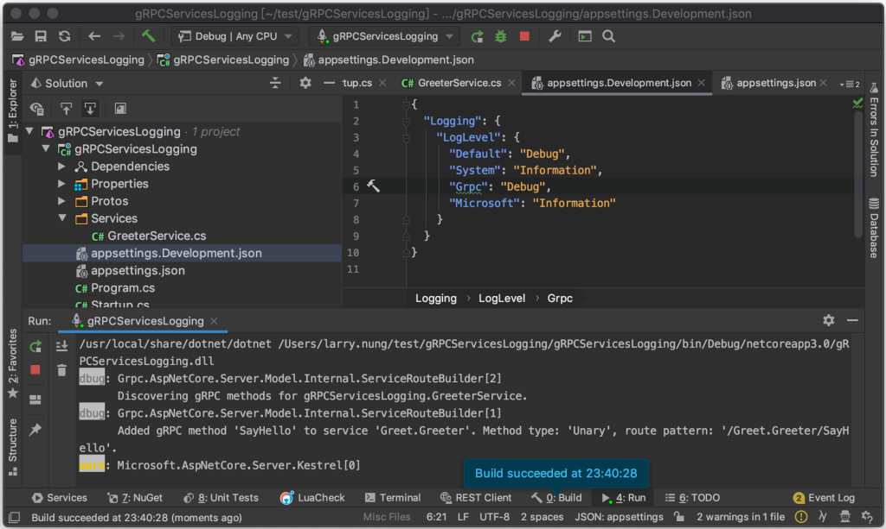
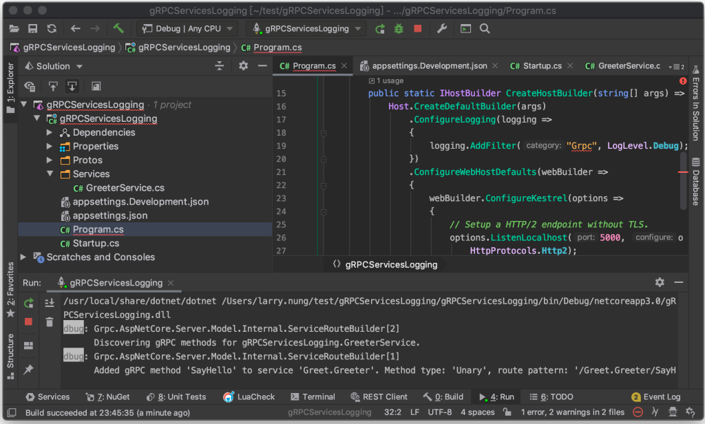
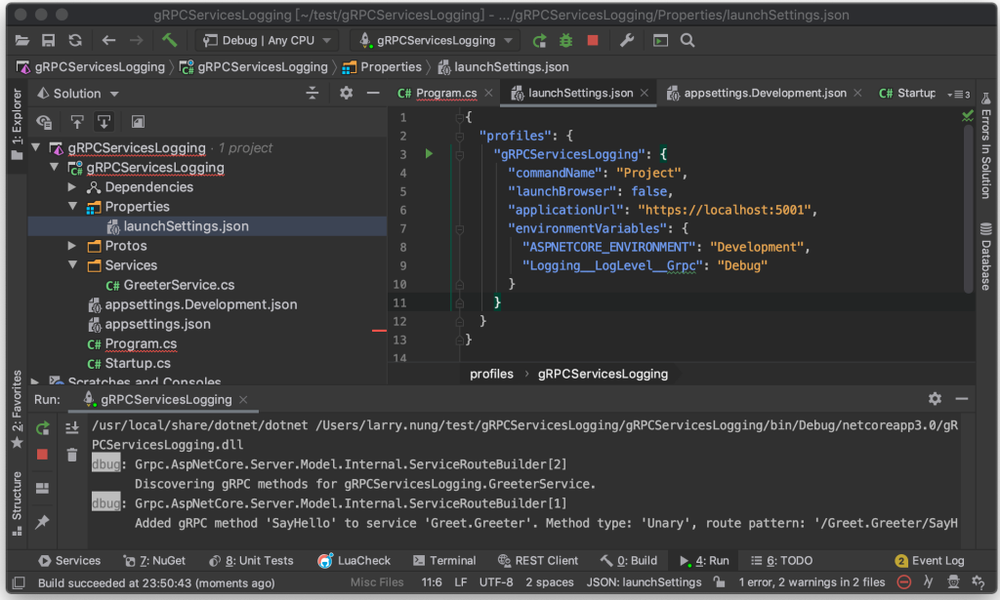

gRPC Service 內建的 log 可透過 appsettings.json 控制 log 層級。  

<!-- More -->

</br>


預設為 Information 層級。  

```json
{
  "Logging": {
    "LogLevel": {
      "Default": "Debug",
      "System": "Information",
      "Grpc": "Information",
      "Microsoft": "Information"
    }
  }
}
```

</br>


所以 gRPC service 運行起來會看到 Info 或是 Warn 層級的 Log 輸出。



</br>


若是調整為 Debug 層級，可看到像是哪個 gRPC method 被調用，以及是哪個 Method type 這樣的細部資訊。  



</br>


除了用 appsettings.json 設定，也可以在建立 HostBuilder 時設定。  

```c#
...
    public class Program
    {
        ...
        public static IHostBuilder CreateHostBuilder(string[] args) =>
            Host.CreateDefaultBuilder(args)
                .ConfigureLogging(logging =>
                {
                    logging.AddFilter("Grpc", LogLevel.Debug);
                })
                .ConfigureWebHostDefaults(webBuilder =>
                {
                    webBuilder.ConfigureKestrel(options =>
                    {
                        // Setup a HTTP/2 endpoint without TLS.
                        options.ListenLocalhost(5000, o => o.Protocols =
                            HttpProtocols.Http2);
                    });
                    webBuilder.UseStartup<Startup>();
                });
    }
...
```



</br>


或是透過 Logging__LogLevel__Grpc 環境變數設定也可以。  

```json
{
  "profiles": {
    "gRPCServicesLogging": {
      "commandName": "Project",
      "launchBrowser": false,
      "applicationUrl": "https://localhost:5001",
      "environmentVariables": {
        "ASPNETCORE_ENVIRONMENT": "Development",
        "Logging__LogLevel__Grpc": "Debug"
      }
    }
  }
}
```


