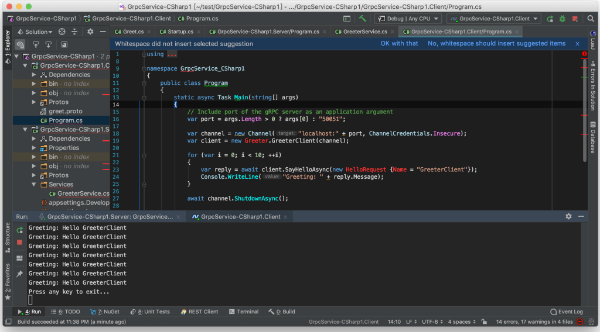
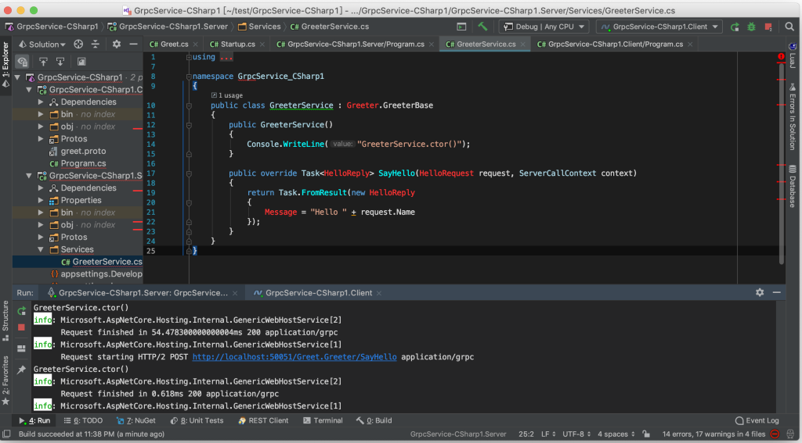
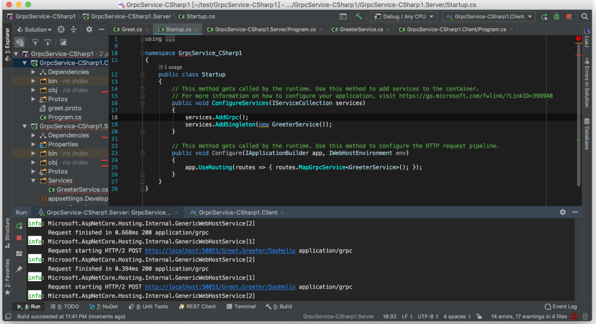

ASP.NET Core 的 gRPC service 預設是沒有 Singleton 的，所以如果今天 gRPC client 發送多次訊息給 gRPC server。  

<!-- More -->



<br/>


gRPC server 會建多次 gRPC service 實體。  



<br/>


為避免這樣的情況，可在 Startup 的 ConfigureServices 內透過 services.AddSingleton 將 Service 的實體帶入。  

```c#
...
public class Startup
{
    public void ConfigureServices(IServiceCollection services)
    {
        ...
        services.AddGrpc();
	services.AddSingleton(service);
        ...
    }
   ...
}
```

<br/>


gRPC server 就只會用指定的 gRPC service 實體去做事。  


