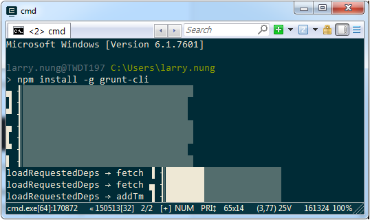
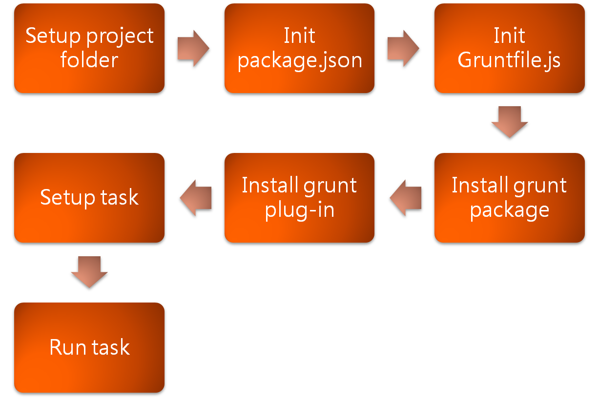

使用 Grunt 前需先確定環境是否已經安裝了 Node.js 與 grunt-cli。

npm install grunt-cli -g

環境安裝無誤就可以開始使用 Grunt，使用上大致分為下列幾個步驟：

以 Windows 的操作為例，首先需要有專案目錄。

md

接著需要建立 npm 套件的設定檔。

npm init

再來要建立 Grunt 設定檔。

type NUL > Gruntfile.js

加入 Grunt 套件。

npm install grunt --save-dev

加入 Grunt plug-in。

npm install  --save-dev

開啟 Grunt 設定檔設定 Grunt task。

notepad gruntfile.js

運行 Grunt task。

grunt