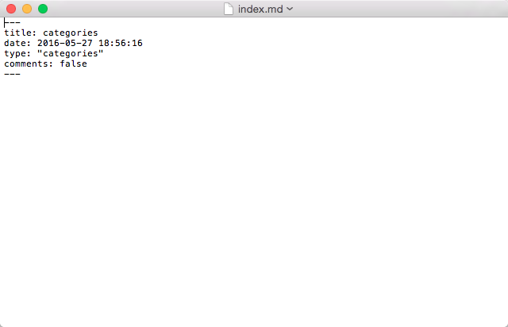

要為 Hexo 部落格建立分類頁面，首先要建立 categories 的頁面。  

<!-- More -->

    hexo n page categories

 

開啟剛產生的分類頁面，設定 type 為 categories。如果不希望能在分類頁面上留言的話，這邊也可以順便將 comments 為 false。  

 

再來開啟 Hexo 的設定檔，確定 default_category/category_map 設定是否需要更動。  

 

並在文章上方設定 categories，指定文章的分類。  

 

將服務運行起來就可以在 `/categories` 看到分類頁面了。  

 

Link
