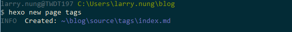
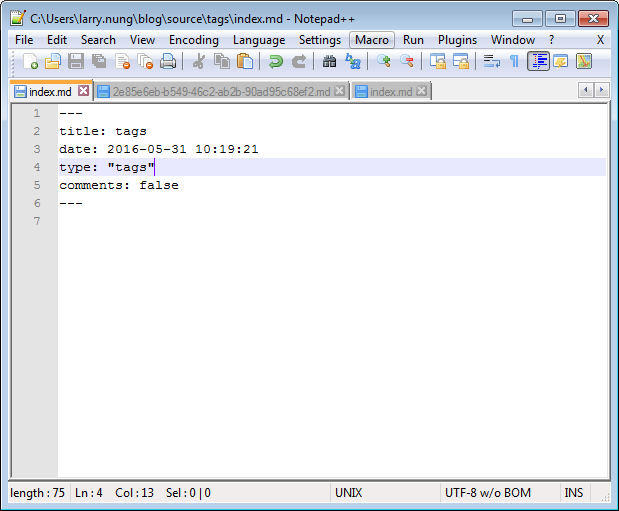
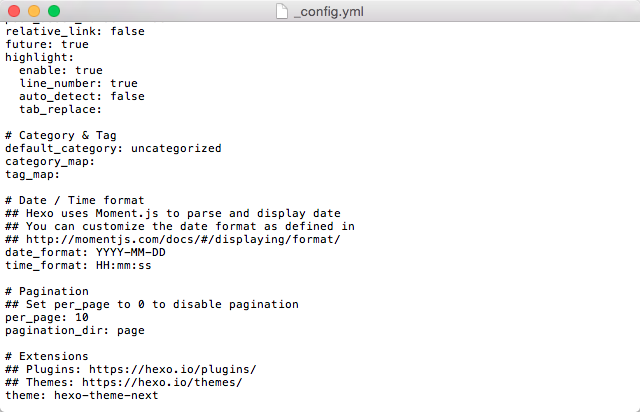
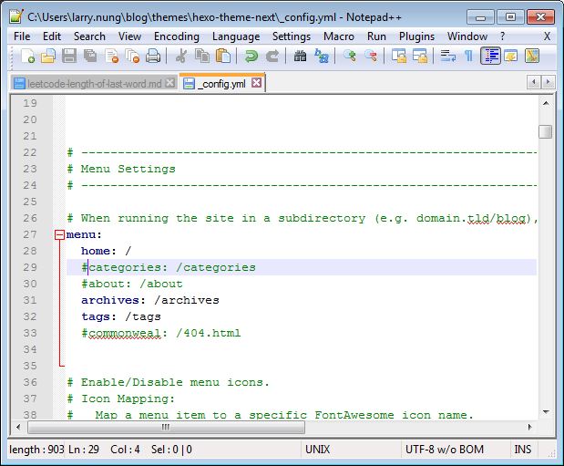
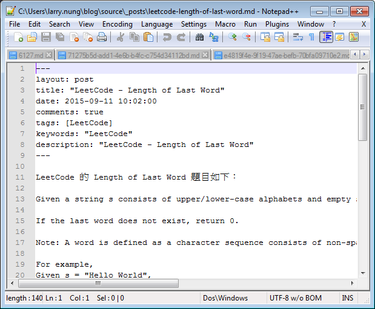
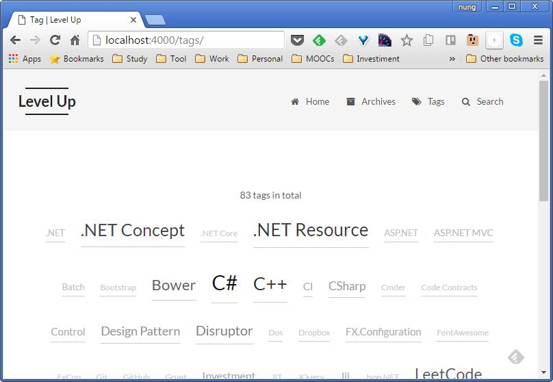

要為 Hexo 部落格建立標籤頁面，首先要建立 tag 的頁面。  

<!-- More -->

    hexo n page tags

 

開啟剛產生的標籤頁面，設定 type 為 tags。如果不希望能在標籤頁面上留言的話，這邊也可以順便將 comments 為 false。

 

再來開啟 Hexo 的設定檔，確定 tag_map 設定是否需要更動。

 

如果 theme 有支援設定，這邊也要確認是否有需要更動，像是是否要加選單之類的。  

 

並在文章上方設定 tags，指定文章的分類。  

 

將服務運行起來就可以在 /tags 看到標籤頁面了。

 
