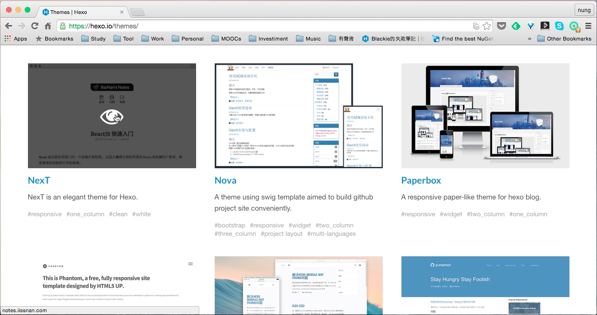
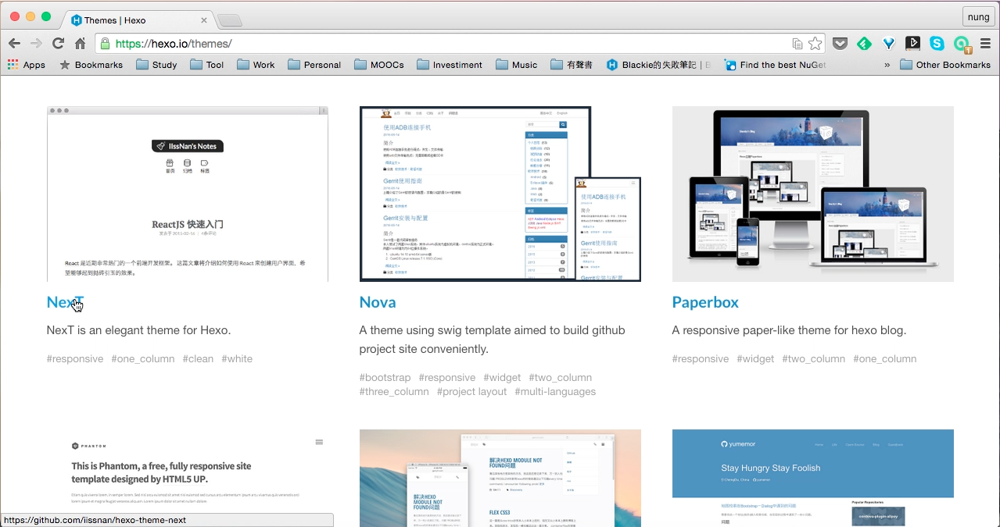
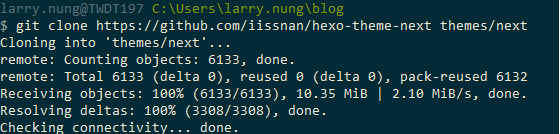
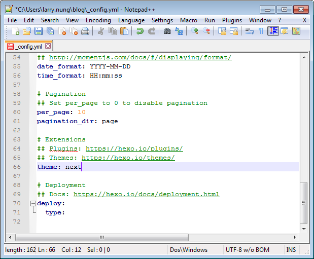
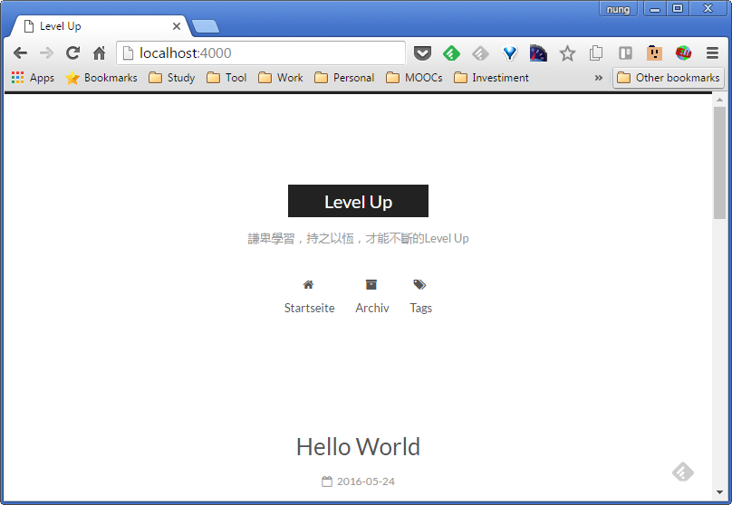

Hexo 支援主題的更換，[Themes | Hexo](https://hexo.io/themes/) 網站上也提供許多不同的主題可供我們選用，看到有興趣的主題可以直接點擊主題的圖片開啟 Demo Site 瀏覽。    

<!-- More -->

 

若確定選用該主題，可以點選圖片下方主題的名字連結到下載頁面。  

 

以筆者用的 Next 主題為例，我們可以直接用 GitHub 下載 Zip 檔，或是用 Git Clone 將主題下載下來。這邊只要將下載下來的主題放置在 themes 目錄下就可以了。    

 

接著開啟 Hexo 的設定檔，將 theme 設定指到剛下載的主題目錄。  

 

主題套用就完成了。  

 

Link
