要使用 Travis CI 自動幫我們發佈 Hexo 部落格，先參閱筆者 [Travis CI - Free Hosted Continuous Integration Platform for the Open Source Community | Level Up](http://larrynung.github.io/2014/01/01/travis-ci-free-hosted-continuous-integration-platform-for-the-open-source-community/) 這篇，登入 Travis CI ，給予授權，並為 Repository 啟用 Travis CI。  

<!-- More -->


<br/>


接著要準備一組 Personal access token 給 Travis CI。先將 GitHub 的 Settings 開啟。  

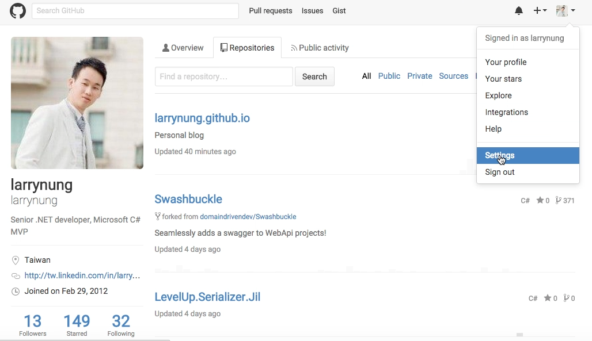

<br/>


切到 Personal access tokens 頁面。  

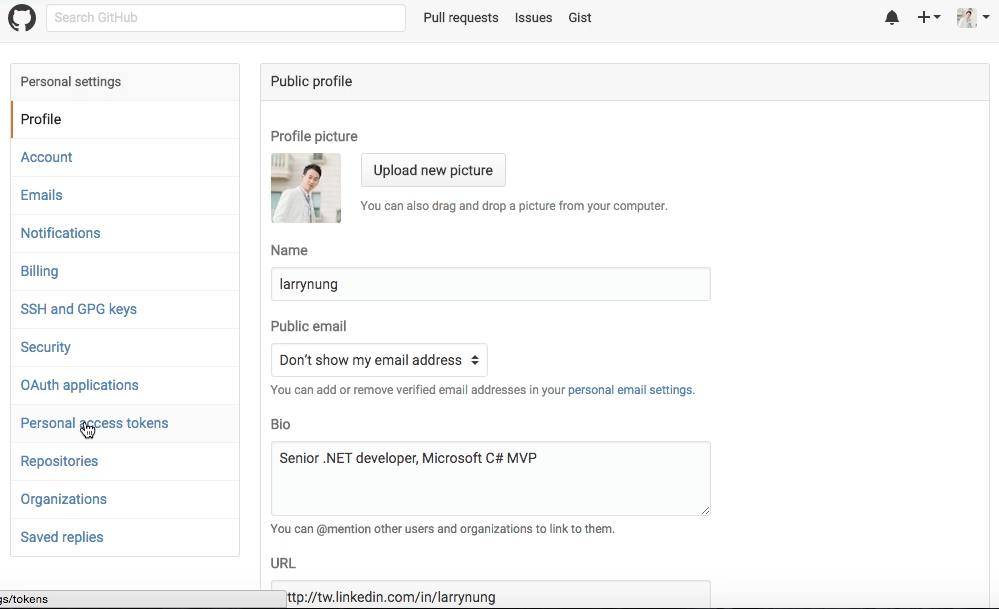

<br/>


按下 Generate new token 按鈕建立一組 token。  

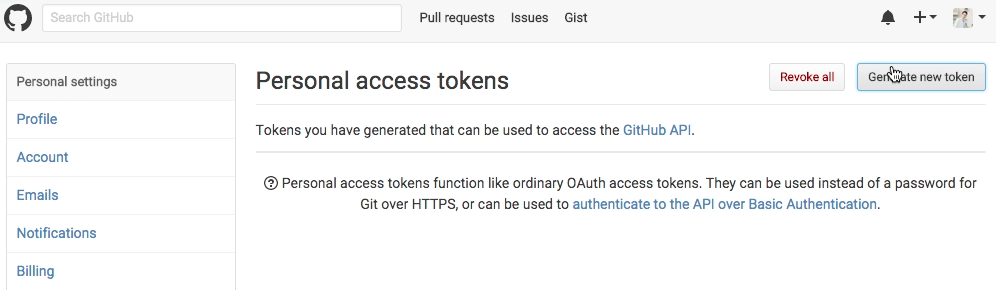

<br/>


為這組 Token 設定一個名稱，並給予它 repo 的權限。  

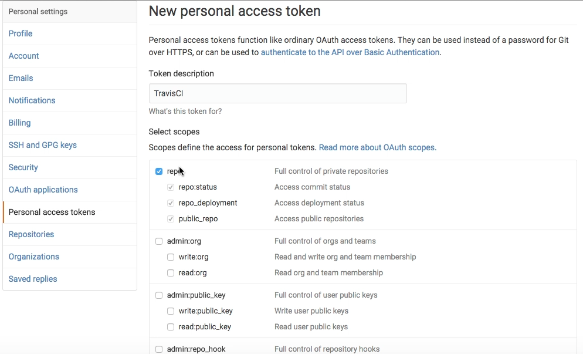

<br/>


Token 產生後複製留存以供後續使用。  

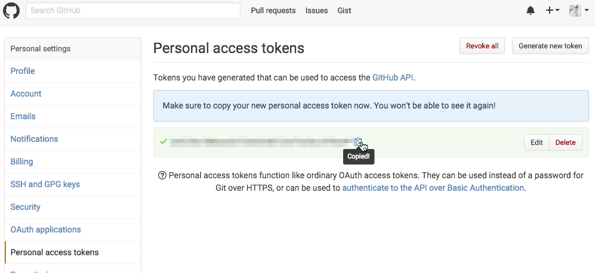

<br/>


再來要準備 Travis CI 的設定檔 .travis.yml，放置於 Repository 的根目錄，內容大概像這樣 (branches 位置、使用者名稱、與電子郵件位置請自行替換)：    

```yml
language: node_js
node_js:
- '0.12'
branches:
  only:
  - hexo
before_install:
- npm install -g hexo-cli
install:
- npm install
script:
- hexo clean
- hexo generate
after_success:
- git config --global user.name "<Name>"
- git config --global user.email "<Email>"
- sed -i'' "/^ *repo/s~github\.com~${GH_TOKEN}@github.com~" _config.yml
- hexo deploy
```

<br/>


再安裝 travis 命令列工具 (官方提供的命令列工具是 Ruby 的版本，如果是 Windows 用戶需加裝 [RubyInstaller for Windows](http://rubyinstaller.org/)，然後用 Start Command Prompt with Ruby 進行下列操作)。  

    gem install travis

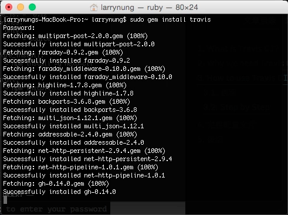

<br/>


安裝完後查閱命令列工具版本以確定安裝無誤。  

    travis version


<br/>


使用命令列工具登入 GitHub 帳號。  

    travis login

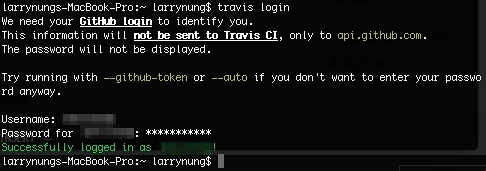

<br/>


使用命令列工具將剛產生出來的 Token 加密並寫入 Travis CI 設定檔。  

    travis encrypt 'GH_TOKEN=<TOKEN>' --add


<br/>


寫入後的設定檔會變得像下面這樣：  

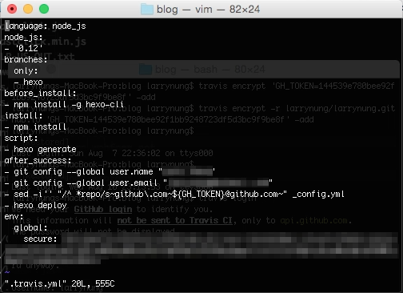

<br/>


將設定檔 Commit 回 Repository。  

    git add .
    git commit -a -m "Add .travis.yml"
    git push origin <branch>

<br/>


這樣每當我們將部落格文章 Commit 回 Repository 時，Travis CI 就會自動開始進行發佈的動作。  

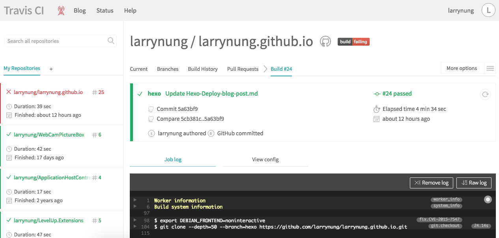

<br/>


注意到這邊，這樣的設定 Travis CI 也會嘗試建置 master branch，可透過設定讓他只建置有放 .travis.yml 檔的 branch。  

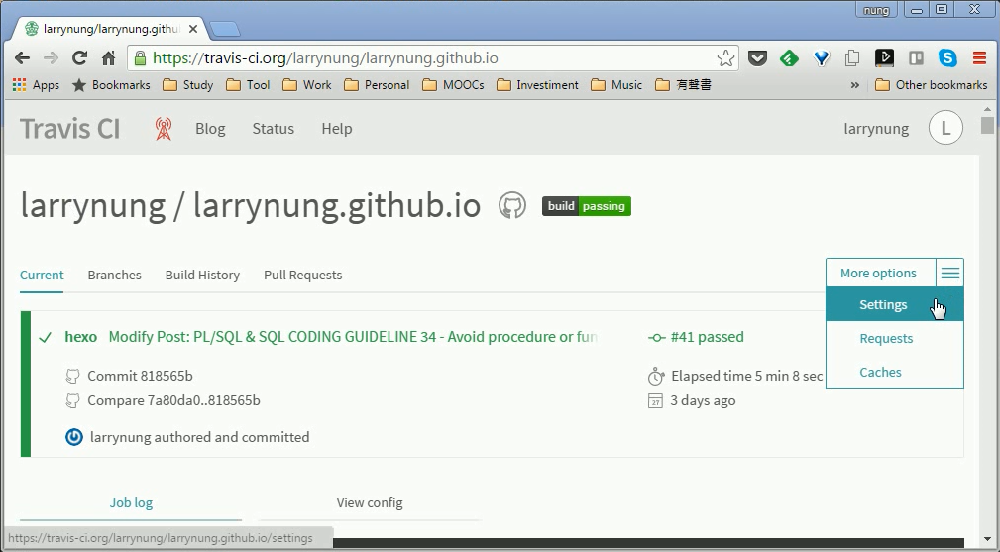

<br/>


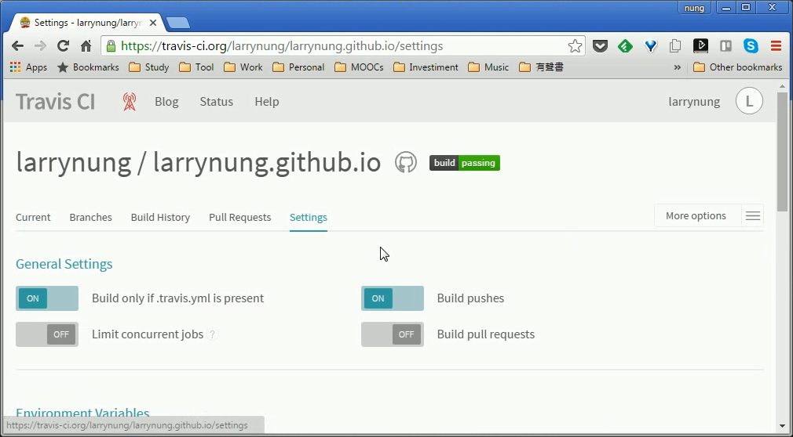

<br/>


Link
----
* [Travis CI - Free Hosted Continuous Integration Platform for the Open Source Community | Level Up](http://larrynung.github.io/2014/01/01/travis-ci-free-hosted-continuous-integration-platform-for-the-open-source-community/)
* [Hexo 自动部署到 Github | 三点水](http://lotabout.me/2016/Hexo-Auto-Deploy-to-Github/)
