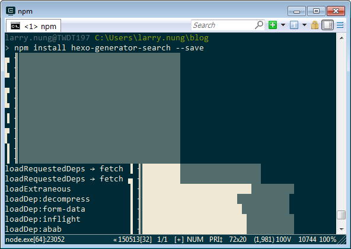
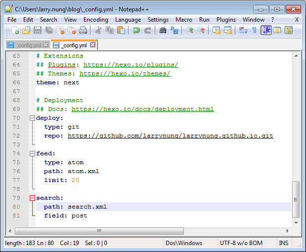
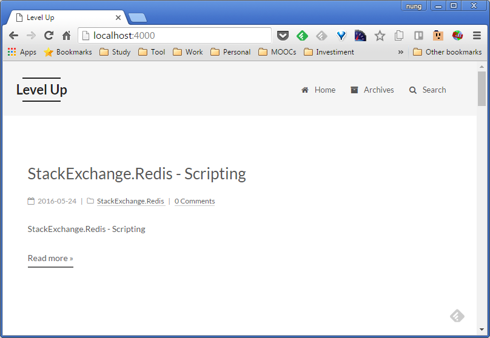
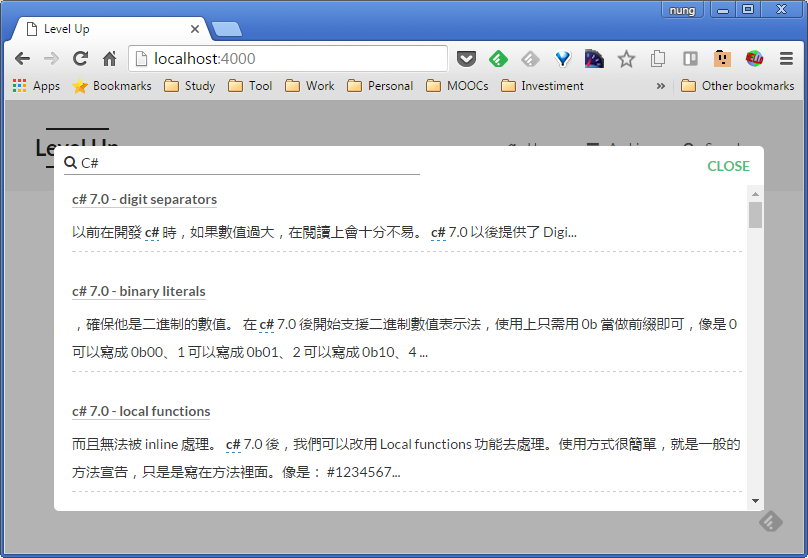

要為 Hexo 架設的部落格加上搜尋，但卻不想依賴外部服務，可以為 Hexo 部落格加裝 [hexo-generator-search](https://github.com/PaicHyperionDev/hexo-generator-search) 套件。  

<!-- More -->

    npm install hexo-generator-search --save

 

套件安裝完需開啟 Hexo 的設定檔，加上 search 的設定。path 的部分指到的是該套件產生的索引檔案，也就是 search.xml，field 則是指定搜尋的範圍，可帶入 post/page/all。  

    search:
      path: search.xml
      field: post

 

如果使用的主題支援的話，設完後將服務跑起就可以開始使用搜尋的功能。  

 

 

Link
