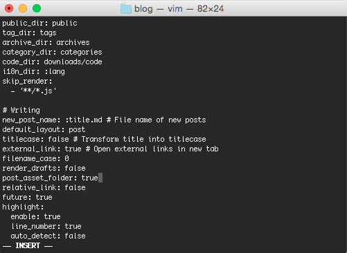
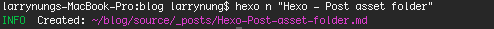
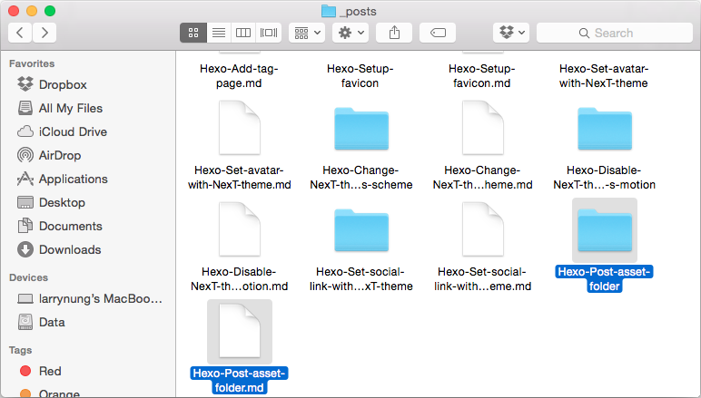
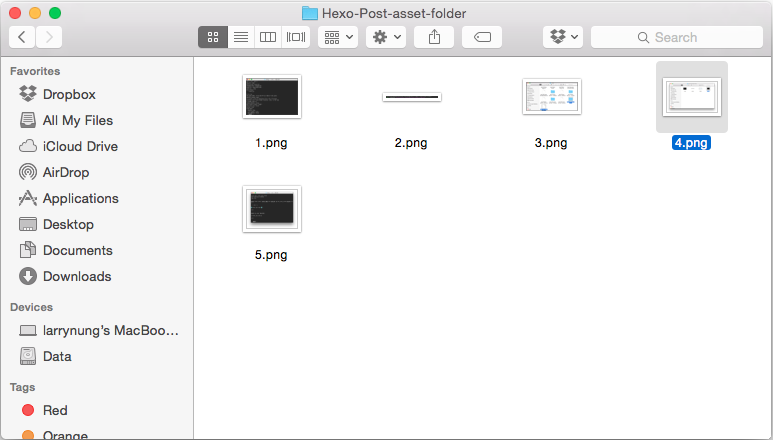
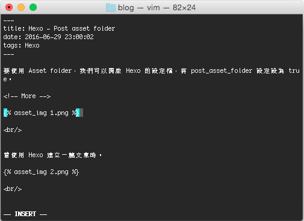

要使用 Asset folder，我們可以開啟 Hexo 的設定檔，將 post_asset_folder 設定設為 true。

當使用 Hexo 建立一篇文章時。

就會連帶幫我們建一個與文章同名的 Asset folder。

我們可以將文章以外所有的檔案放置在這目錄下，然後使用下列語法將之引用。





像是這邊筆者將圖片放置在 Asset folder 內。

在文章中使用就會像下面這樣：

Link
----
* [資產資料夾 | Hexo](https://hexo.io/zh-tw/docs/asset-folders.html)