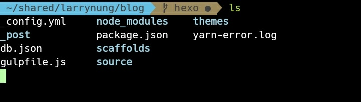
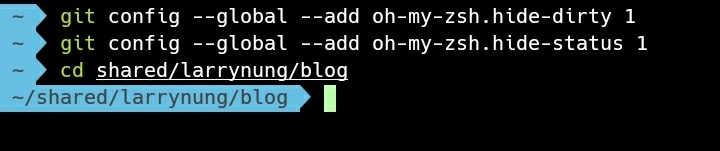

oh-my-zsh 切換到 Git 版控目錄，若操作上十分緩慢，命令送出後會卡住很久才回應。

<!-- More -->

 

可以調用下列命令，將 oh-my-zsh 的 git 資訊隱藏:

    git config --global --add oh-my-zsh.hide-dirty 1
    git config --global --add oh-my-zsh.hide-status 1

 

速度就會快非常多。
