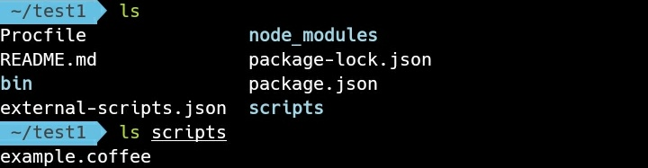
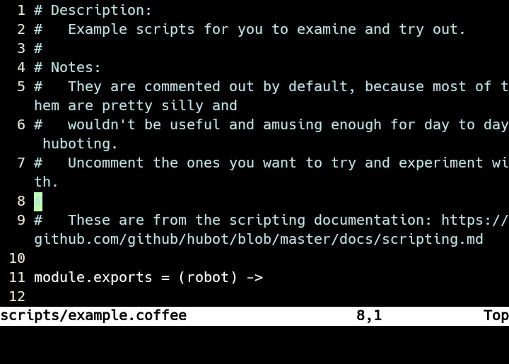
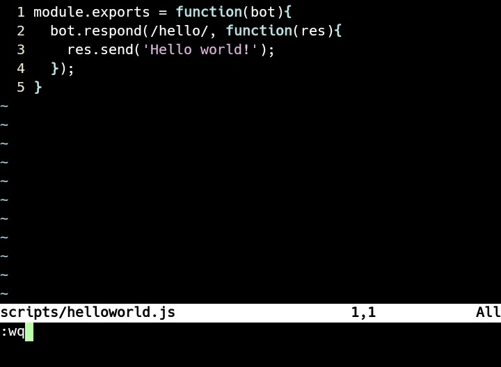

Hubot scripting 支援 Coffee script 與 Javascript，script 放置於 scripts 目錄下， 內含範本 example.coffee 可以參閱。





在 scripts 目錄內建立 script 檔，像是筆者這邊就準備了一個簡單的 script，當監聽到 hello 就會回應 Hello world!。

```
module.exports = function(bot){
bot.respond(/hello/, function(res){
res.send('Hello world!');
});
}
```



將 Hubot 運行起來即可正常運作。


Link
----
* [Scripting](https://hubot.github.com/docs/scripting/)