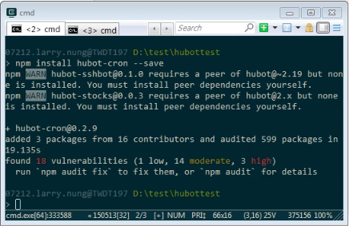
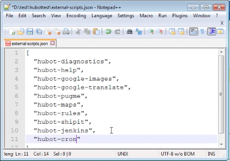
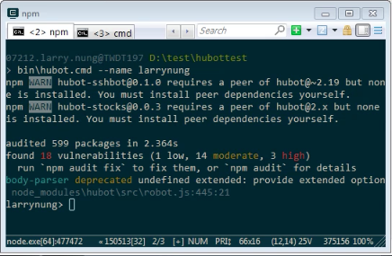
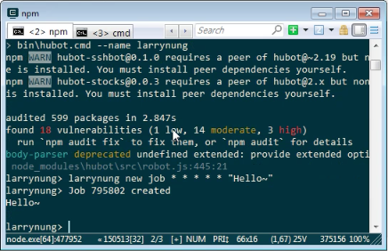
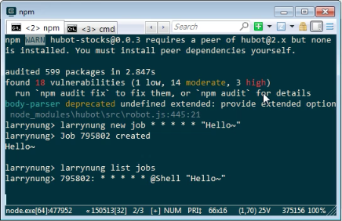
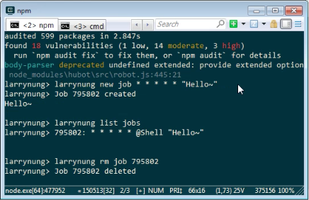

要讓 Hubot 支援排程發送訊息，可以安裝 hubot-cron 套件。

npm install hubot-cron --save

然後在 external-scripts.json 加入 hubot-cron。

接著將 Hubot 運行起來。

就可以在 Hubot 內加入排程訊息。

new job

有需要的話可以查閱加入的排程。

list jobs

也可以移除加入的排程。

rm job

Link