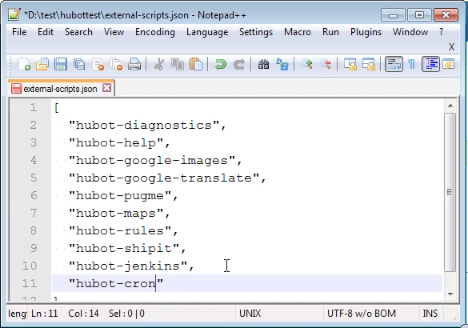
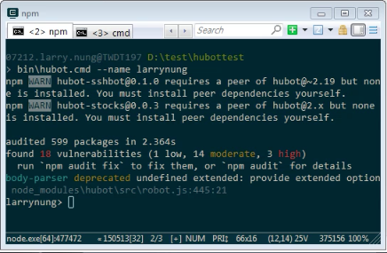
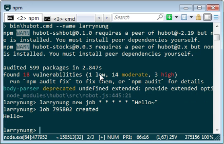
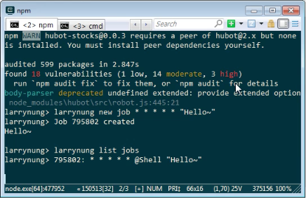
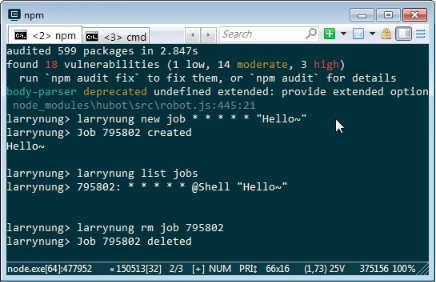

要讓 Hubot 支援排程發送訊息，可以安裝 hubot-cron 套件。

<!-- More -->

    npm install hubot-cron --save

 

然後在 external-scripts.json 加入 hubot-cron。  

 

接著將 Hubot 運行起來。  

 

就可以在 Hubot 內加入排程訊息。  

    <Hubot> new job <Cron> <Msg>

 

有需要的話可以查閱加入的排程。  

    <Hubot> list jobs

 

也可以移除加入的排程。  

    <Hubot> rm job <ID>

 

Link
