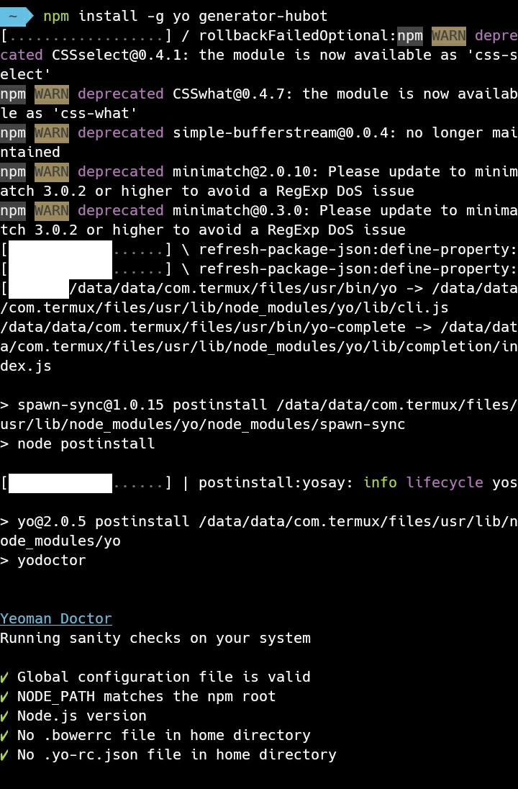
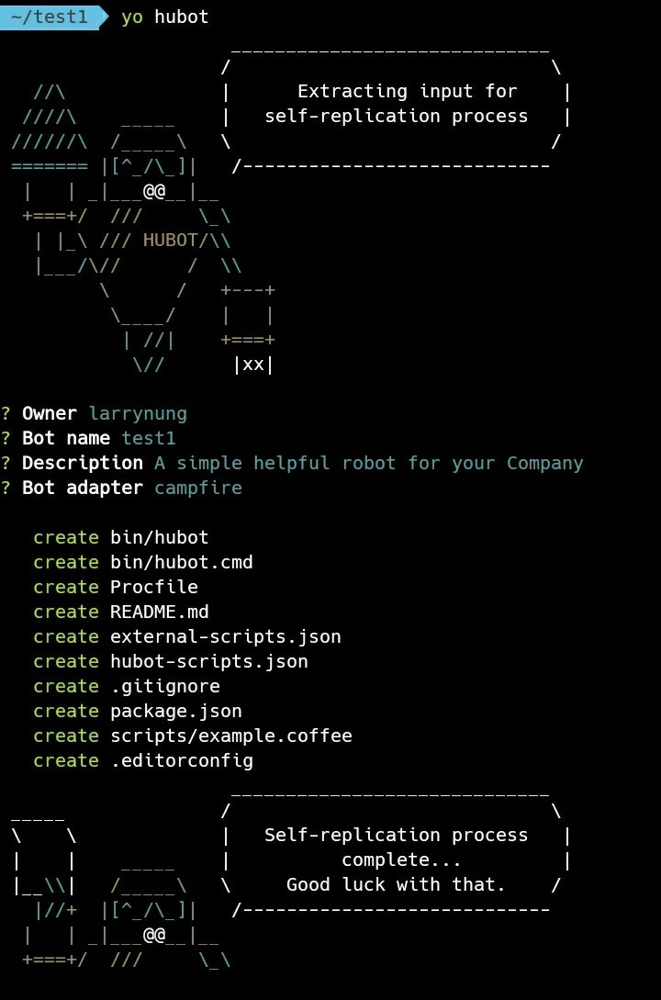
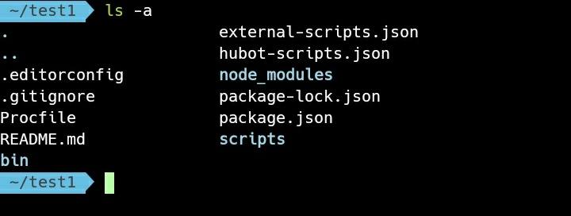
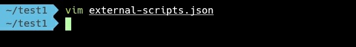
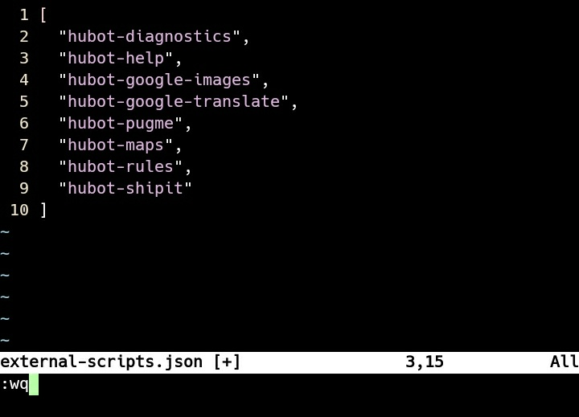
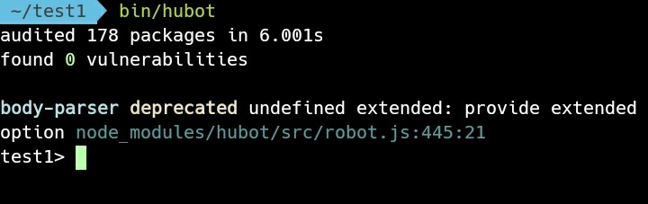
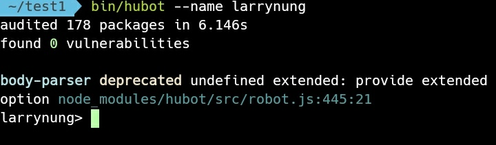
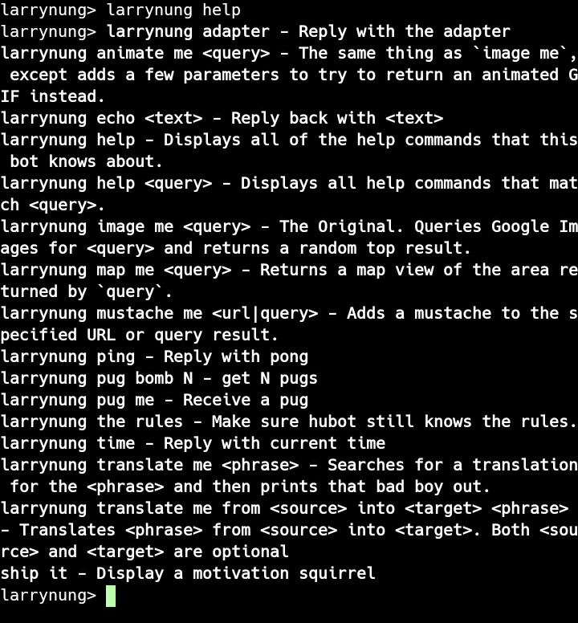
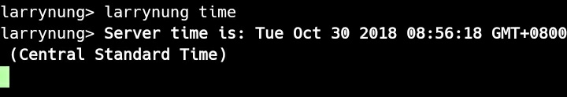

Hubot 安裝環境內需先有 Node.js，然後透過 Node.js 套件管理工具安裝 Yeoman 與 Hubot 到全域。  

<!-- More -->

    npm install -g yo generator-hubot

 

透過 Yeoman 建立 Hubot 專案。  

    yo hubot

 

Hubot 專案建立後會幫我們產生必要的檔案。  

    ls -a

 

一開始我們只是簡單的測試，不需要使用 Redis 與 Heroku，所以開啟 external-scripts.json 設定檔。  

    vim external-scripts.json

 

將 Redis 與 Heroku 設定移除後存檔。  

 

另外可以移除 hubot-scripts.json 設定檔，避免後面操作因為空的設定看到警告訊息。  

    rm hubot-scripts.json

 

運行 Hubot。  

    bin/hubot

 

運行時可用參數 --Name 為 Hubot 命名。  

    bin/hubot --name <Name>

 

Hubot 啟動後可用一下基本指令，像是 help 指令可查詢可使用的指令。  

    <Name> help

 

ping 指令可測試回應。  

    <Name> ping

 

time 指令可查詢時間。  

    <Name> time

 

echo 指令可回送發送過去的訊息。  

    <Name> echo <Message>

 

Link
----
* [Getting Started With Hubot](https://hubot.github.com/docs/)
