要將 Hubot 整合 Jenkins 服務，可為 Hubot 加裝 hubot-jenkins 套件。

npm i hubot-jenkins

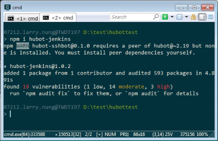

開啟 external-scripts.json，加上 hubot-jenkins 設定，存檔後關閉。

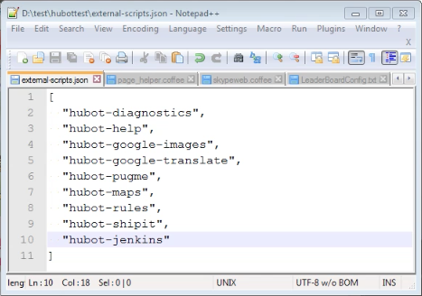

然後要透過 HUBOT_JENKINS_URL 環境變數設定 Jenkins 服務的位置。

set HUBOT_JENKINS_URL=

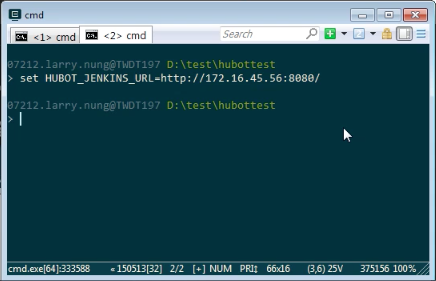

透過 HUBOT_JENKINS_AUTH 環境變數設定 Jenkins 服務的帳密 (使用 user:password 這樣的格式做設定)。

set HUBOT_JENKINS_AUTH=

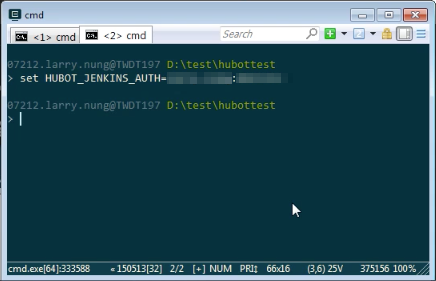

將 Hubot 啟動，可對 Hubot 調用命令查閱 Jenkins 服務上有的 Job。

jenkins list

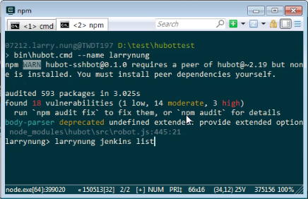

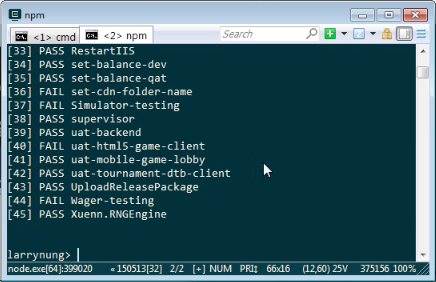

可查詢指定的 Jenkins Job。

jenkins describe

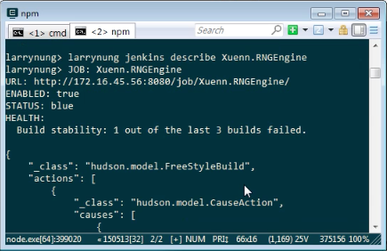

可用 Jenkins Job Name 去建置特定的 Jenkins Job。

jenkins build

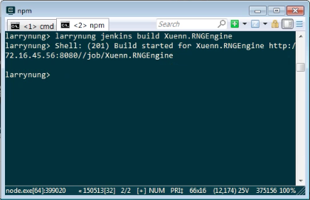

或是用編號建置特定的 Jenkins Job。

jenkins b

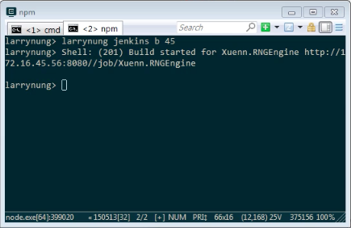

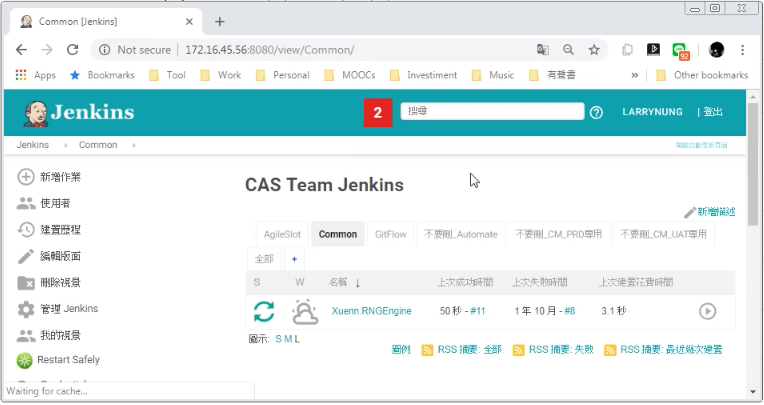

也可以查詢特定 Jenkins Job 最後一次建置。

jenkins last

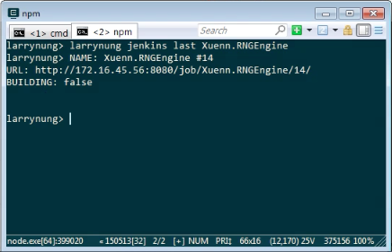

Link
----
* [hubot-jenkins - npm](https://www.npmjs.com/package/hubot-jenkins)