要將 Hubot 整合 Jenkins 服務，可為 Hubot 加裝 hubot-jenkins 套件。  

<!-- More -->

    npm i hubot-jenkins

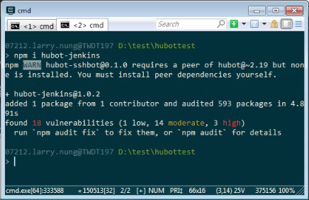

 

開啟 external-scripts.json，加上 hubot-jenkins 設定，存檔後關閉。

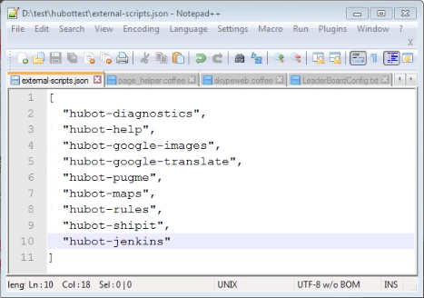

 

然後要透過 HUBOT_JENKINS_URL 環境變數設定 Jenkins 服務的位置。  

    set HUBOT_JENKINS_URL=<JenkinsUrl>

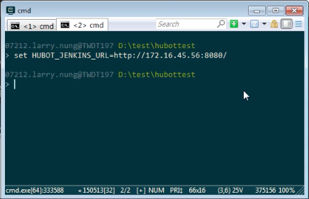

 

透過 HUBOT_JENKINS_AUTH 環境變數設定 Jenkins 服務的帳密 (使用 user:password 這樣的格式做設定)。  

    set HUBOT_JENKINS_AUTH=<Auth>

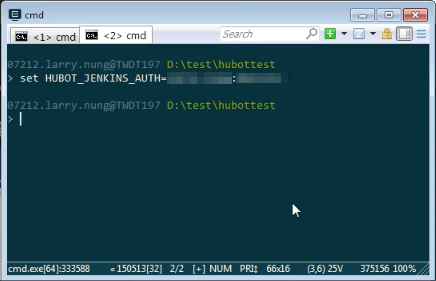

 

將 Hubot 啟動，可對 Hubot 調用命令查閱 Jenkins 服務上有的 Job。  

    <Hubot> jenkins list

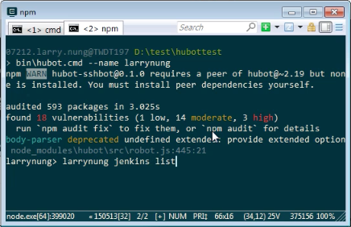

 

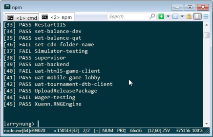

 

可查詢指定的 Jenkins Job。  

    <Hubot> jenkins describe <Job>

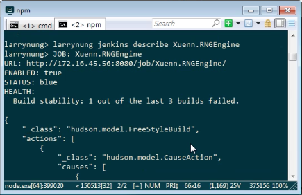

 

可用 Jenkins Job Name 去建置特定的 Jenkins Job。  

    <Hubot> jenkins build <Job>

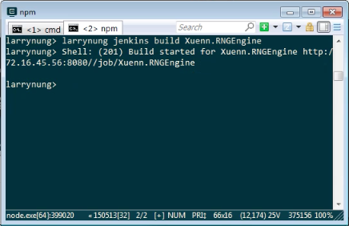

 

或是用編號建置特定的 Jenkins Job。  

    <Hubot> jenkins b <No>

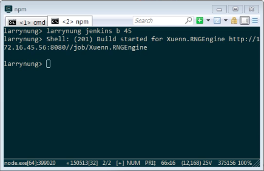

 

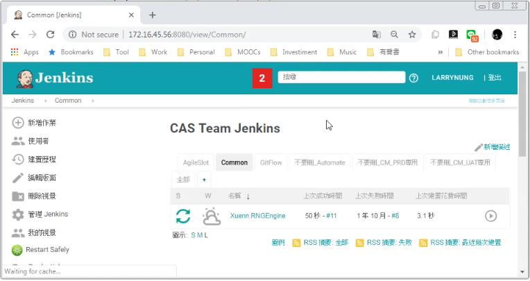

 

也可以查詢特定 Jenkins Job 最後一次建置。  

    <Hubot> jenkins last <Job>

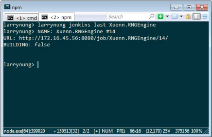

 

Link
----
* [hubot-jenkins - npm](https://www.npmjs.com/package/hubot-jenkins)
