要將 Hubot 整合 Slack，首先要先在 Slack 上建立 Hubot App。  

<!-- More -->

 

在 Slack 上點選加入 Apps。  

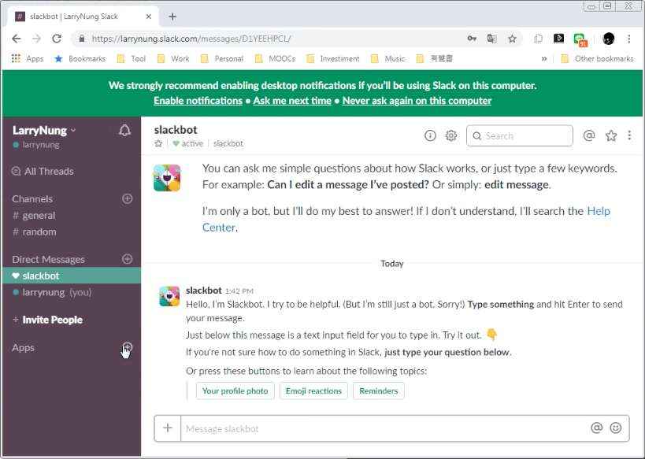

 

選取安裝 Hubot App。  

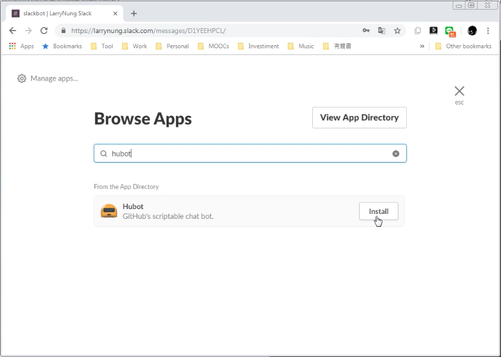

 

點選 Install 按鈕。  

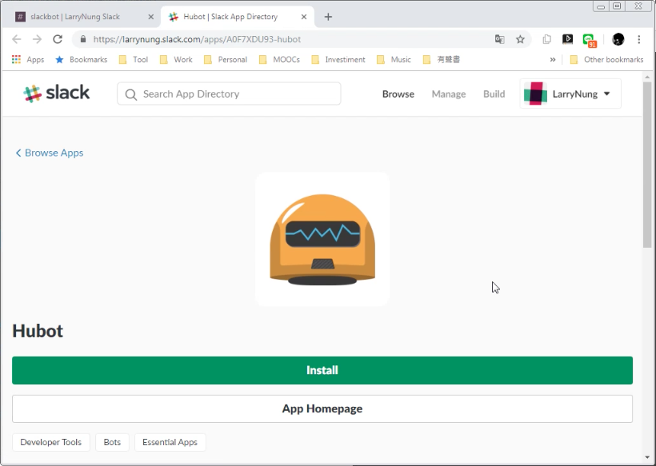

 

為加進 Slack 的 Hubot 取個名字，然後按下 Add Hubot Integration 按鈕。  

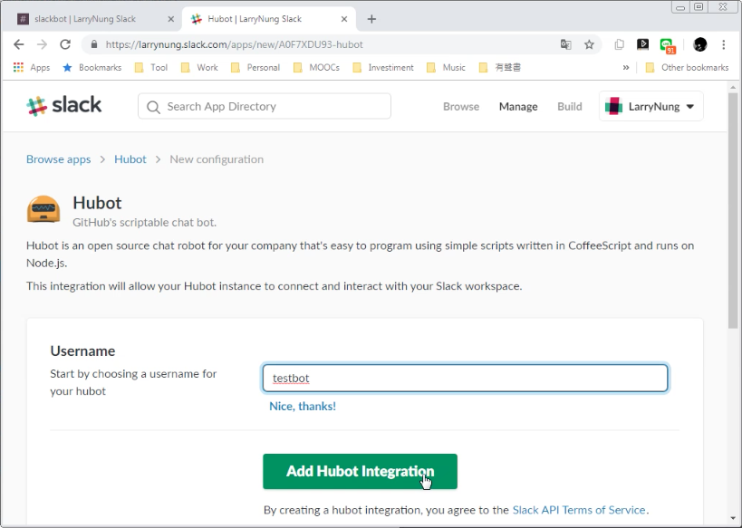

 

複製 API Token 供後續使用，設定 Hubot 的名字、圖示...等資訓。   

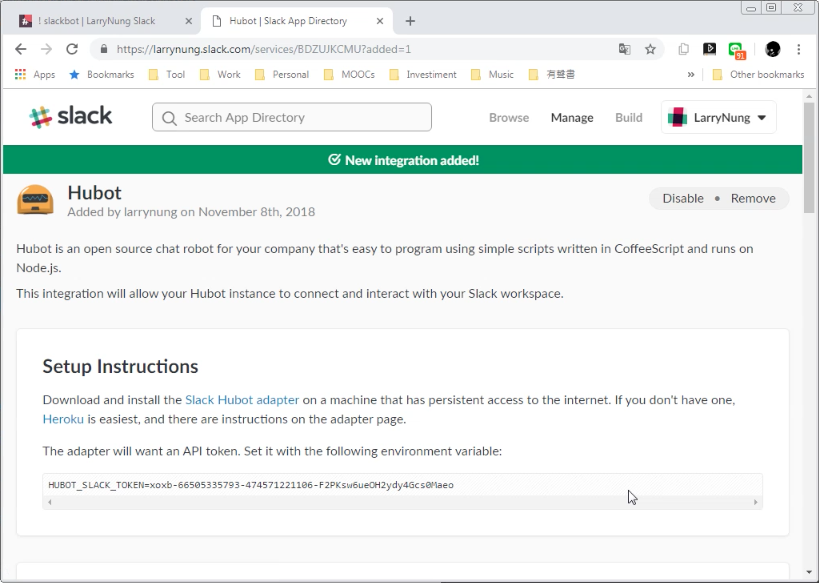

 

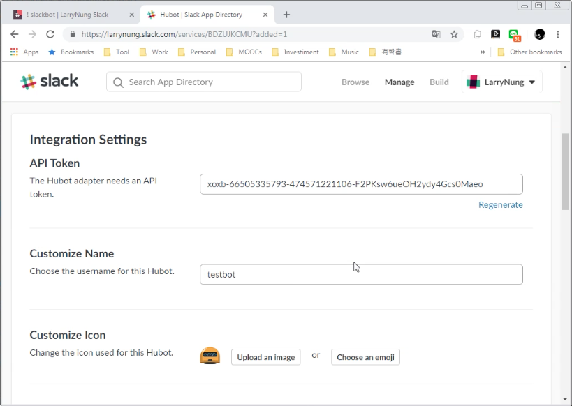

 

按下 Save Integration 按鈕。  

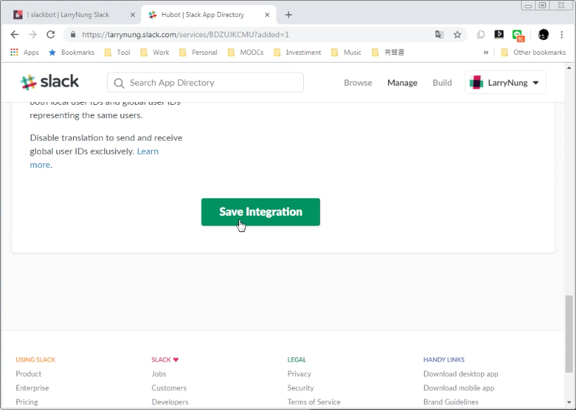

 

Slack 的 Apps 那區就會顯示剛所建立的 Hubot App。  

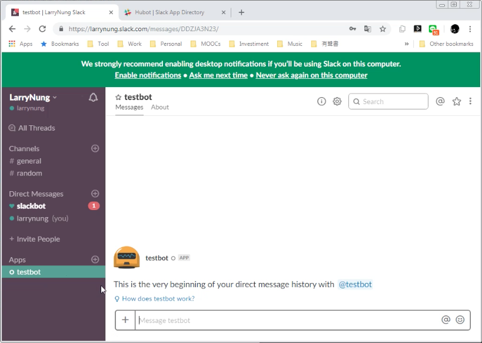

 

接著安裝 Hubot 要用到的 Slack adapter。  

    npm install hubot-slack --save

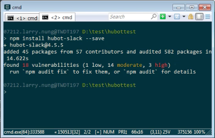

 

將剛剛複製的 API Token 設到環境變數。  

    set HUBOT_SLACK_TOKEN=<Token>

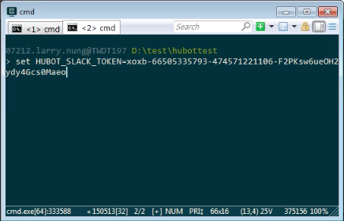

 

將 Hubot 運行起來並指定使用 Slack adapter。  

    hubot --adapter slack

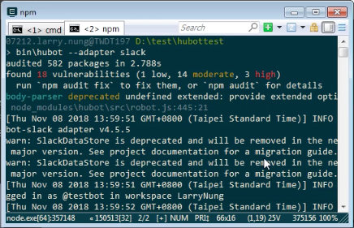

 

Hubot 與 Slack 就做完整合的動作了，可直接對 Slack 的 Hubot app 調用 Hubot 的命令。  

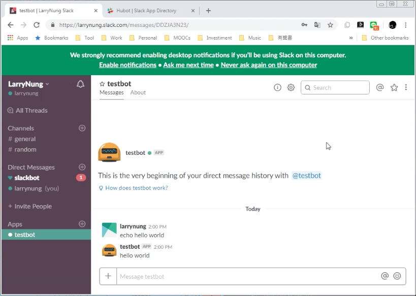

 

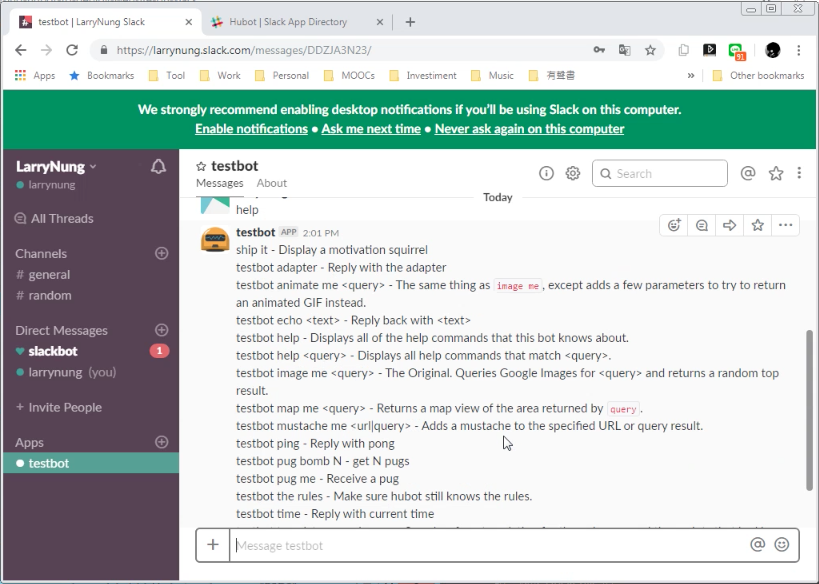

 

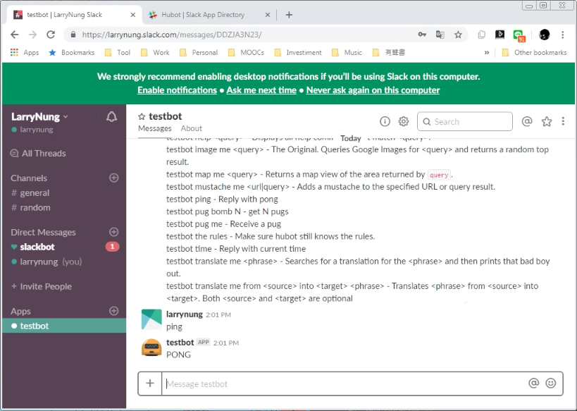

 

Link
----
* [Using Hubot with slack](https://monicagranbois.com/blog/bots/using-hubot-with-slack/)
* [hubot-slack - npm](https://www.npmjs.com/package/hubot-slack)
