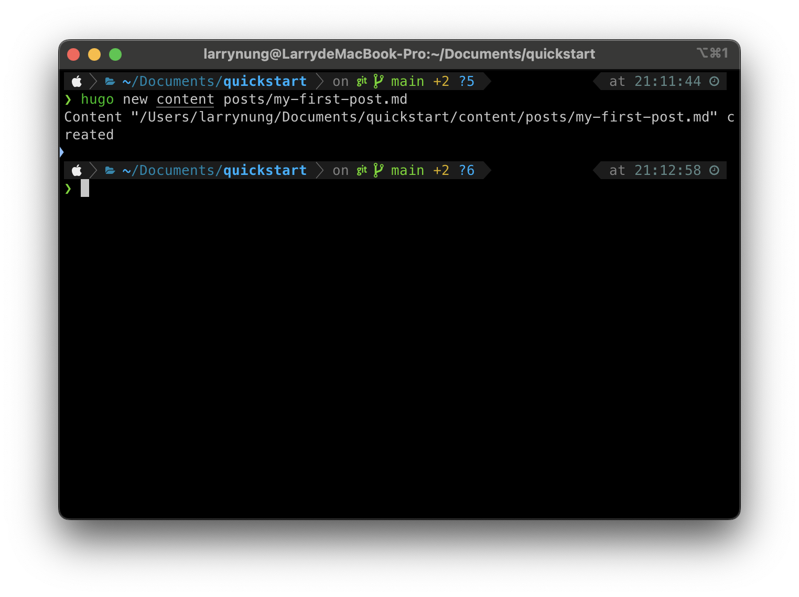
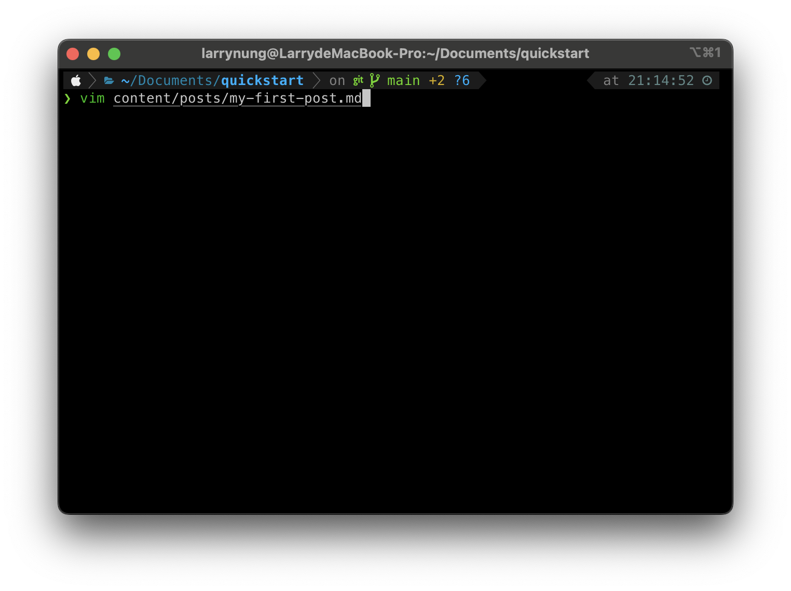
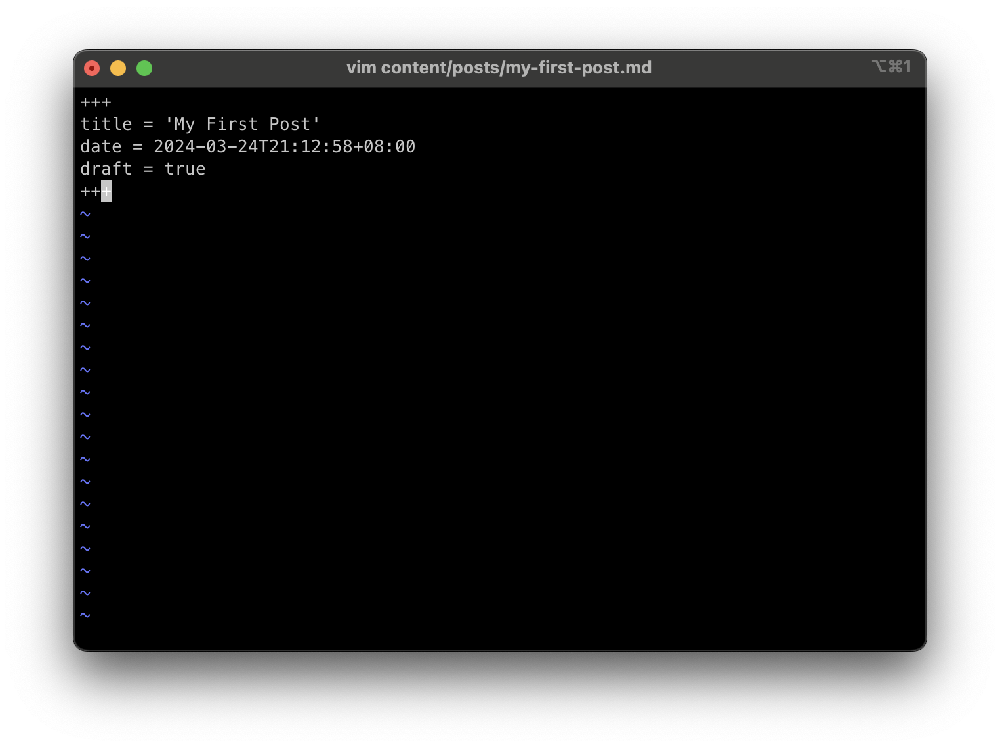
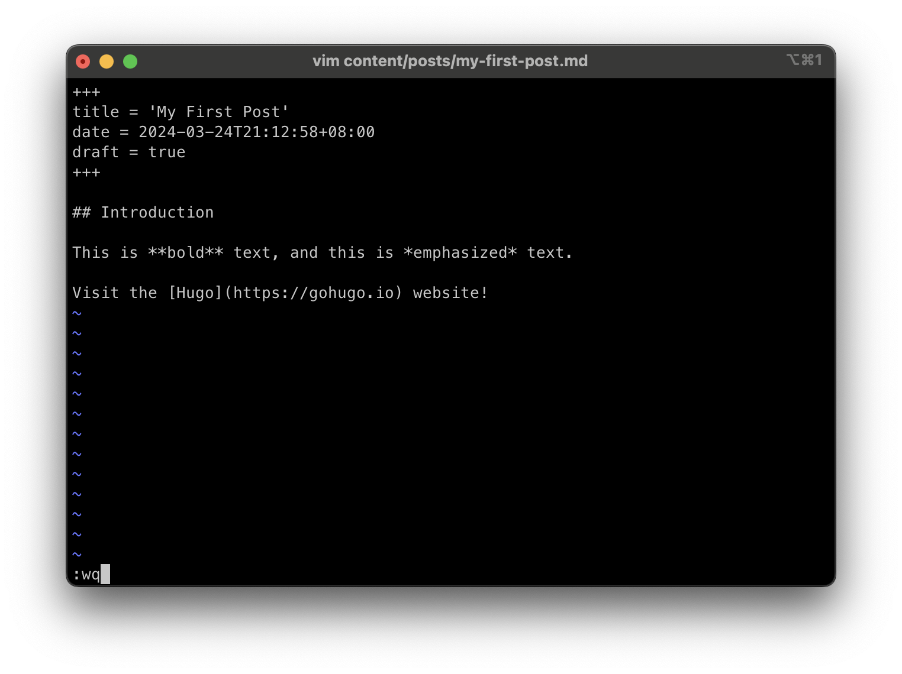
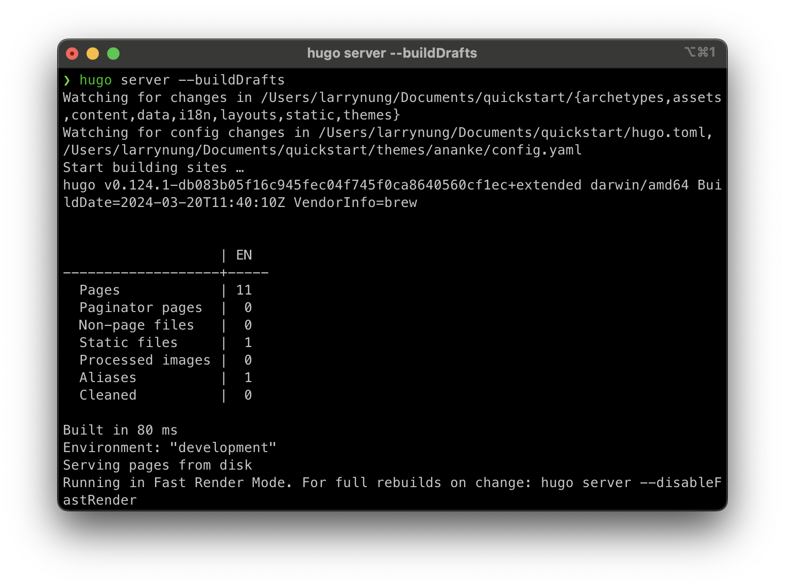
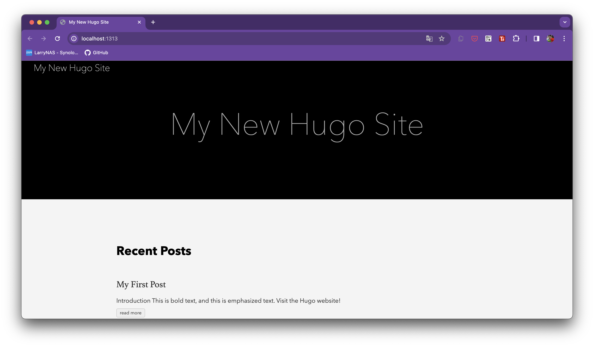
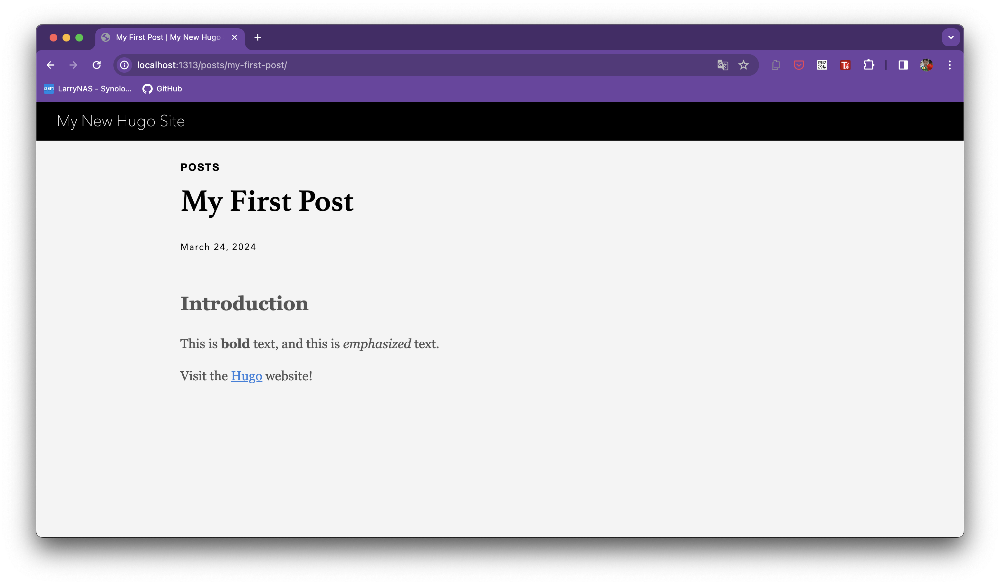

+++
title = 'Hugo - Add Content'
date = 2024-04-08T22:54:27+08:00
tags = ['Hugo']
+++

Hugo 站台建立完後可以開始為站台加入文章，透過 Hugo 的 new content 命令，帶入文章檔名建立 Hugo 文章。

    hugo new content posts/[postfilename].md

開啟建立的 Hugo 文章檔案進行文章的撰寫。

    vim content/posts/[postfilename].md

文章撰寫完成可透過 Hugo 的 server 命令，帶入 --buildDrafts 或 -D 參數啟動 Hugo 站台，表示文章在草稿階段也要呈現。

    hugo server --buildDrafts
    hugo server -D

透過瀏覽器瀏覽 http://localhost:1313/ 即可看到 Hugo 站台運行後的樣子，Hugo 站台內會有剛撰寫的 Hugo 文章。

Link
====
* [Quick start | Hugo](https://gohugo.io/getting-started/quick-start/)