+++
title = 'Hugo - Build and Deploy With GitHub Actions'
date = 2024-04-09T22:30:36+08:00
tags = ['Hugo']
+++

要使用 GitHub Actions 建置並部署 Hugo 到 GitHub Pages，先要切到 GitHub Pages Repository 下的 Settings/Pages 頁面，在 Build and deployment 的 Source 這邊選用 GitHub Actions。

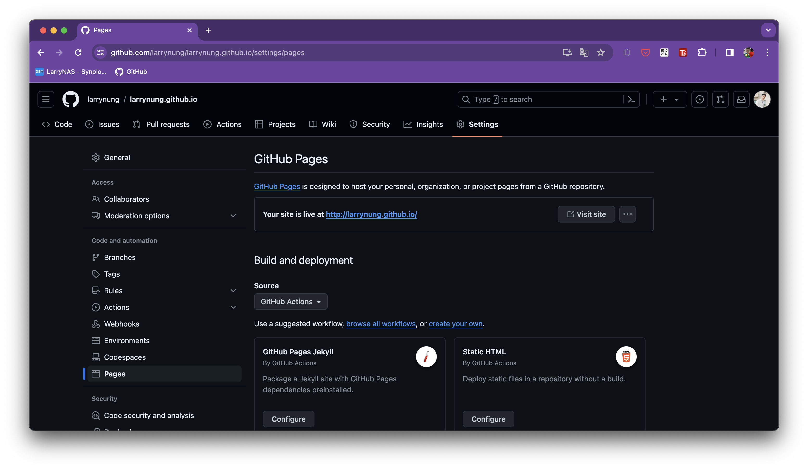

搜尋使用 Hugo GitHub Actions。

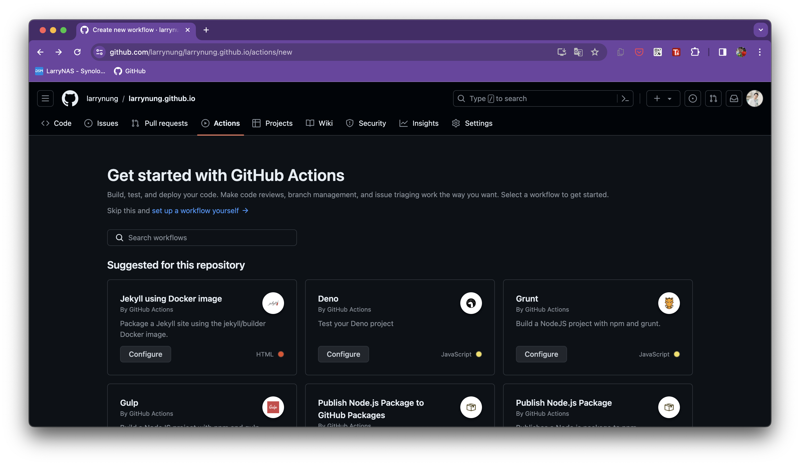

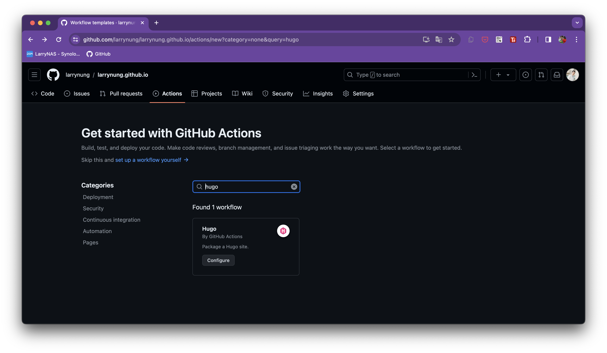

這邊會帶出 Hugo GitHub Actions 的 Workflows 設定檔，該設定檔給的是用 master branch 去做設定的內容，預設也是存放到 master branch。如果是 master branch 合用可直接存檔，不合用也只能自行修改上傳到 git。

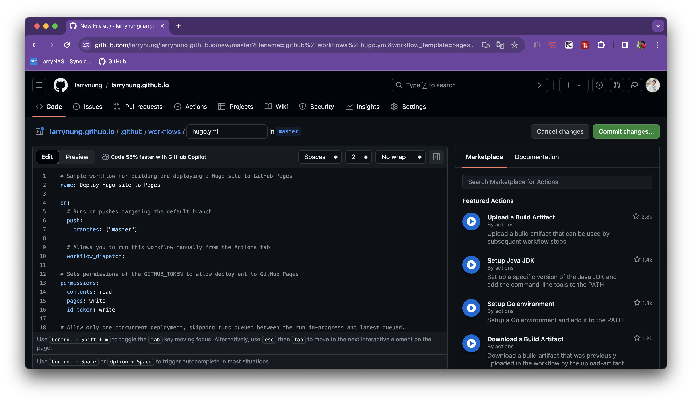

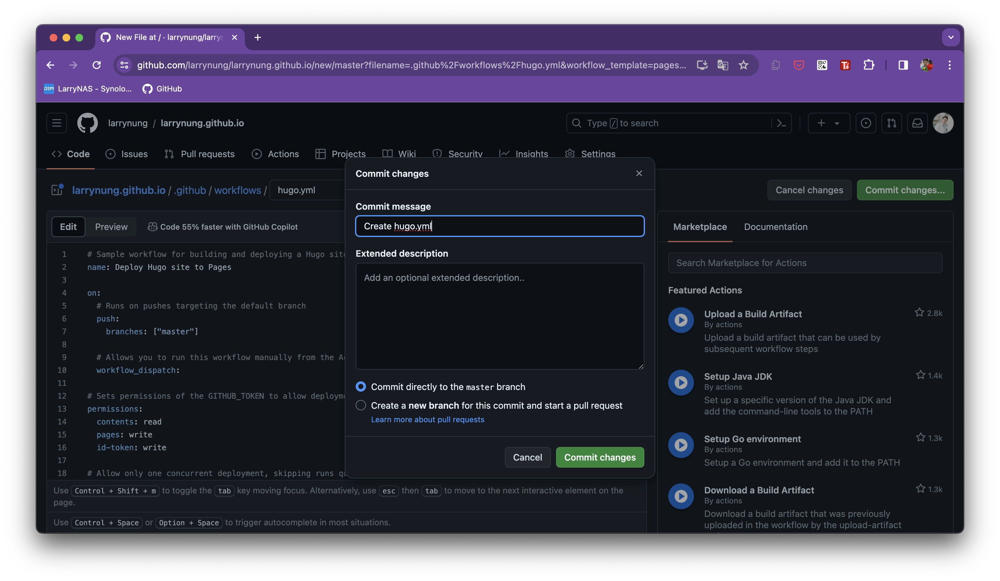

設定完後在 Actions 左半邊就會看到剛加的 Workflows

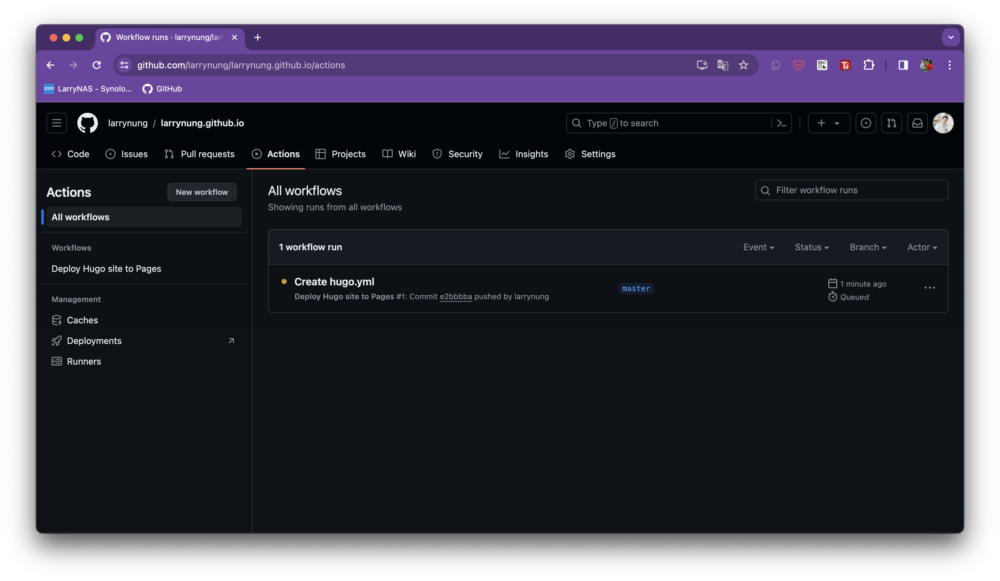

切到剛加的 Workflows，右側可選取 Branch 運行 Workflow。

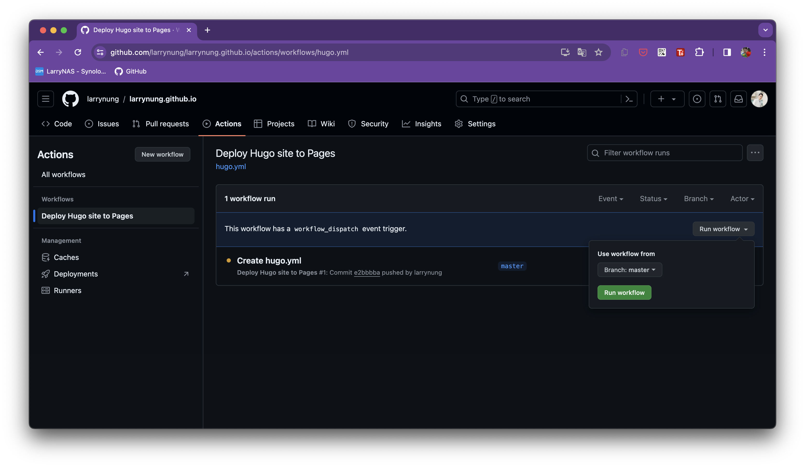

運行後會看到列表產生了對應的建置與部屬的動作。

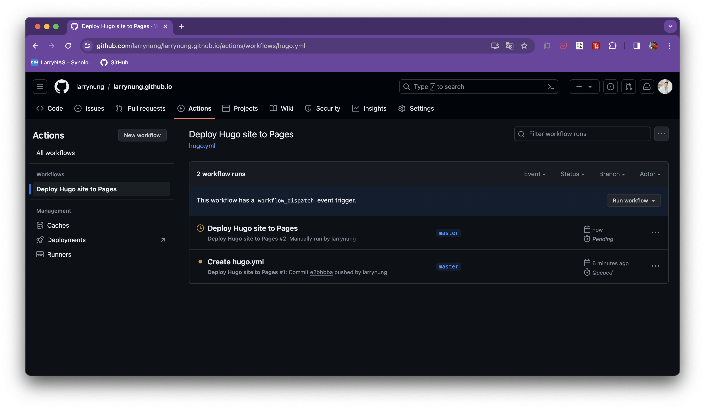

點進去可以看到建置與部屬動作的細節。

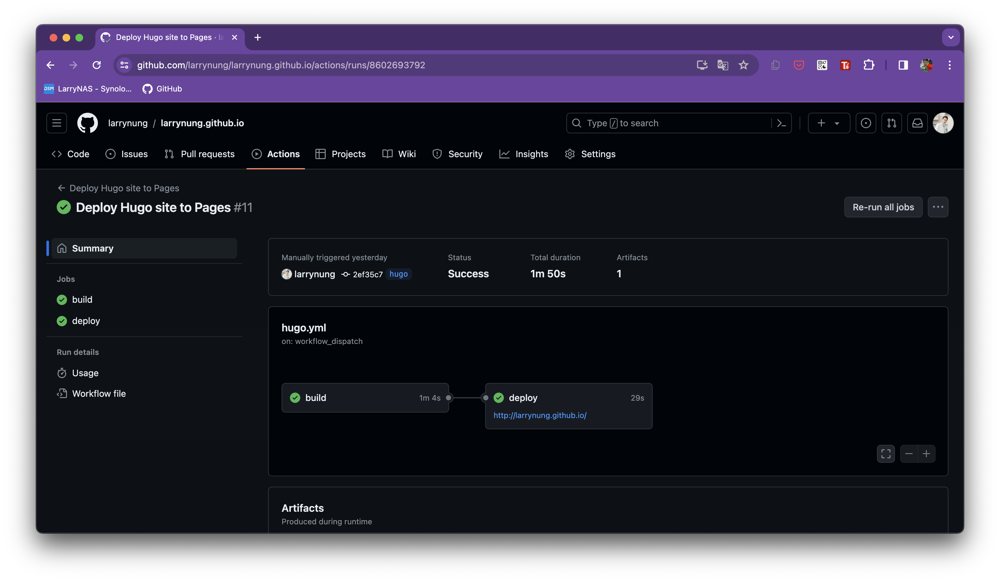

這邊要特別注意，若是 Hugo GitHub Actions 當初設定的不為 master branch，需在 Settings/Environments 這邊設定 github-pages。

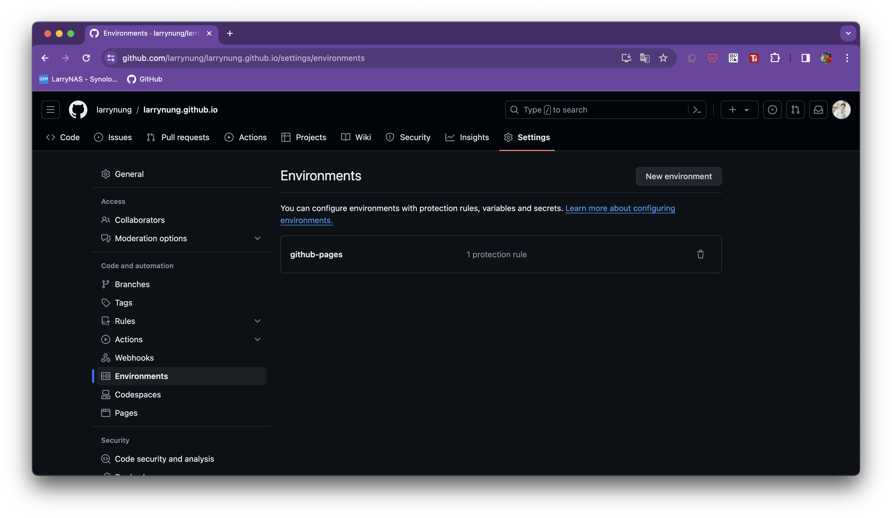

將指定的 branch 加入允許部署 GitHub Pages。

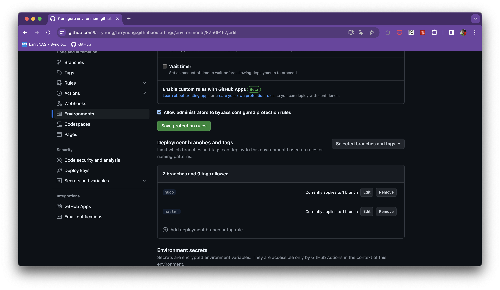

不然在 Workflows 建置與部屬時會看到下面這樣的失敗畫面。

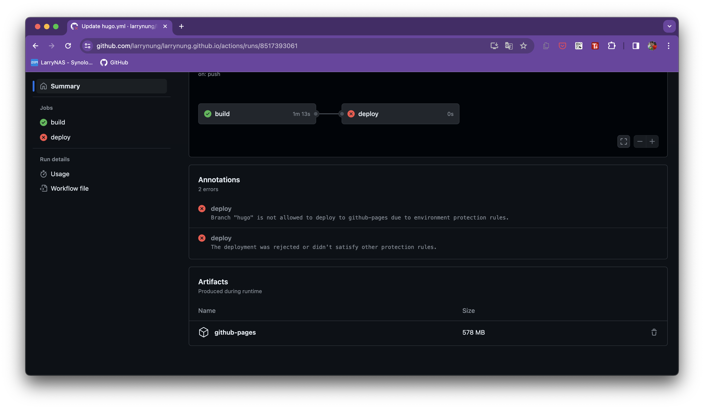