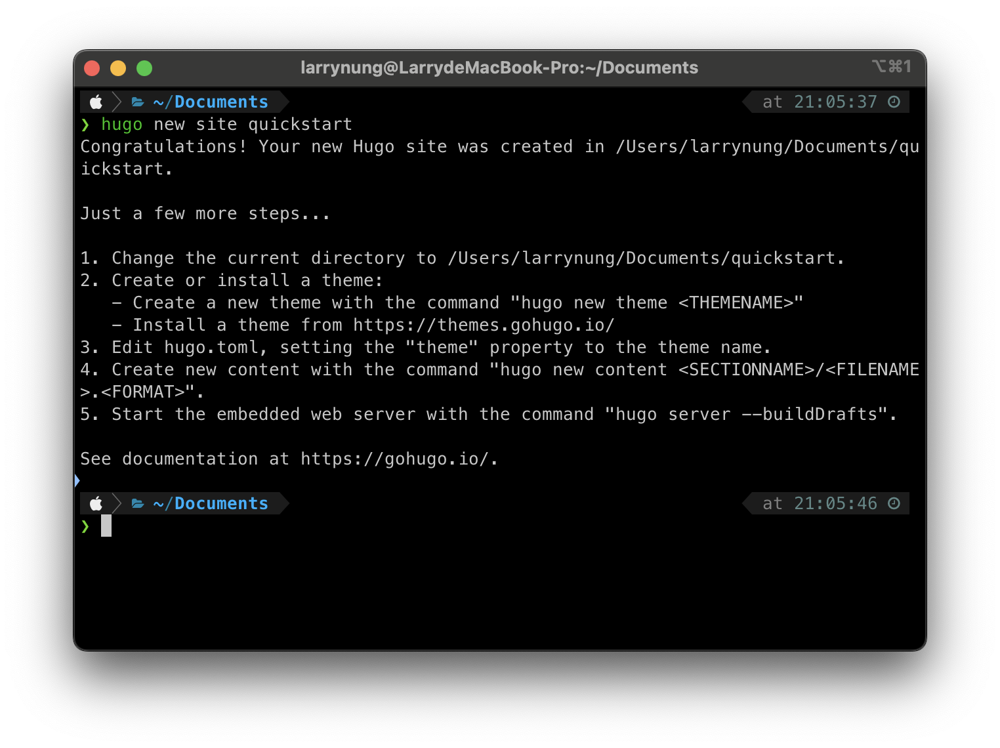
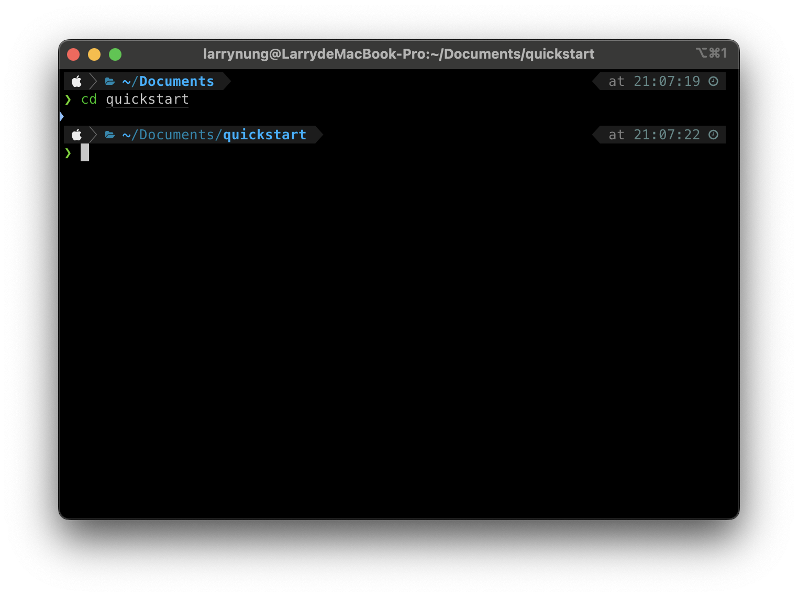
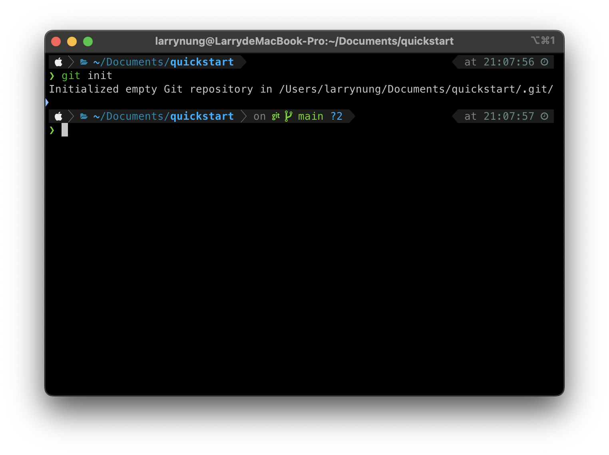
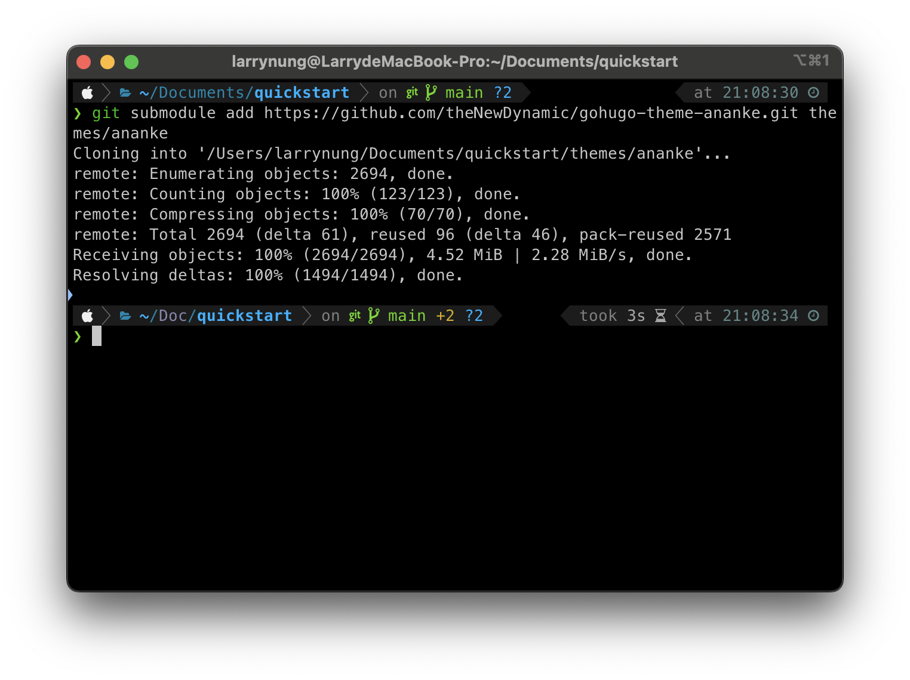
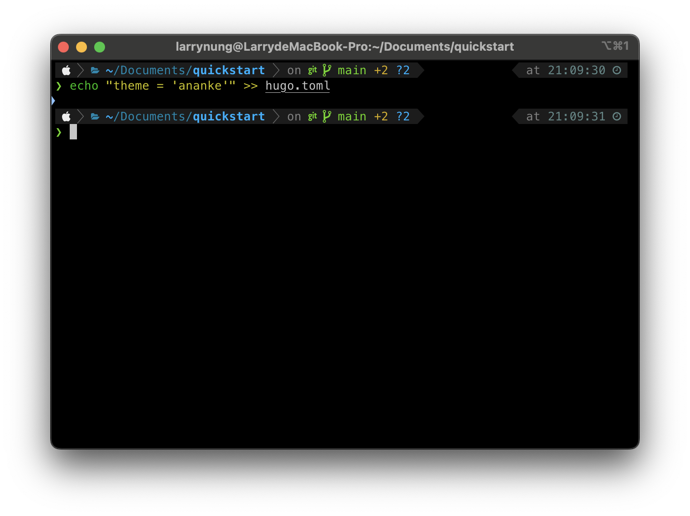
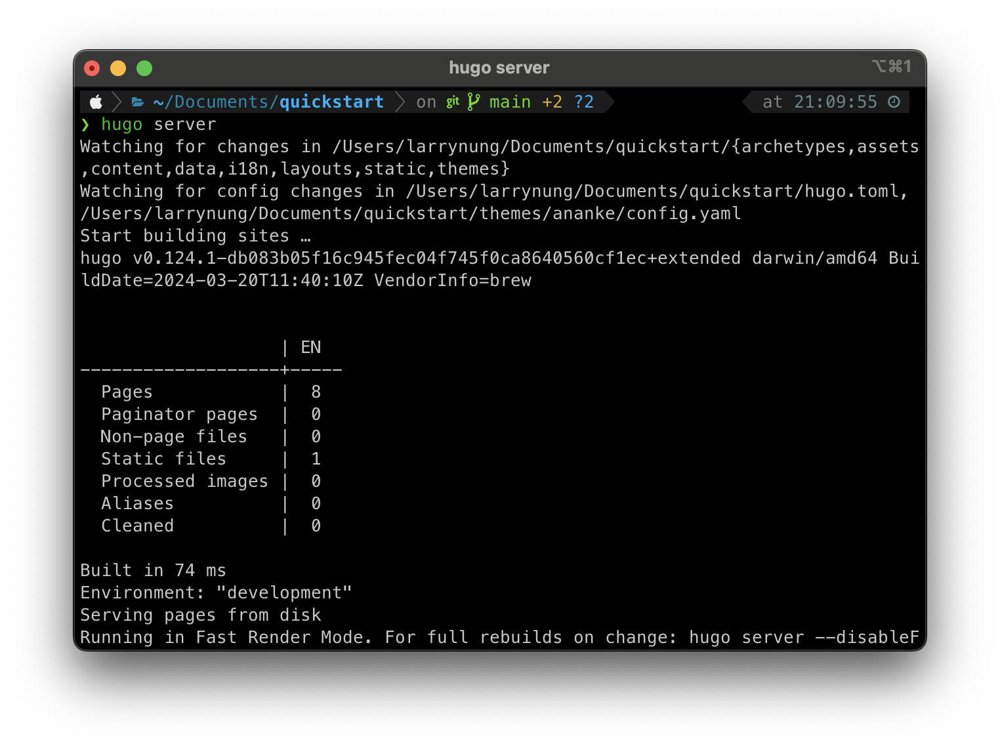
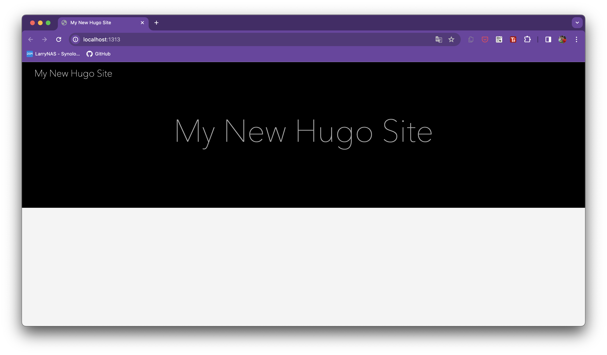

+++
title = 'Hugo - Create a Site'
date = 2024-04-08T22:20:37+08:00
tags = ['Hugo']
+++

Hugo 裝完後，首先需要先建立站台。

    hugo new site [sitename]

建立完後進入站台目錄。

    cd [sitename]

初始化 git。

    git init

透過 git submodule 將 Hugo 的 ananke theme 加入站台。

    git submodule add https://github.com/theNewDynamic/gohugo-theme-ananke.git themes/ananke

修改 hugo.toml 將 Hugo 站台套用 ananke theme。

    echo "theme = 'ananke'" >> hugo.toml

本地將 Hugo 站台運行起來。

    hugo server

透過瀏覽器瀏覽 http://localhost:1313/ 即可看到 Hugo 站台運行後的樣子。

