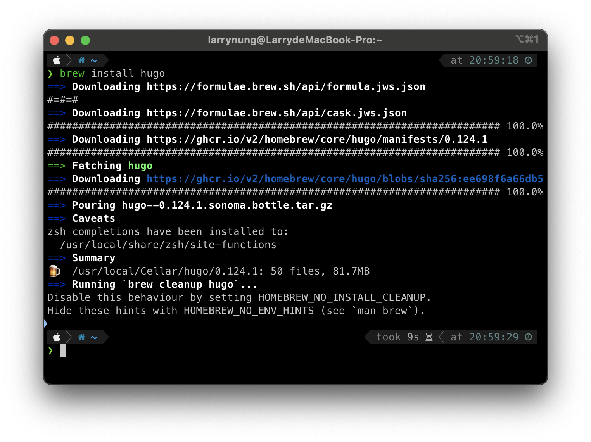
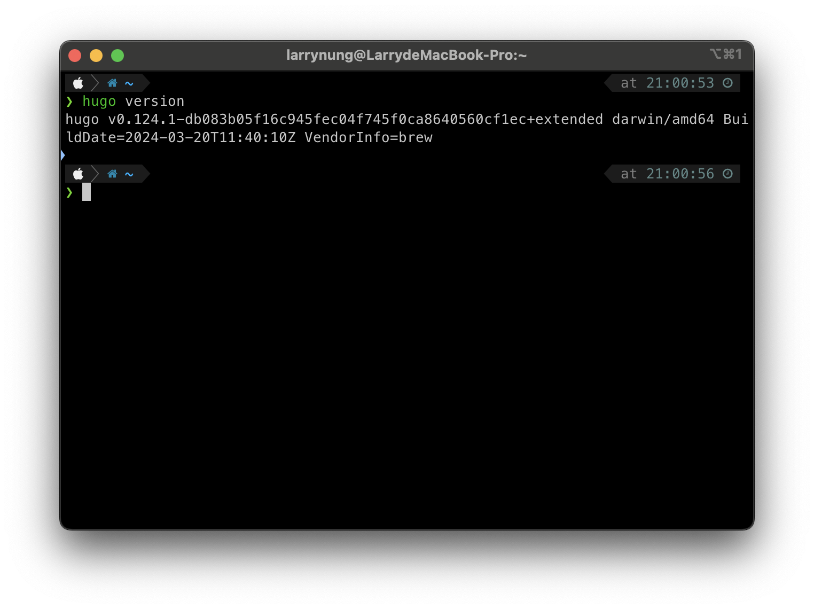
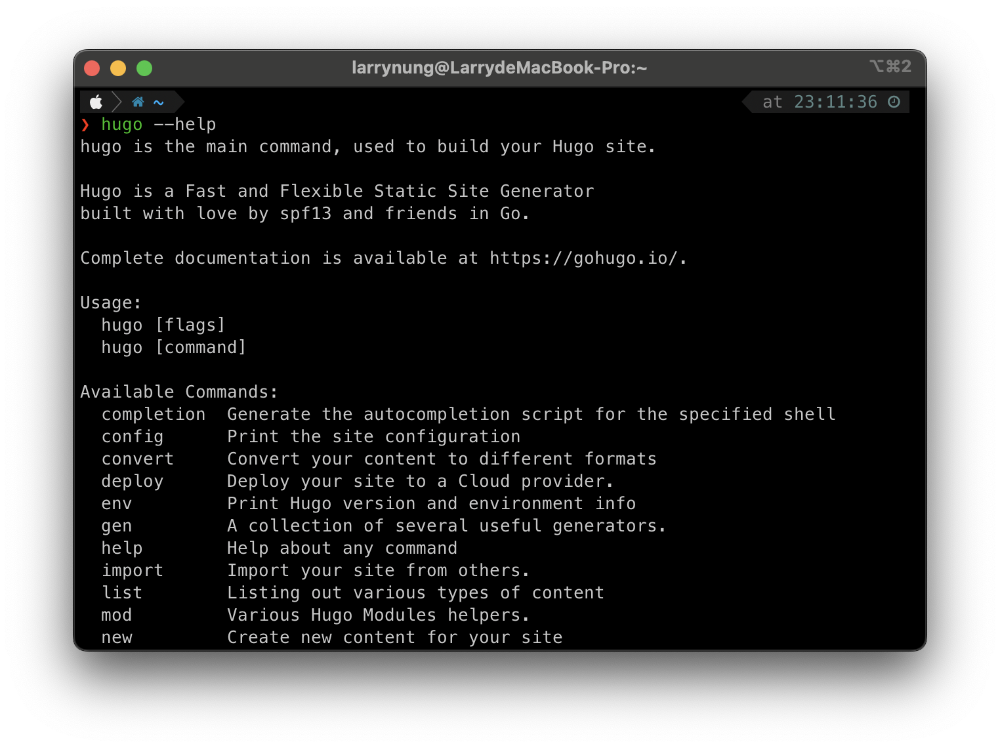

+++
title = 'Hugo - Install Hugo on MacOS'
date = 2024-04-06T22:59:20+08:00
tags = [Hugo, Homebrew]
+++

Hugo 在 MacOS 下可直接透過 Homebrew 安裝。

    brew install hugo

安裝後可調用 Hugo 命令帶入 version 參數查閱 Hugo 版本，確認 Hugo 的安裝是否正確。

    hugo version

後續 Hugo 命令使用有問題可調用 Hugo 命令帶入 --help 參數查詢 Hugo 命令的使用方式。

    hugo --help

Link
====
* [macOS | Hugo](https://gohugo.io/installation/macos/)
