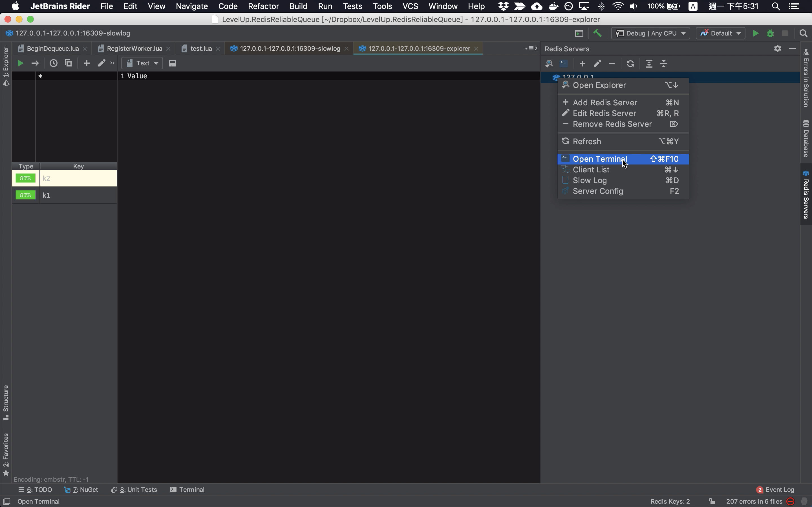
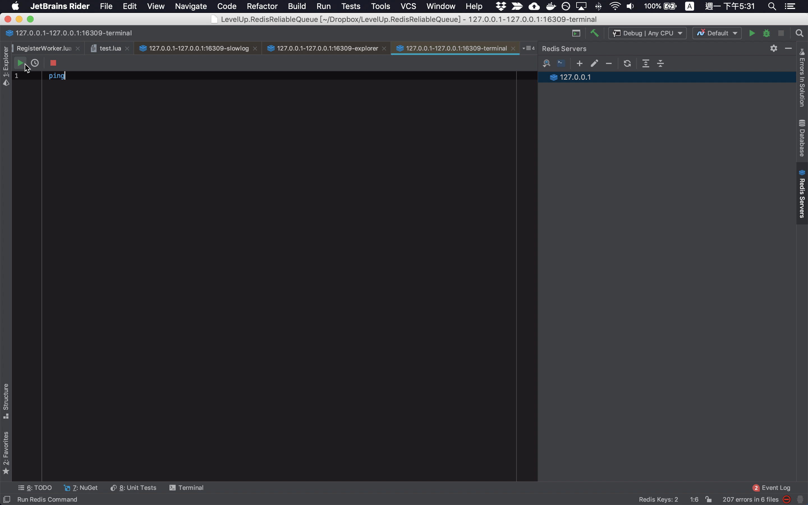
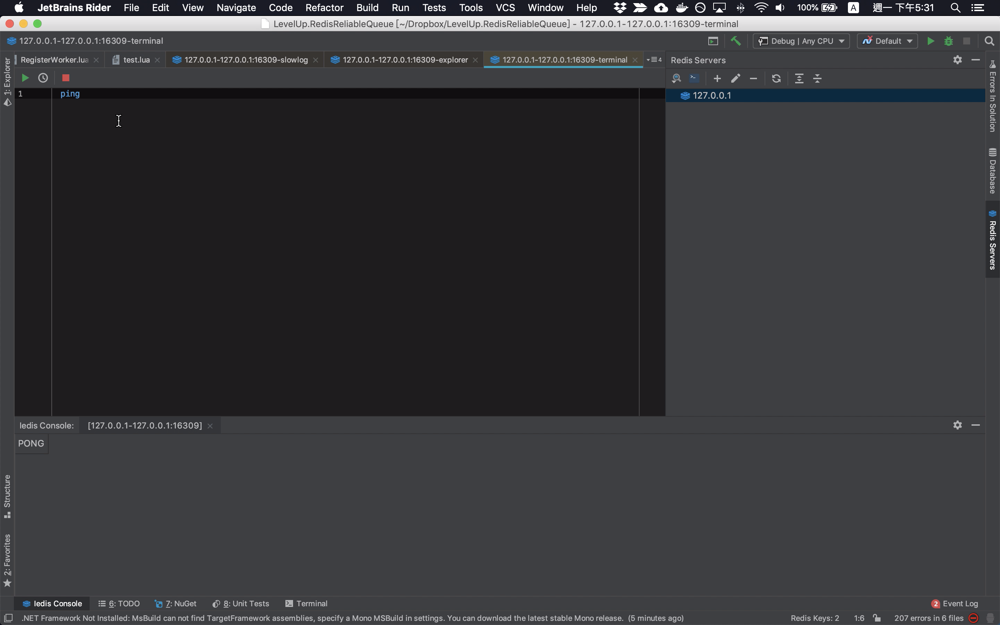

在 Redis Servers Tool Window 內的連線設定上按下滑鼠右鍵，點選滑鼠右鍵快顯選單上的 Open Terminal 選單選項，或是透過上方的工具列，抑或者是熱鍵 ⌘ + ⇧ + F10。  

<!-- More -->

 

即可開啟 Terminal 視窗，可在 Terminal 視窗撰寫並調用 Redis 命令。  

 

 

Link
----
* [Iedis: Advanced Console](https://www.codesmagic.com/iedis/userguide/advanced-console)
