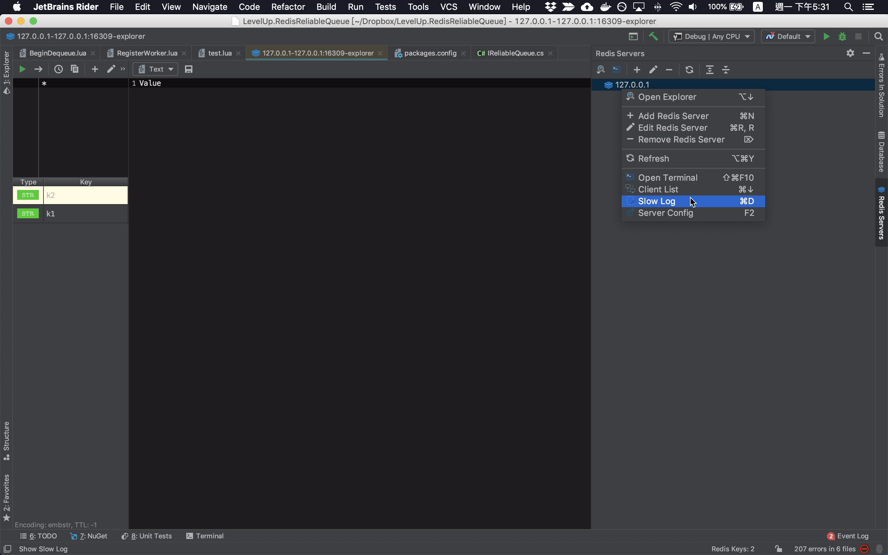
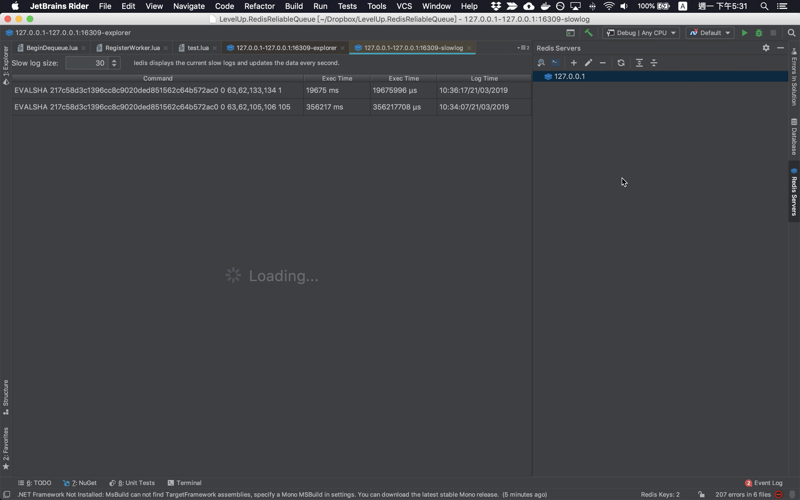

在 Redis Servers Tool Window 的 Redis 連線上按下滑鼠右鍵，在滑鼠右鍵快顯選單中有個 Slow Log 選單選項，點選該選單選項。

<!-- More -->

 

可看到 Redis 執行比較慢的記錄，會有命令名稱、執行時間等。  

 

Link
----
* [Iedis: Config Monitor](https://www.codesmagic.com/iedis/userguide/config-monitor)
