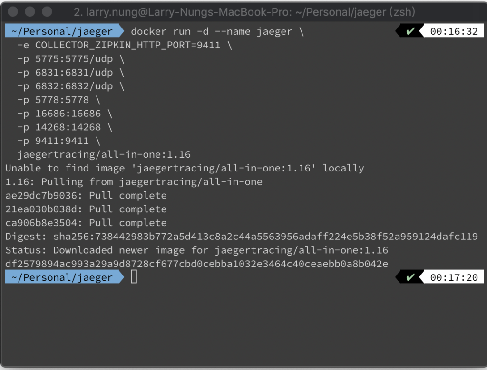
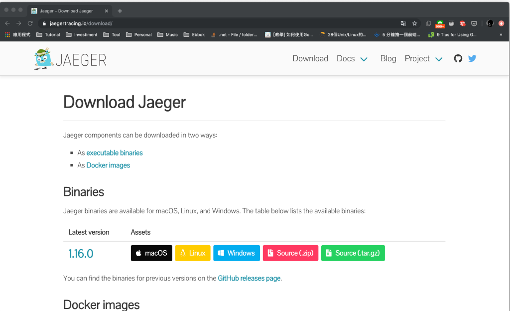
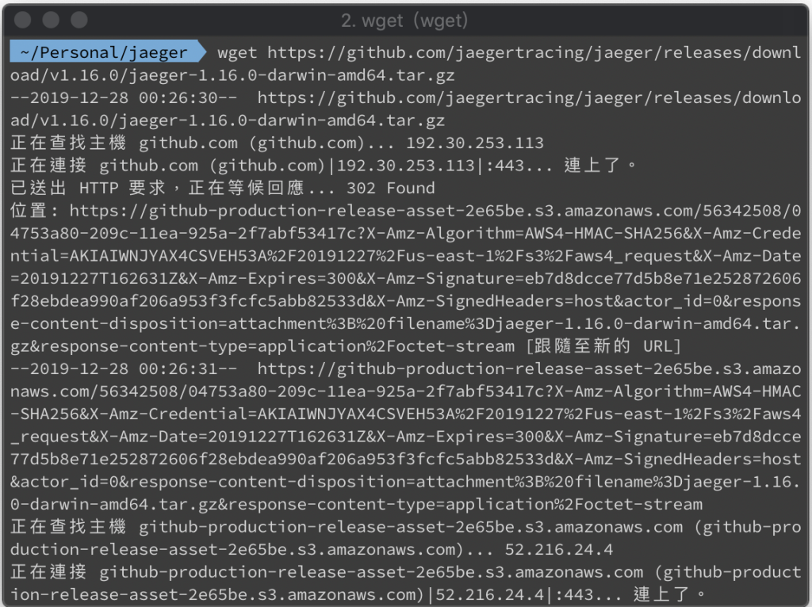
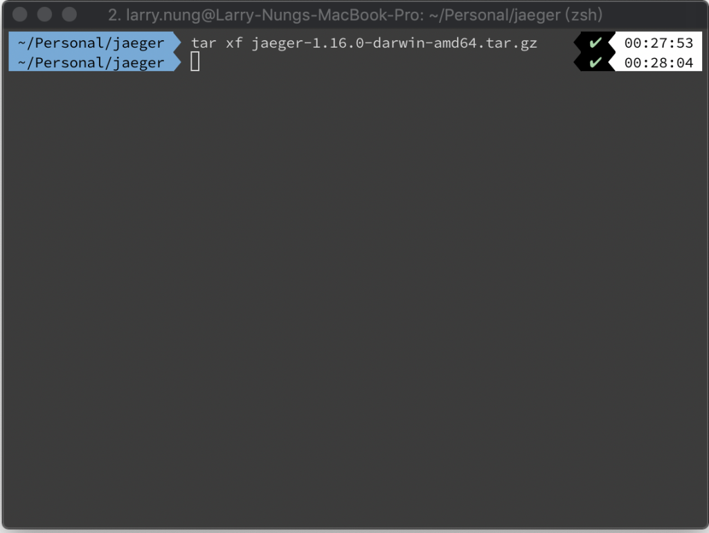
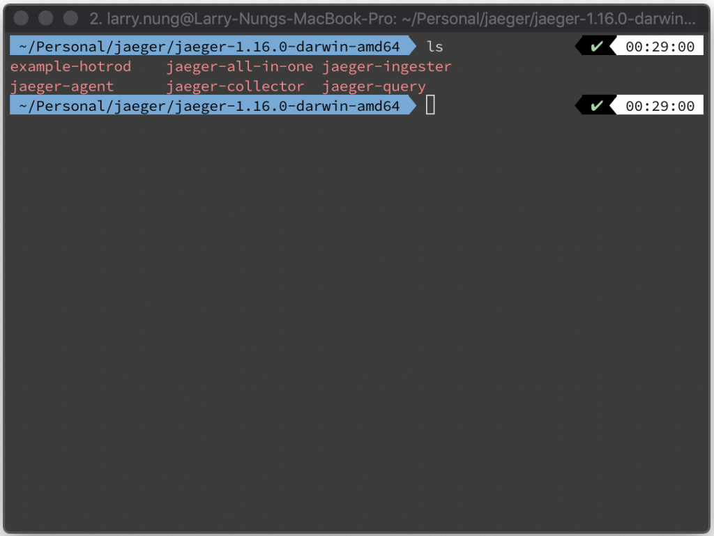
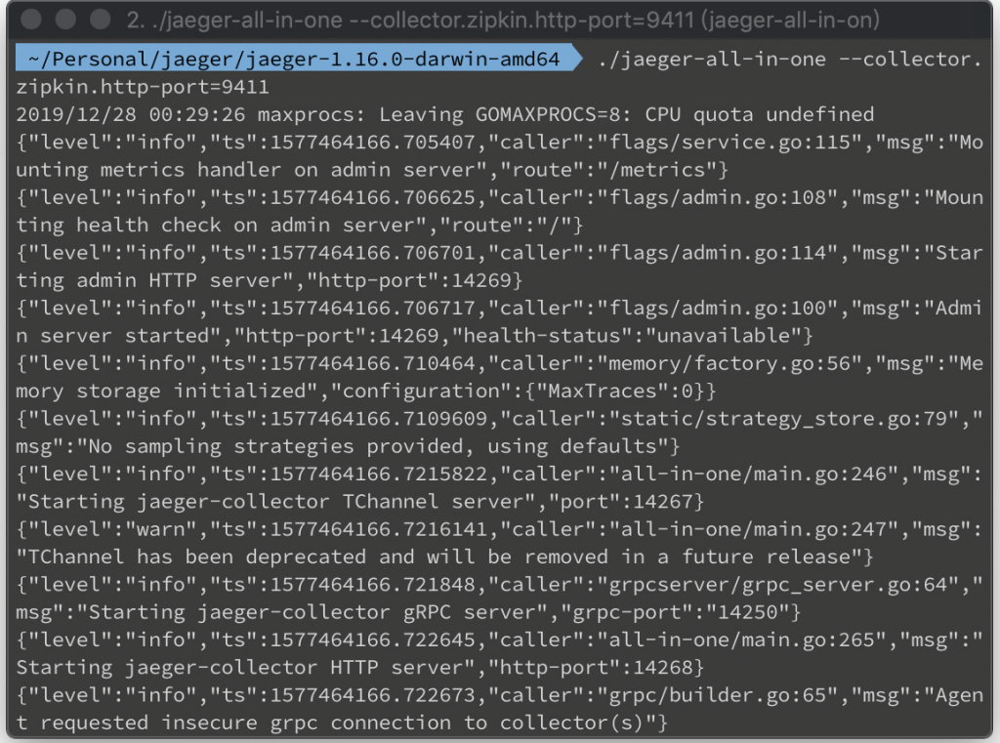
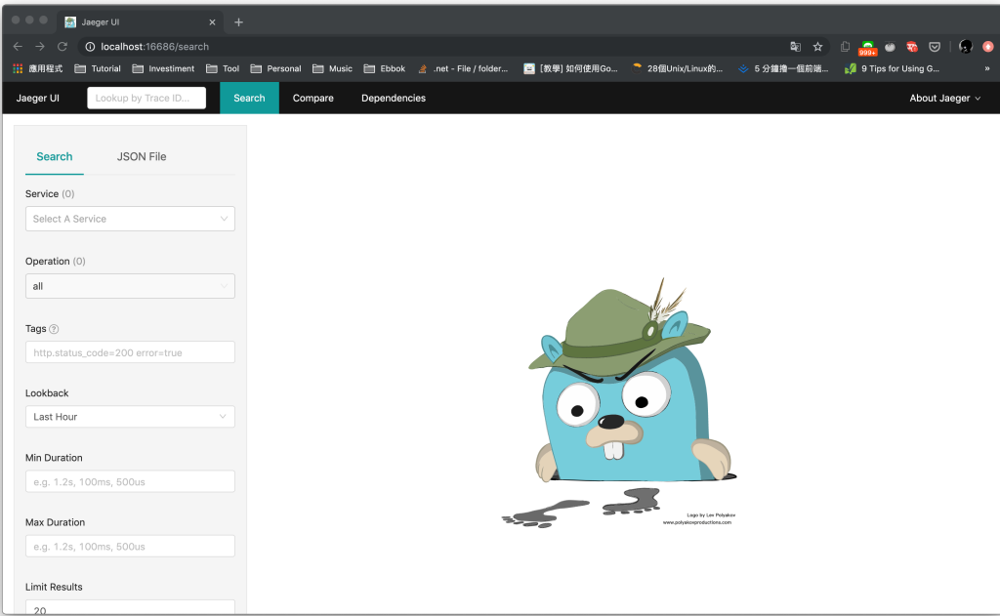

要使用 Jaeger，最簡便的做法是直接使用 Docker 去起 jaegertracing/all-in-one 容器。

docker run -d --name jaeger \
-e COLLECTOR_ZIPKIN_HTTP_PORT=9411 \
-p 5775:5775/udp \
-p 6831:6831/udp \
-p 6832:6832/udp \
-p 5778:5778 \
-p 16686:16686 \
-p 14268:14268 \
-p 9411:9411 \
jaegertracing/all-in-one

或是從下載頁下載 Jaeger。

wget https://github.com/jaegertracing/jaeger/releases/download/v1.16.0/jaeger-1.16.0-darwin-amd64.tar.gz

解壓縮。

tar xf jaeger-1.16.0-darwin-amd64.tar.gz

運行 jaeger-all-in-one 啟動 Jaeger 服務。

jaeger-all-in-one --collector.zipkin.http-port=9411

透過瀏覽器訪問 http://localhost:16686 應該就可以看到 Jaeger 的操作界面。

Link
====
* [Getting Started — Jaeger documentation](https://www.jaegertracing.io/docs/1.16/getting-started/)