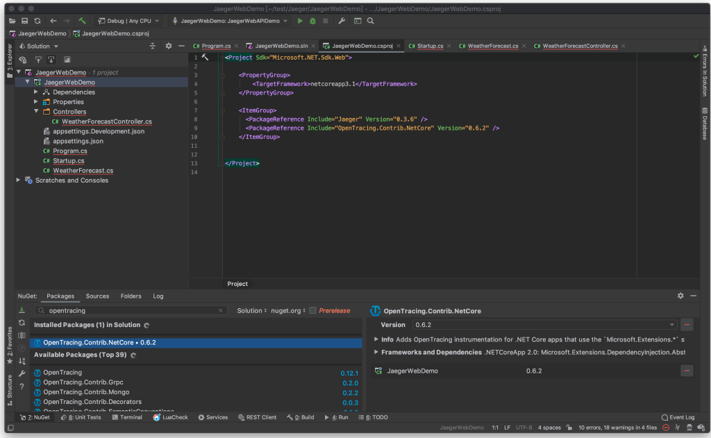
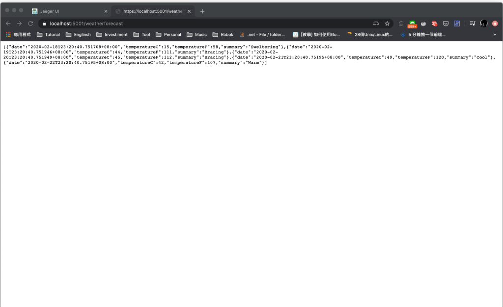
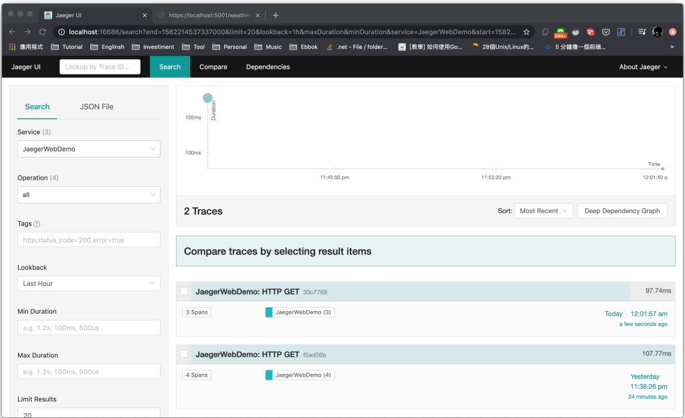
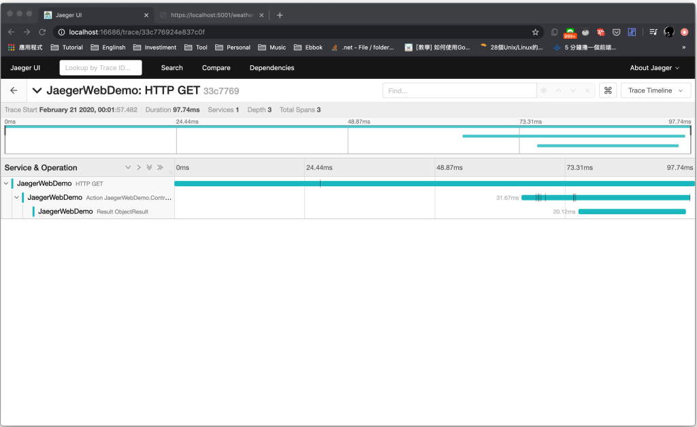
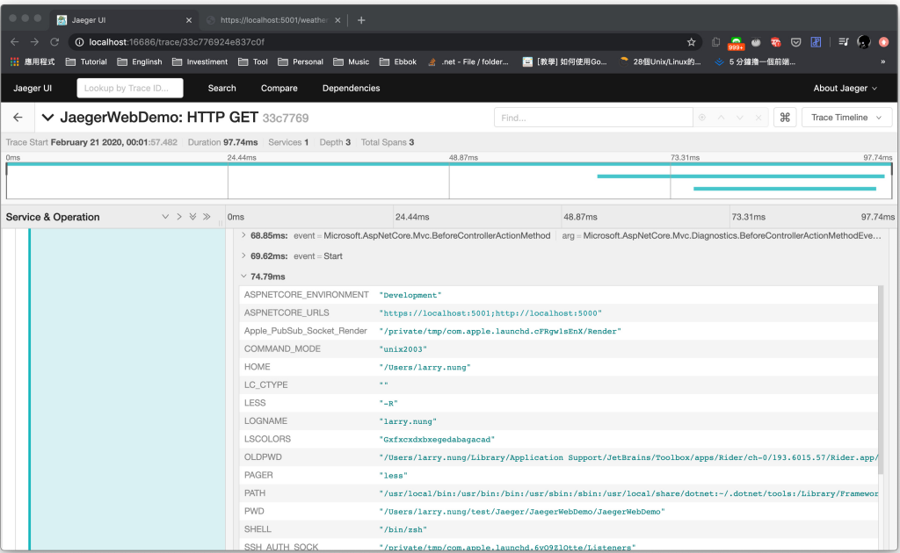

要使用 Jaeger 追蹤 ASP.NET Core 的程式，可先加入 Jaeger 與 OpenTracing.Contrib.NetCore 套件。  

<!-- More -->

```xml
<Project Sdk="Microsoft.NET.Sdk.Web">
    ...
    <ItemGroup>
      <PackageReference Include="Jaeger" Version="0.3.6" />
      <PackageReference Include="OpenTracing.Contrib.NetCore" Version="0.6.2" />
    </ItemGroup>
    ...
</Project>
```



<br>


修改 Startup.ConfigureServices 啟用。  

```c#
...
    public class Startup
    {
        ...
        public void ConfigureServices(IServiceCollection services)
        {
            ...
            services.AddOpenTracing();
            
            var serviceName = AppDomain.CurrentDomain.FriendlyName;
            var tracer = new Tracer.Builder(serviceName)
                .WithSampler(new ConstSampler(true))
                .Build();


            GlobalTracer.Register(tracer);

            services.AddSingleton<ITracer>(tracer);
	    ...
        }
	...
    }
...
```

<br>


到這邊程式 Controller 的 Action 已經會送到 Jaeger 可被 Tracing 了。  

<br>


若要增加額外的 Tracing 的資訊，可透過 DI 或是 GlobalTracer.Instance 取得 Tracer，有了 Tracer 就可以建立 Span，或是用 ActiveSpan 取得當前的 Span，並透過 Span 加上 Tag 或 Log。

```c#
...
       [HttpGet]
        public IEnumerable<WeatherForecast> Get()
        {
            var tracer = GlobalTracer.Instance;
            var span = tracer.ActiveSpan;
            span.Log("Start");

            ...

            span.Log(Environment.GetEnvironmentVariables()
                .OfType<DictionaryEntry>()
                .ToDictionary(item => item.Key.ToString(), item => item.Value));

            span.Log("End");

            return data;
        }
...
```


<br>


實際運行程式。  



<br>


選取 Service 與 Operator 下去查詢。  


<br>


可看到找到的 Trace，上半部可看到時間與耗時的分佈，下半部就是簡易的列表，可看出 Trace 名稱、識別碼、是什麼時間點觸發的、耗時多久、有多少 Span。



<br>


點選感興趣的 Trace，會進入 Trace 細部資訊頁面，會將 Trace 及其組成的 Span 以圖形的方式呈現，便於找到相對耗時的操作。  



<br>


展開 Span 可看到 Span 的 Tag 與 Log 這些資訊。  


