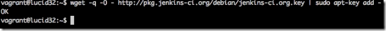
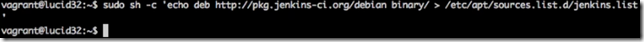
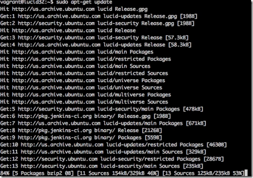
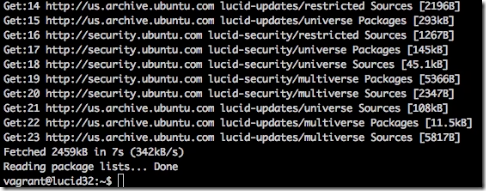
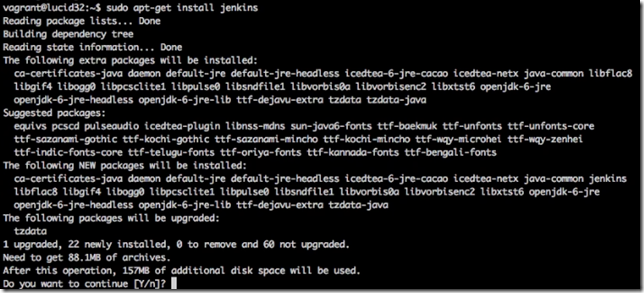
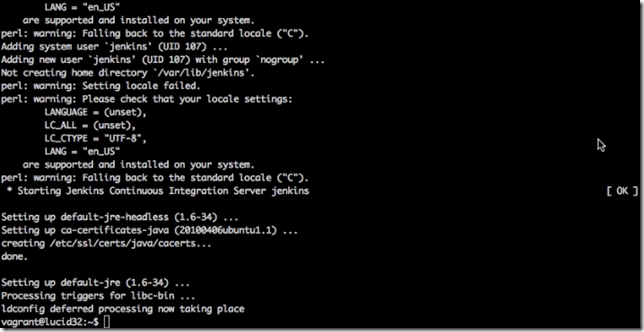
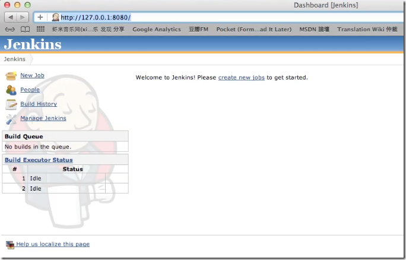

要在 Ubuntu 上安裝 Jenkins CI Server，首先要呼叫命令將金鑰下載並加入。  

<!-- More -->

    wget -q -O - http://pkg.jenkins-ci.org/debian/jenkins-ci.org.key | sudo apt-key add -

 

接著呼叫命令將jenkins package的來源位置加入 apt-get 的 reposity 來源。  

    sudo sh -c 'echo deb http://pkg.jenkins-ci.org/debian binary/ > /etc/apt/sources.list.d/jenkins.list'

 

呼叫命令更新套件清單。  

    sudo apt-get update

 

 

最後再呼叫命令進行 Jenkins 的安裝。  

    sudo apt-get install jenkins

 

 

安裝完後呼叫命令將 Jenkins 服務啟動。  

    sudo /etc/init.d/jenkins start

 

服務啟動後開啟瀏覽器訪問 http://127.0.0.1:8080 位置，沒意外的話應該可以看到 Jenkins 運行的畫面。

 
