要設定 Jenkins 的 Slave 節點，先將 Jenkins 切到設定全域安全性。

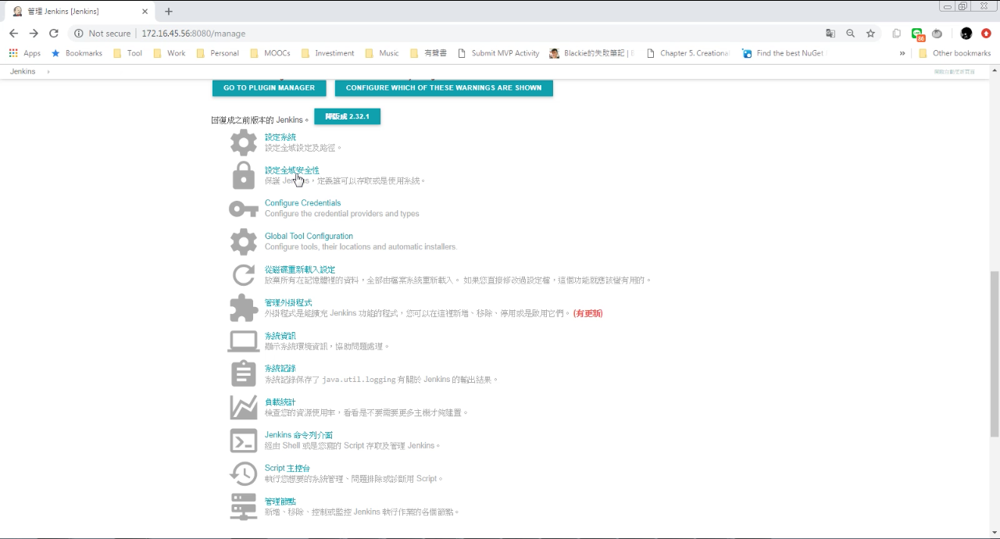

設定 JNLP agent 要走的 TCP port。

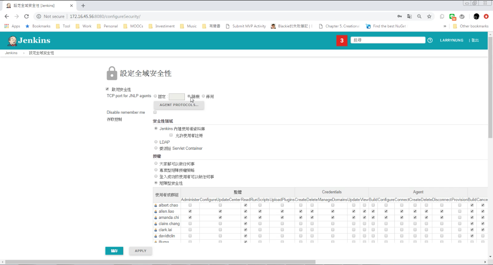

存檔離開。

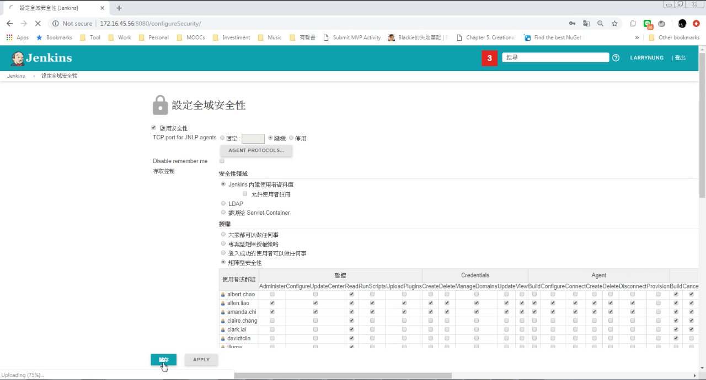

然後進到管理節點。

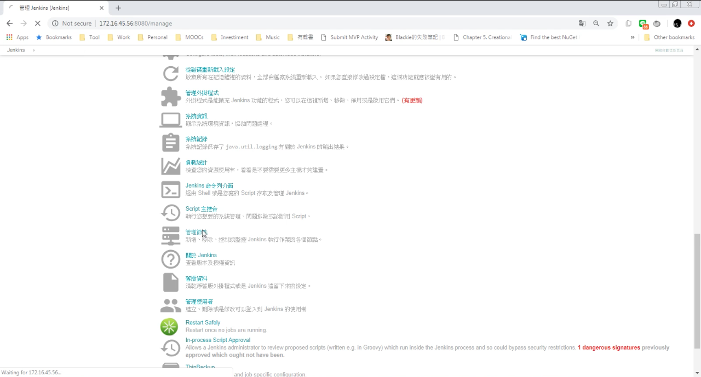

點選新增節點。

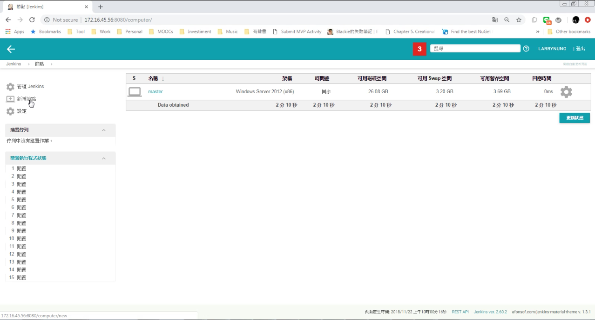

設定節點名稱後按下 OK 按鈕。

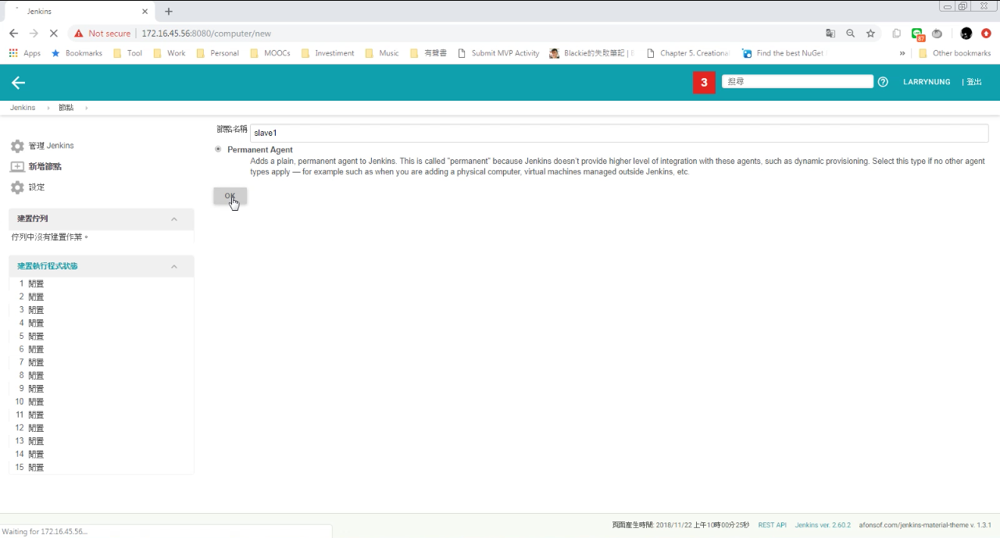

接著進行節點細部設定，像是執行程式數量這邊可以設定要讓該節點運同時運行多少的任務，遠端檔案系統根目錄這邊設定該節點電腦存放必要程式的位置，設定完成按下儲存按鈕。

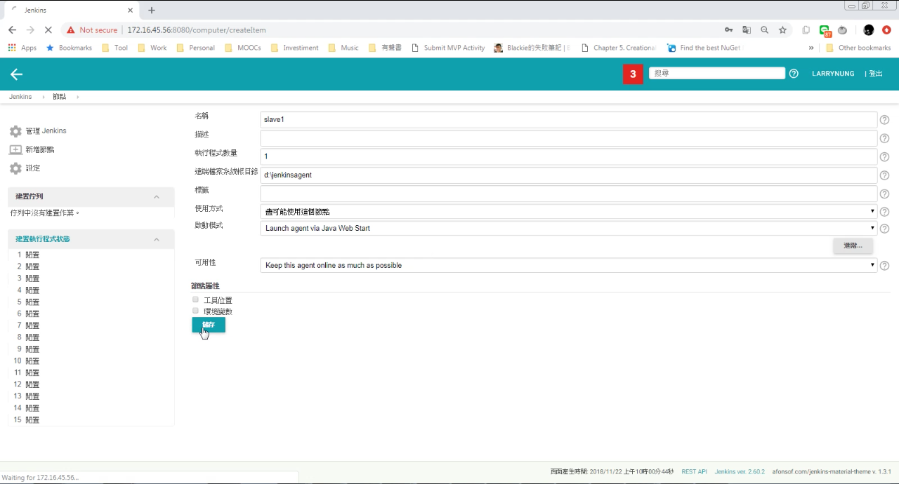

節點清單中會出現剛所加入的節點，點選該節點。

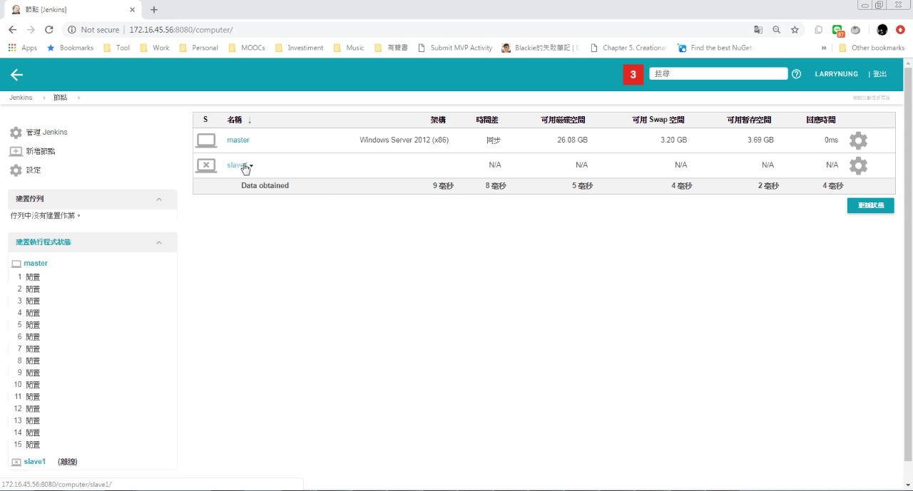

這邊會提示節點電腦的設置。

這邊可以下載他所提供的 JNLP 檔。

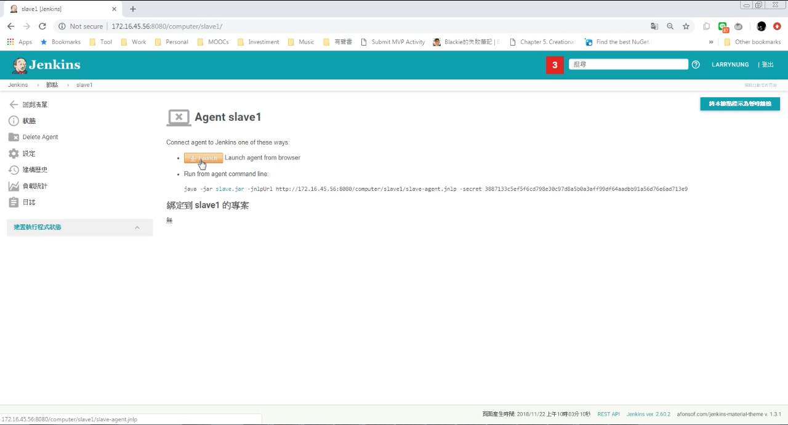

將下載下來的 JNLP 檔放至 Slave 節點電腦運行，只要 JRE 有安裝就能直接用滑鼠連點開啟運行。

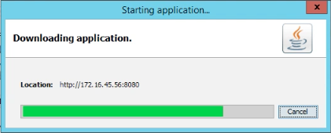

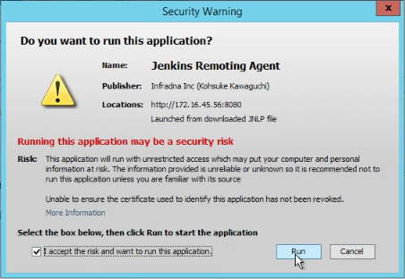

運行後剛在節點設定那邊所指定的位置就會存放運行必要的檔案。

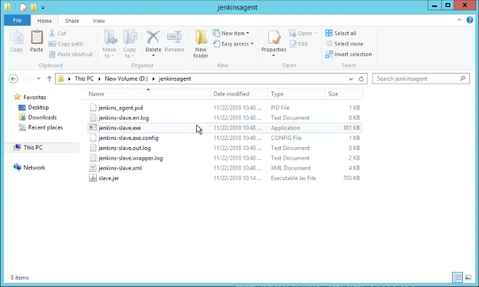

Jenkins 節點清單這邊也會看到節點有正常的被連接。

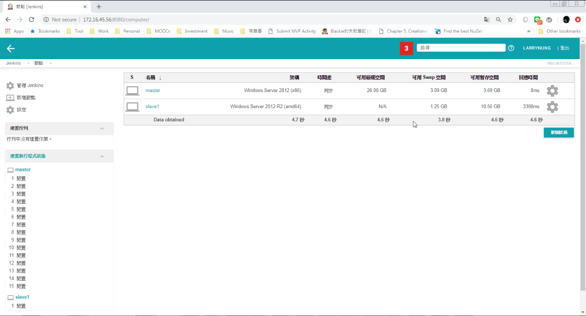

除了用下載的 JNLP 檔案外，我們也可以用命令的方式啟動 Slave 節點服務。

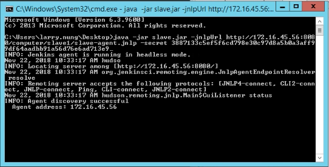

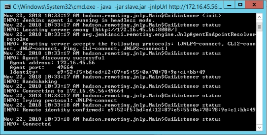

如要將 Slave 節點服務註冊成 Windows 服務，可透過 JNLP 檔運行後開出的視窗，點選 [File | Install as a service]  主選單選項。

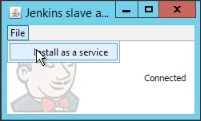

然後點選 OK 按鈕做 Windows 服務的註冊。

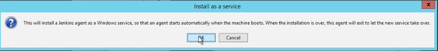

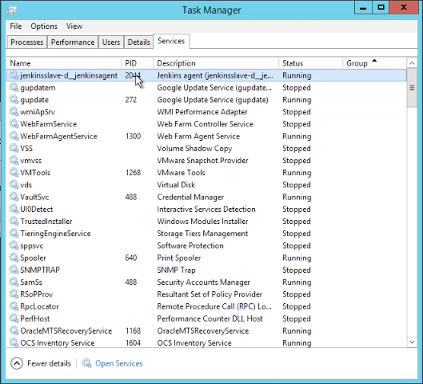