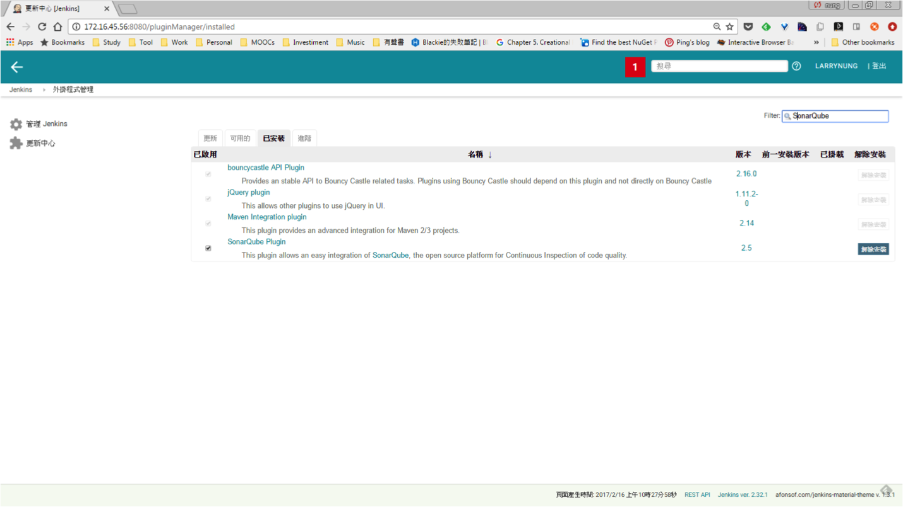
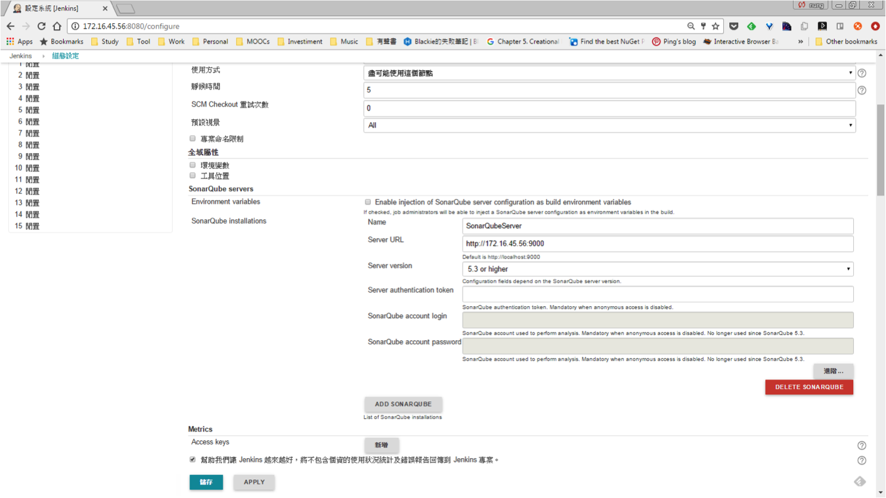
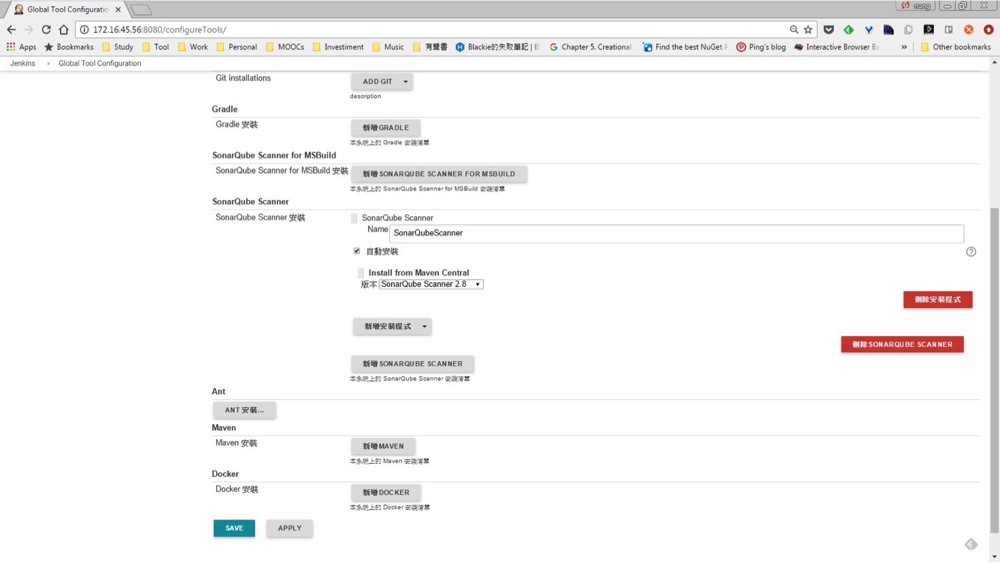
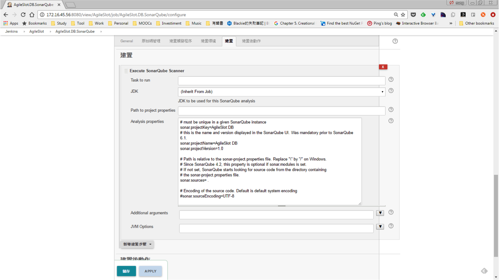

如果要將 SonarQube 整合 Jenkins，讓 Jenkins 幫我們運行並將分析送到 SonarQube，可以使用 Jenkins 的 SonarQube Plugin。  

<!-- More -->

 

先將 Jenkins 安裝 SonarQube Plugin。  

 

安裝完後開啟 Jenkins 的組態設定，設定 SonarQube Server 的資訊。  

 

接著開啟 Jenkins 的 Global Tool Configuration，讓 Jenkins 進行 SonarQube Scanner 的安裝。  

 

安裝與設定都好了後，就可以在 job 的建置這邊使用 Execute SonarQube Scanner 做 SonarQube 分析的設定，語法可參閱 SonarQube Scanner 的設定方式(主要的設定就是 projectKey、projectName、與 sources)。  

 
