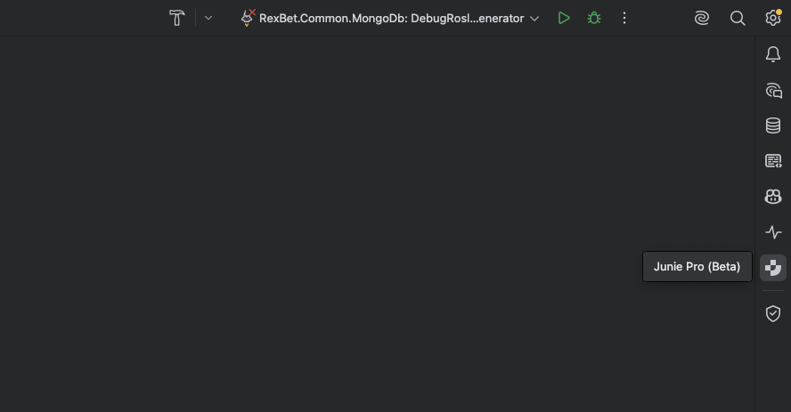
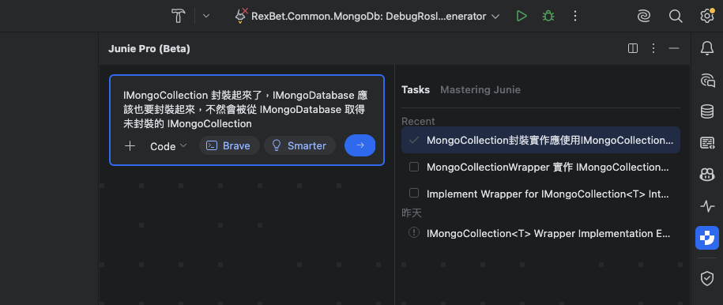
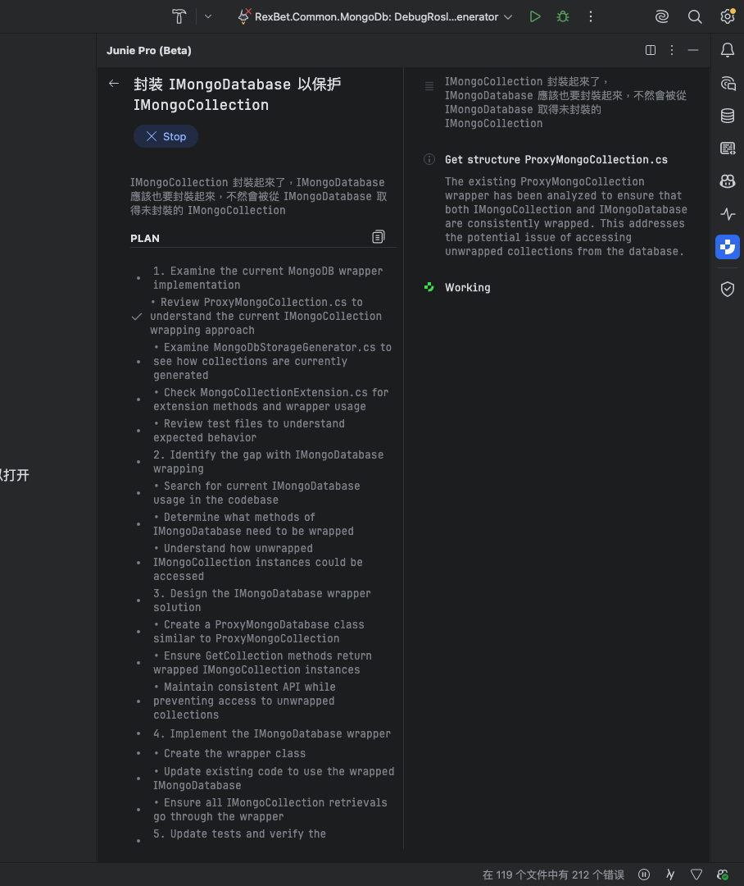
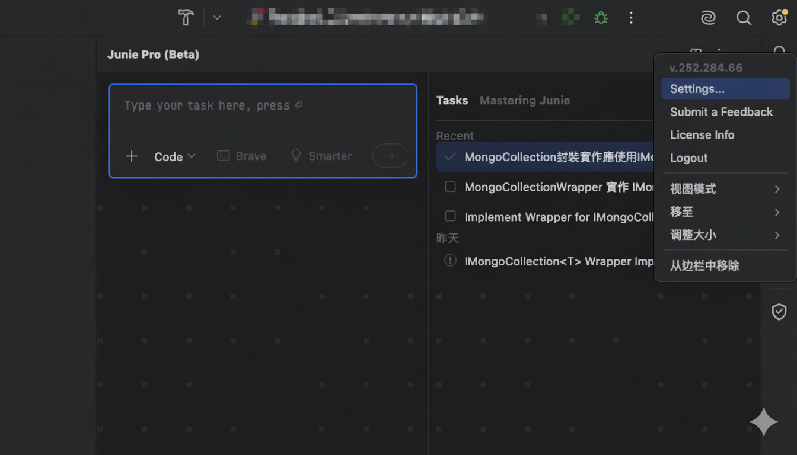
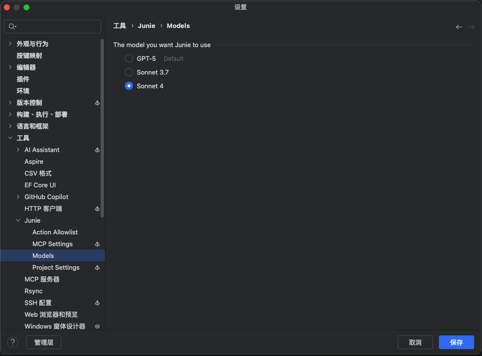
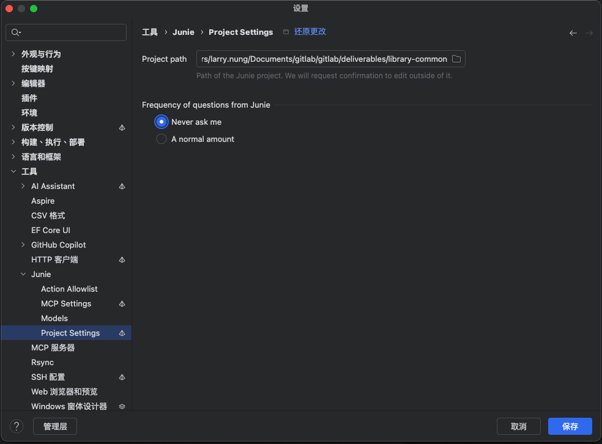
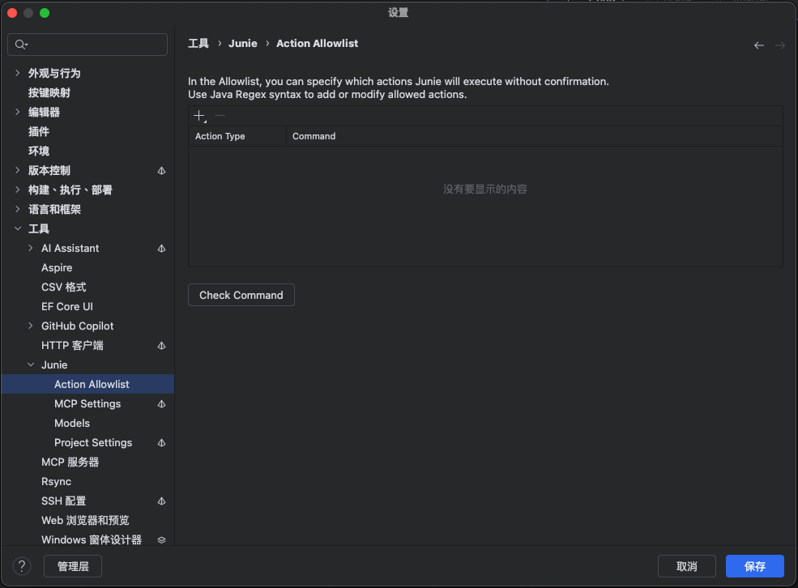
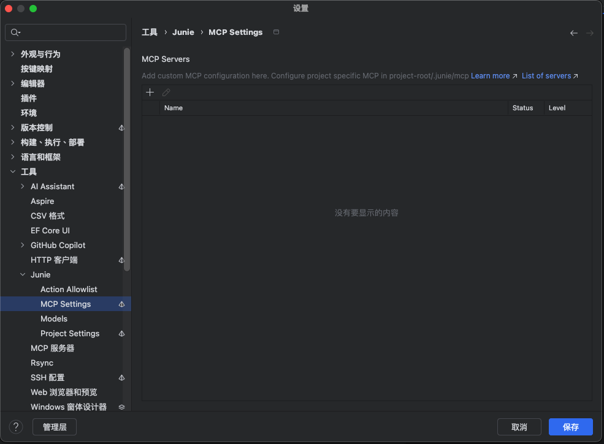

近年來，AI 助理在 IDE 中的整合已成為大勢所趨。它們從最初的程式碼補全，逐漸演變為更強大的開發夥伴。JetBrains 推出的 Junie 正是這一趨勢下的產物，它以「AI 代理 (Agent)」的模式運作，旨在理解並執行更複雜的開發任務。

## 核心互動：用對話驅動開發

Junie 最核心的操作方式，是透過一個類似聊天機器人的介面，用自然語言向它下達指令。這不僅僅是詢問問題，而是可以直接交付一個完整的開發或重構任務。

例如，你可以直接在輸入框中描述你想要達成的目標：

## 從任務到計畫：AI 的思考過程

對於一個複雜的任務，Junie 最強大的地方在於它不會立即執行。相反地，它會先生成一份詳細的、按部就班的行動計畫。這份計畫清晰地展示了 AI 將如何分析程式碼、進行修改、以及驗證結果。

這個「先計畫，後執行」的模式至關重要，它讓開發者有機會在任何程式碼被修改之前，先檢視 AI 的「思考過程」，確保其方向正確無誤，從而放心地將任務委派給它。

## 客製化你的 AI 代理

Junie 提供了豐富的設定選項，讓你可以根據自己的工作習慣和專案需求，來客製化這個 AI 代理。你可以從主選單進入設定畫面。

以下是一些關鍵的設定選項：

#### 1. 選擇 AI 模型

你可以根據任務的性質，選擇不同的底層 AI 大語言模型。這讓你在面對不同挑戰時，可以靈活地切換「大腦」。

#### 2. 專案整合設定

在專案設定中，你可以定義 Junie 的工作目錄，並調整它的互動頻率，例如設定為「永遠不要問我 (Never ask me)」，讓它在執行時更果斷。

   

#### 3. 指令執行權限 (Action Allowlist)

這是一個非常實用的功能。你可以將一些你信任的、常用的指令（例如 `npm install` 或 `git pull`）加入白名單。這樣一來，當 Junie 需要執行這些指令時，就不會再次彈出確認視窗，從而讓整個工作流程更順暢。

#### 4. 進階伺服器設定

對於需要深度客製化的重度使用者，Junie 還提供了例如 MCP 伺服器等進階設定。

## 結論

JetBrains Junie 展示了下一代 AI 開發助理的樣貌：它不僅僅是一個被動的工具，更像一個能理解、規劃、並執行複雜任務的「AI 代理」。透過自然語言互動、透明的行動計畫以及高度的客製化能力，這類工具正在將 IDE 從一個單純的編輯器，轉變為一個真正意義上的智慧開發平台。