要在 Windows 安裝 JFrog Artifactory open source，可先到 JFrog Artifactory open source 的下載頁面。

下載 Windows 用的壓縮檔。

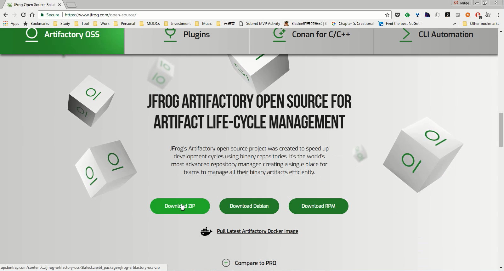

解壓縮下載下來的壓縮檔。

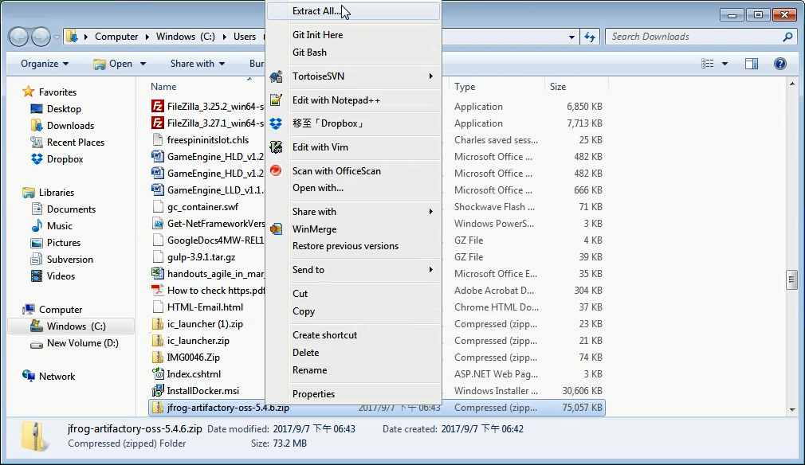

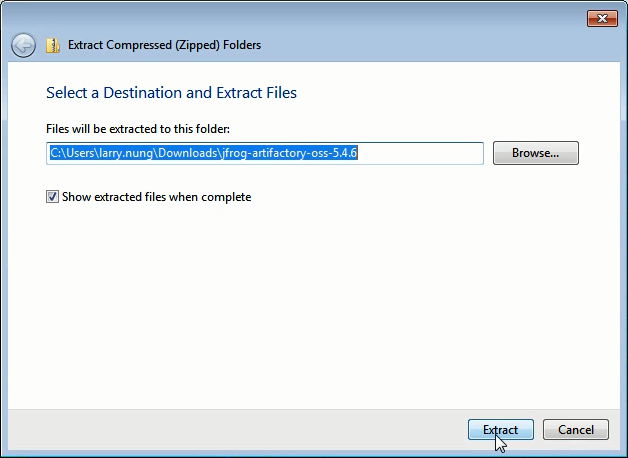

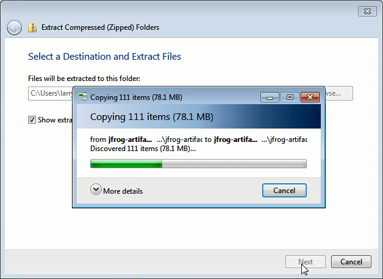

切到 bin 目錄用 Administrator 運行 artifactory.bat。

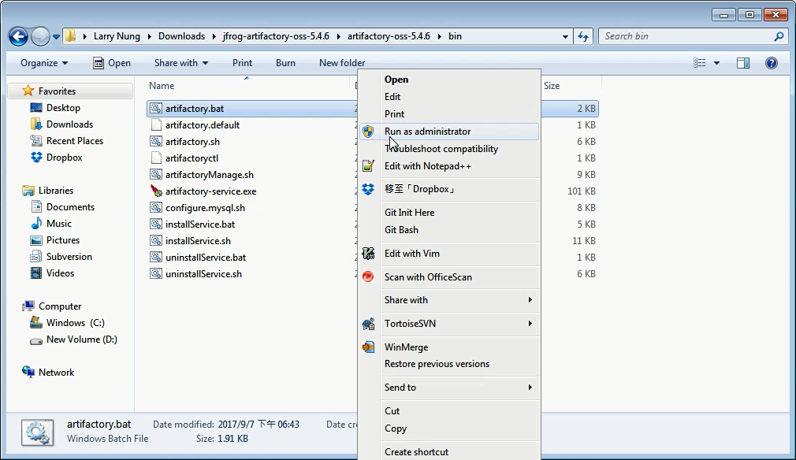

即會運行 JFrog Artifactory 服務。

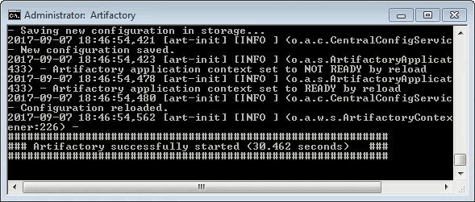

瀏覽器訪問 http://localhost:8081 即可看到 JFrog Artifactory 頁面。

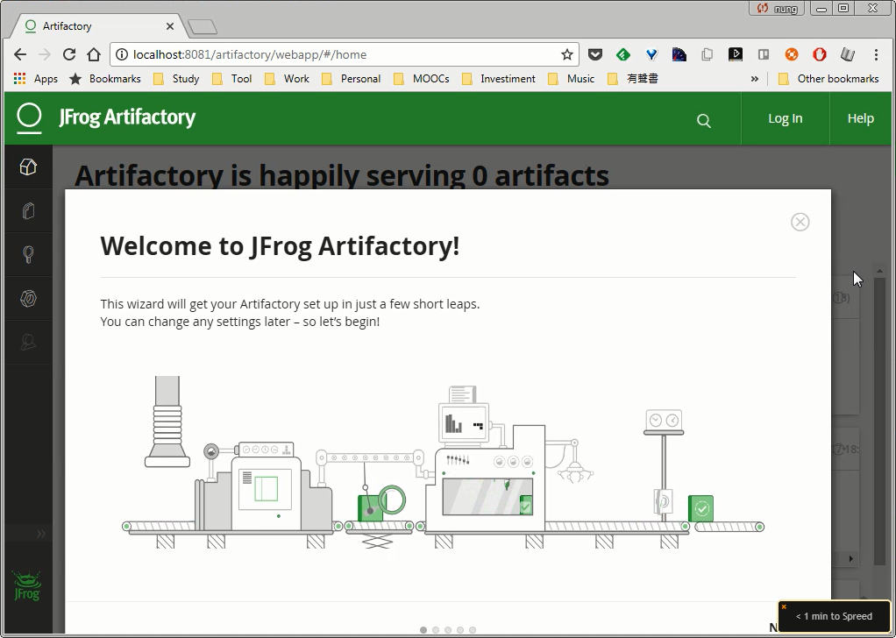

如果要將 JFrog Artifactory 註冊成 Windows 服務，可用 Administrator 運行命令提示字元，在命令提示字元中運行 installService.bat 註冊 Windows 服務。

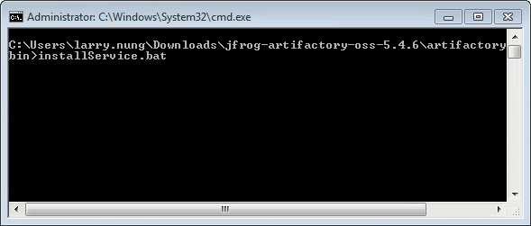

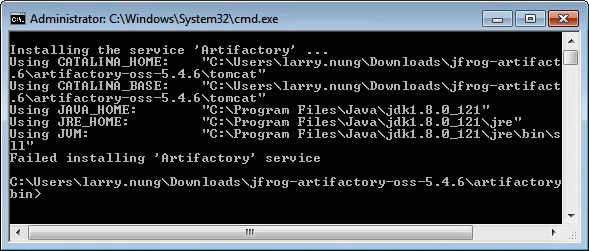

註冊好後可以看到增加的 Artifactory Windows 服務。

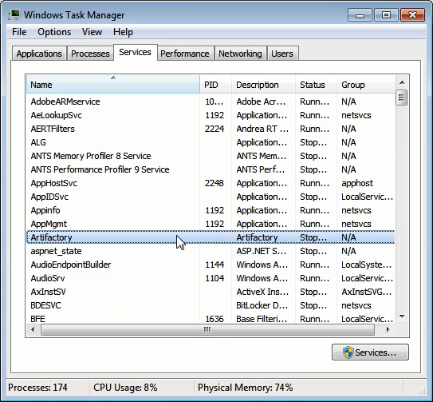

如果要將 JFrog Artifactory 的 Windows 服務移除，一樣用 Administrator 運行命令提示字元，在命令提示字元中運行 uninstallService.bat 取消註冊 Windows 服務。

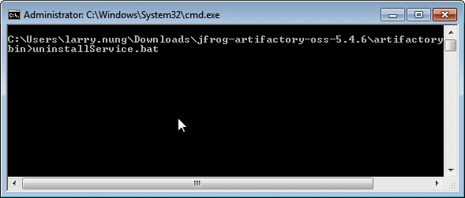

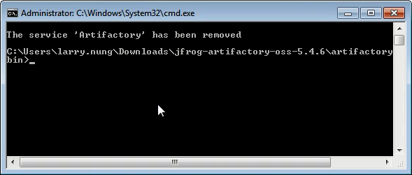

Link
----
* [JFrog - Managing Binaries for Maven Repository, Docker, npm, Ruby and More](https://www.jfrog.com/)