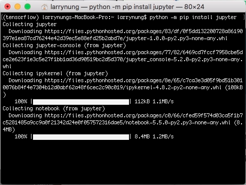
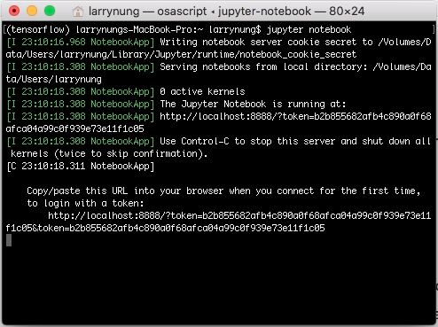
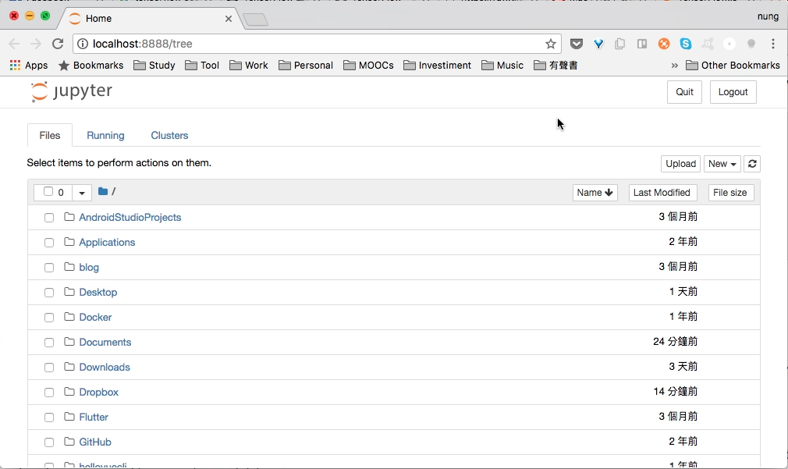

要使用 pip 安裝 Jupyter，可調用下列命令。

python -m pip install --upgrade pip
python -m pip install jupyter

安裝完調用下列命令運行 Jupyter。

jupyter notebook

沒意外的話會看到 Jupyter 被正常帶出。

Link
----
* [Project Jupyter | Install](http://jupyter.org/install.html)