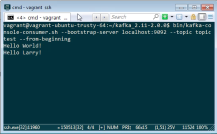

要啟用 Consumer 去接收 Topic 的訊息，可調用 kafka-console-consumer.sh，帶入參數 --bootstrap-server 指定 Bootstrap server 位置、--topic 參數指定 Topic。

bin/kafka-console-consumer.sh --bootstrap-server [BootstrapServer] --topic [Topic] --from-beginning

Link
----
* [Apache Kafka](https://kafka.apache.org/quickstart)