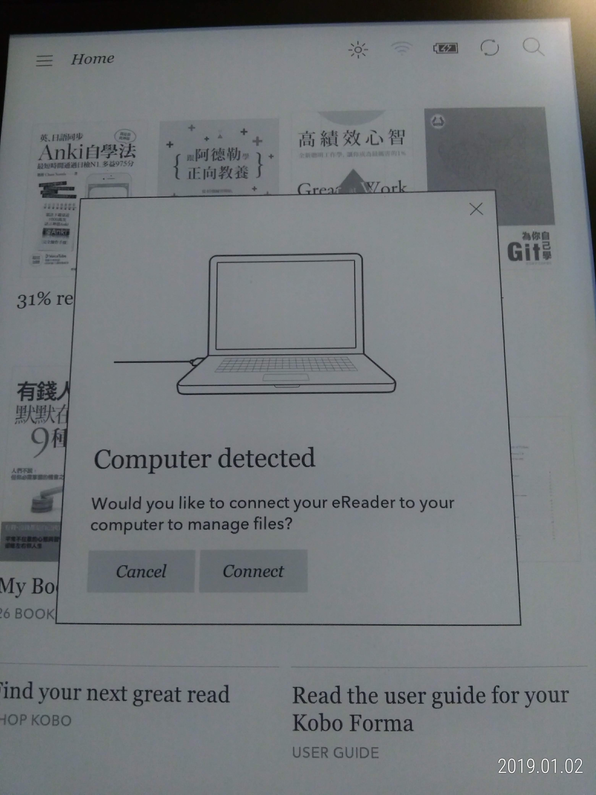
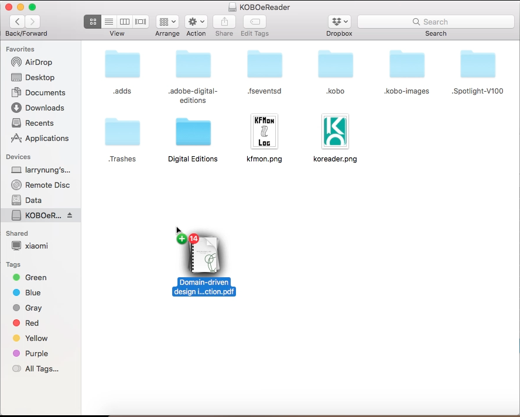
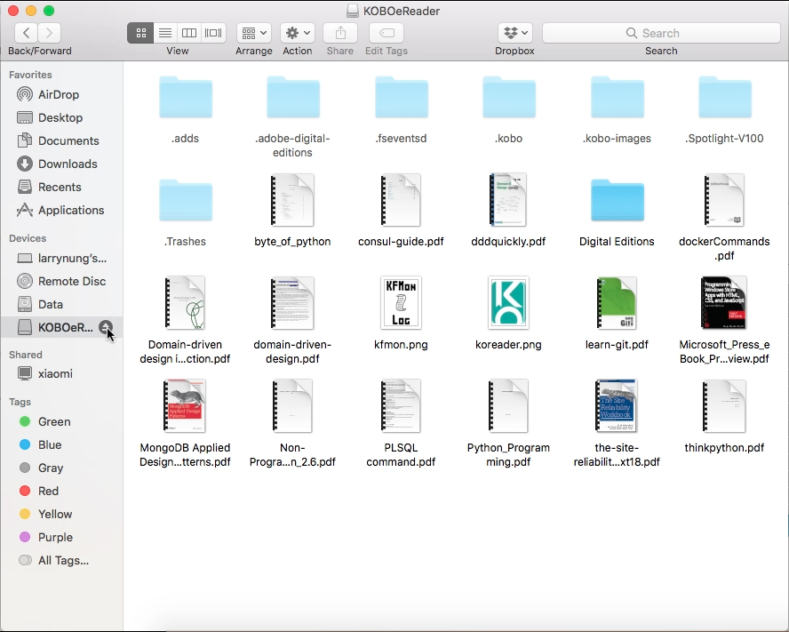
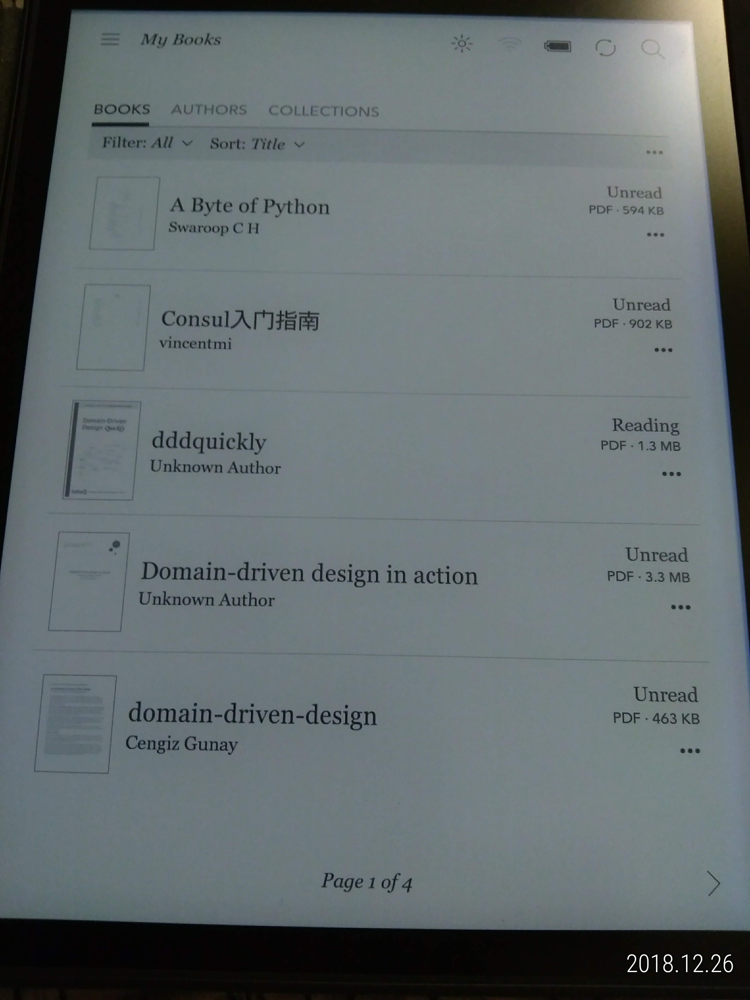

要將自己的電子書檔案放入 Kobo eReader，可用 USB 線連接 MAC 電腦與 Kobo eReader。  

<!-- More -->

 

在 Kobo eReader 上按下 Connect 按鈕。  

 

MAC 電腦會找到 Kobo eReader 裝置，將自己的電子書檔案透過 Finder 放入。  

 

然後退出 MAC 上的 Kobo eReader 裝置。  

 

直接在 Kobo eReader 上就可以看到我們剛所放入的電子書檔案。  

 

Link
----
* [Adding books to your Kobo eReader - kobo.com/help](https://www.kobo.com/help/en-US/article/3174/adding-books-to-your-kobo-ereader?culture=de-de)
