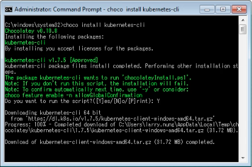
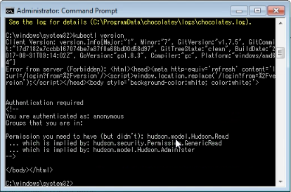

要在 Windows 使用 kubectl，透過 Chocolatey 進行安裝即可。

choco install kubernetes-cli

安裝完可運行 kubectl 命令查閱 kubectl 版本，確認命令可以正確運行。

kubectl version

Link
----
* [Install and Set Up kubectl - Kubernetes](https://kubernetes.io/docs/tasks/tools/install-kubectl/)