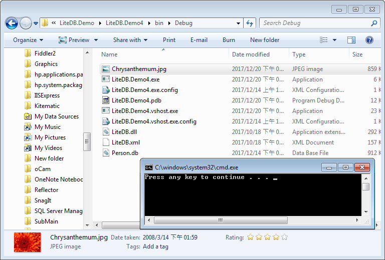
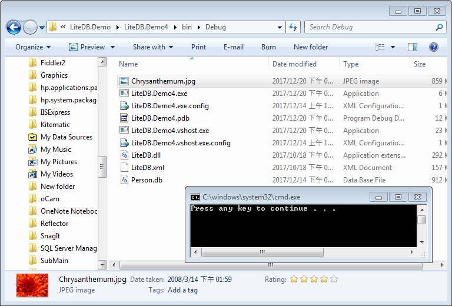

為了控制記憶體的使用量，LiteDB 限制資料的存放量為 1 MB，1 MB 對於一般的資料而言是已經足夠了，但是對於二進制檔案來說就不怎麼足夠，所以 LiteDB 提供 FileStorage 用以存放二進制檔案。  

<!-- More -->

<br/>


FileStorage 支援以下方法：  

| Method | Description | 
|:-------------:|:-------------:|
| Upload | Send file or stream to database. Can be used with file or Stream. If file already exists, file content is overwritten. |
| Download | Get your file from database and copy to Stream parameter |
| Delete |  Delete a file reference and all data chunks |
| Find | Find one or many files in _files collection. Returns LiteFileInfo class, that can be download data after.  |
| SetMetadata | pdate stored file metadata. This method doesn't change the value of the stored file. It updates the value of _files.metadata. |
| OpenRead | Find file by _id and returns a LiteFileStream to read file content as stream |

<br/>


像是要塞入二進制的檔案，可以使用 FileStorage.Upload 方法，調用時帶入識別檔案用的 ID，以及檔案的位置。  

```C#
…
using (var db = new LiteDatabase(dbFile)) 
{ 
  db.FileStorage.Upload(id, file); 
} 
```

<br/>


```C#
using System;
using System.IO;

namespace LiteDB.Demo4
{
    class Program
    {
        static void Main(string[] args)
        {
            using (var db = new LiteDatabase("Person.db"))
            {
                var fs = db.FileStorage;
                var file = @"C:\Users\Public\Pictures\Sample Pictures\Chrysanthemum.jpg";
                var fileName = Path.GetFileName(file);
                fs.Upload(fileName, file);
            }
        }
    }
}
```

<br/>


要開啟二進制檔案，可以使用 FileStorage.OpenRead 方法，調用時帶入識別檔案用的 ID。  

```C#
…
using (var db = new LiteDatabase(dbFile)) 
{ 
  …  
  using (var stream = db.FileStorage.OpenRead(id)) 
  { 
    …
  } 
} 
```

<br/>


```C#
using System;
using System.IO;

namespace LiteDB.Demo4
{
    class Program
    {
        static void Main(string[] args)
        {
            using (var db = new LiteDatabase("Person.db"))
            {
                var fs = db.FileStorage;
                var fileName = "Chrysanthemum.jpg";
                using(var fileStream = File.Create(fileName))
                using (var stream = fs.OpenRead(fileName))
                {
                    stream.CopyTo(fileStream);
                }
            }
        }
    }
}
```

<br/>




<br/>


要將 LiteDB 內的二進制檔案寫回硬碟，可以使用 FileStorage.Download 方法，調用時帶入識別檔案的 ID，及目的檔案串流。  

```C#
…
using (var db = new LiteDatabase(dbFile)) 
{ 
  …  
  using(var fileStream = File.Create(id)) 
  { 
    fs.Download(id, fileStream); 
  } 
} 
```

<br/>


```C#
using System;
using System.IO;

namespace LiteDB.Demo5
{
    class Program
    {
        static void Main(string[] args)
        {
            using (var db = new LiteDatabase("Person.db"))
            {
                var fs = db.FileStorage;
                var fileName = "Chrysanthemum.jpg";
                using (var fileStream = File.Create(fileName))
                {
                    fs.Download(fileName, fileStream);
                }
            }
        }
    }
}
```

<br/>




<br/>
