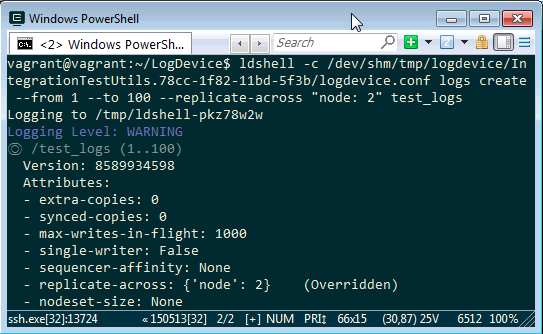

LogDevce cluster 啟用後，首先需要先建立 Log range。  

<!-- More -->

 

調用 ldshell 命令使用 -c 參數指定 LogDevice 的設定檔，後面帶著 logs create 指定 LogDevice 建立 log、使用 --from 與 --to 指定 log 的 range、--replicate-across 指定資料要抄寫到幾個 Cluster 節點、最後指定 Log range 的名字即可。  

    ldshell -c <Config> logs create --from <Start> --to <End> --replicate-across "<ReplicateAccross>" <LogName>

 
 

Link
----
* [Creating your first cluster · LogDevice](https://logdevice.io/docs/FirstCluster.html)
