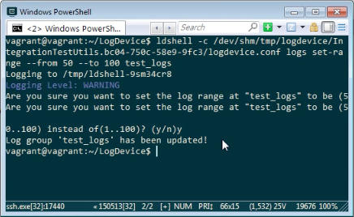
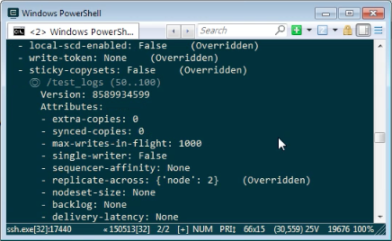

要使用 ldshell 變更 LogDevice 的 Log range，可以使用 -c 參數指定使用 Interactive Mode，帶入 LogDevice 的設定檔，帶入 logs set range，帶入 Log range，以及 Log name。  

<!-- More -->

    ldshell -c <Config> logs set range --from <Start> --to <End> <Log>

 

像是這邊筆者就將 test_logs 的 Range 變更為 50 到 100，查閱 Log 也確實做了改變。  

 

Link
----
* [Log configuration · LogDevice](https://logdevice.io/docs/Logs.html)
