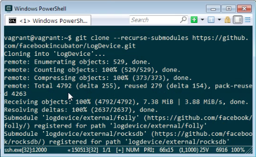
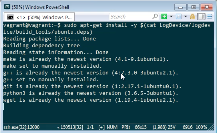
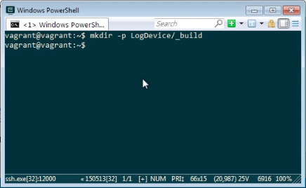
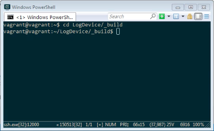
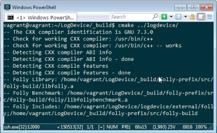
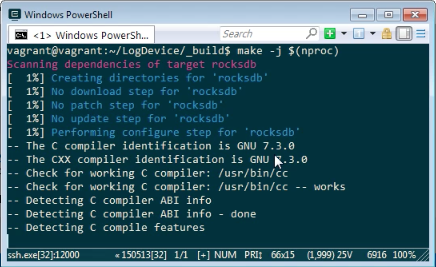
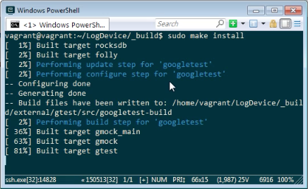

LogDevice 目前只支援在 Ubuntu 18 LTS "Bionic Beaver" 安裝。  

<!-- More -->

 

且只支援由 Source 建置安裝，所以我們需先下載 LogDevice 的 Source Code。  

    git clone --recurse-submodules git://github.com/facebookincubator/LogDevice

 
 

安裝 LogDevice 依賴的套件。  

    sudo apt-get install -y $(cat LogDevice/logdevice/build_tools/ubuntu.deps)

 
 

然後建立目錄用來做建置。  

    mkdir -p LogDevice/_build

 
 

進到建立的建置目錄。 

    cd LogDevice/_build 

 
 

使用 cmake 設定建置。  

    cmake ../logdevice/

 
 

運行 make 建置。  

    make -j $(nproc)

 
 

如果要將建置的檔案安裝至系統中，可調用下列命令：  

    sudo make install

 
 

Link
----
* [Installation · LogDevice](https://logdevice.io/docs/Installation.html)
