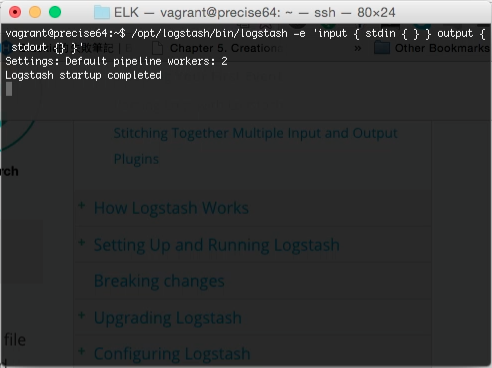
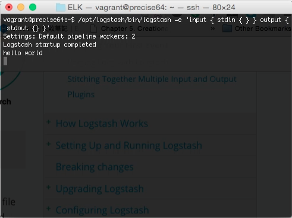
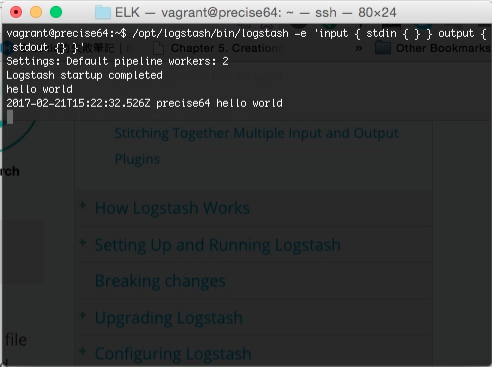
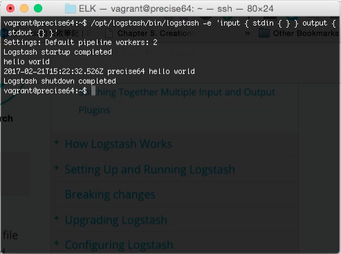
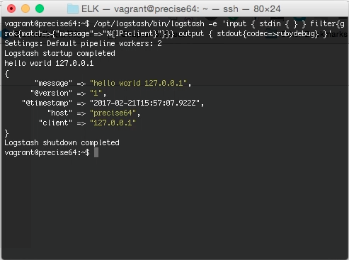

Logstash 安裝好後，可以用 Logstash 的 -e 參數帶入 Logstash 設定快速的體驗一下。  

<!-- More -->

    logstash -e <Setting>

 

像是下面這樣帶入簡單的設定，將標準輸入串流輸入的資料導到標準輸出串流。  

    logstash -e 'input { stdin{} } output { stdout{} }'

 

將資料輸入。  

 

資料就會被輸出到標準輸出串流。  

 

不再使用時按下熱鍵 Ctrl + D 即可退出。  

 

除了 Input & Output 外，也可以試著設定 Filter，像是要用 Filter 去將訊息內的 IP 切成 client field，可以像下面這樣調用。  

    logstash -e 'input { stdin{} } filter { grok { match => { "message" => "%{IP:client}" } } } output { stdout { codec => rubydebug } }'
 

 
