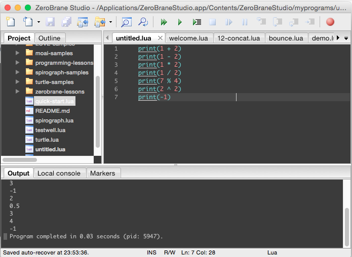

Lua 的 Arithmetic operators 有 +、-、*、/、%、>=，這些運算符可用來做數值的運算。  

<!-- More -->

| Operator | Description |
|:-------------:|:-------------:|
| + | 用來將前後數值相加 |
| - | 用來將前後數值相減 |
| * | 用來將前後數值相乘 |
| / | 用來將前後數值相除 |
| % | 用來將前後數值相除取模 |
| ^ | 用來將數值乘冪 |
| - | 用來將數值正負反轉 |

<br/>


使用起來就像下面這樣：  

```Lua
print(1 + 2)            
print(1 - 2)    
print(1 * 2)          
print(1 / 2)         
print(7 % 4) 
print(2 ^ 2)       
print(-1)                  
```

<br/>




<br/>


Link
----
* [Lua 5.1 Reference Manual](http://www.lua.org/manual/5.1/manual.html#2.5.2)
