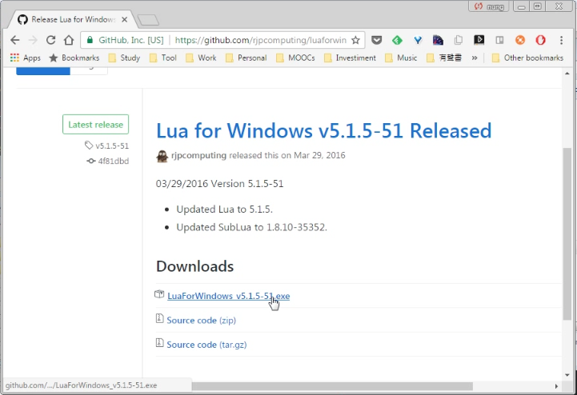
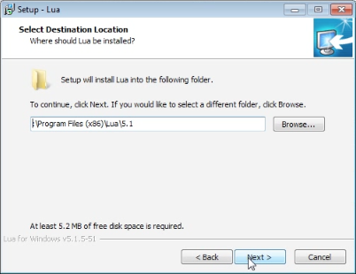
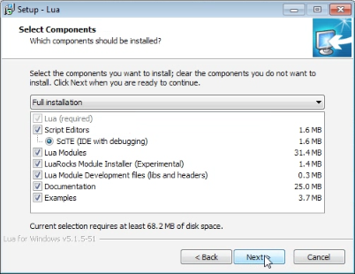
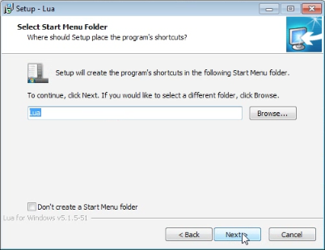
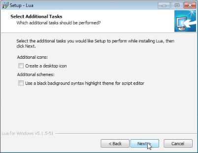
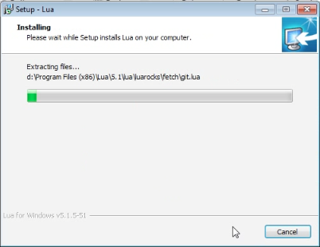
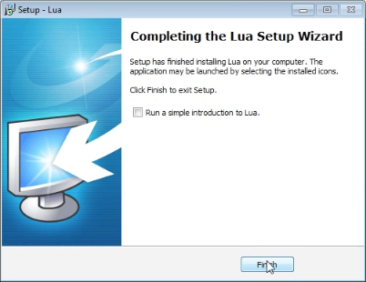

在 Winwodw 下要使用 Lua binary，可下載 [Lua for Windows](https://github.com/rjpcomputing/luaforwindows)。

下載後點擊安裝即可。

Link
----
* [rjpcomputing/luaforwindows: Lua for Windows is a 'batteries included environment' for the Lua scripting language on Windows.](https://github.com/rjpcomputing/luaforwindows)